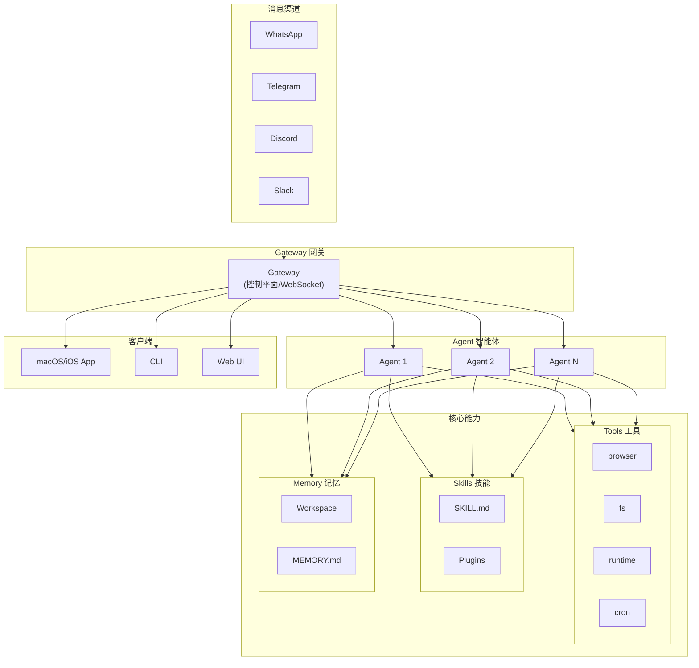

+++
date = '2026-02-04T19:15:45+08:00'
draft = false
title = 'OpenClaw 个人 AI 助手部署实战'
categories = ['AgentAI']
tags = ['AgentAI']
+++

## 什么是 [OpenClaw](https://openclaw.ai/)？

> 你的个人 AI 助手，能干活、会学习、懂协作

OpenClaw 是一个开源的个人 AI 助手平台，通过 LLM + 工具调用 + 工作流编排实现真正的自动化——不是简单的问答，而是能实际完成任务的数字员工。

**简单来说**：你可以把它想象成一个 7×24 小时在线的私人助手，通过自然语言描述就能帮你完成各种任务。

**举个例子**，我每天早上的智驾简报和下午的 arxiv 论文推送都是它自动完成的：


**核心能力**：
- **本地运行**：Mac/Windows/Linux，支持 Anthropic/OpenAI/本地模型，数据不出本地
- **多端交互**：WhatsApp、Telegram、Discord、Slack、Signal、iMessage、Matrix 等主流平台
- **持久记忆**：上下文持久化，跨会话学习，成为「专属」自动化助手
- **浏览器控制**：自动操作网页、填写表单、数据抓取
- **系统访问**：读写文件、执行 Shell 命令，支持沙箱隔离
- **技能扩展**：社区技能、自定义插件、Agent 自动生成 Skill
- **实时语音**：macOS/iOS/Android 语音交互能力
- **Canvas 工作台**：可视化工作流与执行展示

### 架构组成

OpenClaw 采用**事件驱动、Session 隔离**的架构，以 Gateway 为核心的星型模型。



#### Gateway（网关）—— 核心控制平面

Gateway 是 OpenClaw 的**唯一长期运行守护进程**，是整个系统的控制中枢：

- **消息通道管理**：同时维护 WhatsApp、Telegram、Discord、Slack、Signal、iMessage、WebChat 等所有连接
- **事件发射**：发送 `agent`、`chat`、`presence`、`health`、`heartbeat`、`cron` 等事件
- **Session 管理**：作为所有 Session 状态的权威来源
- **协议验证**：对入站帧进行 JSON Schema 验证
- **WebSocket API**：为 CLI、Web UI、macOS App、iOS/Android Nodes 提供类型安全的接口

> 一台主机上只运行一个 Gateway 进程，它是唯一打开 WhatsApp Session 的地方。

#### Agent（智能体）

Agent 是 OpenClaw 的核心执行单元，**不是简单的模型选择**，而是完整的隔离工作环境：

- **Workspace**：独立工作目录，存放 AGENTS.md（规则）、SOUL.md（人格）、USER.md（偏好）、MEMORY.md（记忆）
- **Session Store**：独立的聊天历史和路由状态
- **Model 配置**：可选择不同的模型（OpenAI、Anthropic、MiniMax、Ollama 等）
- **Tools/Skills**：可配置的工具和技能组合
- **人格定义**：通过配置文件定义行为风格

支持**多 Agent 路由**：不同来源的消息可以路由到不同的 Agent，实现任务隔离。

#### Sessions（会话）

Session 提供**意图隔离和灵活路由**：

- **Session 模型**：
  - 每个 Agent 有一个主 DM Session（通常叫 `main`）
  - 群组、频道、线程各自独立的 Session
  - 可选的"安全 DM 模式"：按发送者/渠道隔离 DMs，防止上下文泄露

- **Session 持久化（双层）**：
  - `sessions.json`：元数据、最后活动、开关、Token 计数器
  - `.jsonl`：对话的追加记录，用于重建模型上下文

- **Session Key**：将入站消息路由到正确的会话桶

#### Nodes（节点）

Nodes 是连接到 Gateway 的**远程设备**，通过 WebSocket 声明 `role: node`：

- **macOS Companion App**：桌面端节点
- **iOS / Android 节点**：移动端配对，支持语音、聊天、Canvas、摄像头
- **Headless Node**：`openclaw node run` 无头模式

节点暴露的命令：`canvas.*`、`camera.*`、`screen.record`、`location.get` 等。

#### Workspace / Memory / Context

- **Workspace**：Agent 的本地工作目录，默认文件：
  - `AGENTS.md`：Agent 规则
  - `SOUL.md`：人格定义
  - `USER.md`：用户偏好
  - `TOOLS.md`：工具说明
  - `MEMORY.md`：长期记忆
  - `memory/YYYY-MM-DD.md`：每日记忆文件

- **Memory**：长期记忆，本质是 Workspace 中的 Markdown 文件

- **Context**：每次请求发送给模型的完整内容，包括 system prompt、历史消息、工具结果，受模型上下文窗口限制

#### Tools（工具）

**Tools 是 OpenClaw 暴露给 Agent 的核心能力**，是 Agent 与外部世界交互的接口：

| 工具组 | 工具 | 说明 |
|--------|------|------|
| **browser** | browser | 网页浏览/抓取/操作，最核心 |
| **fs** | read, write, edit, apply_patch | 文件系统操作 |
| **runtime** | exec, bash, process | Shell 命令执行 |
| **automation** | cron, gateway | 定时任务、网关管理 |
| **web** | web_search, web_fetch | 网页搜索/抓取 |
| **memory** | memory_search, memory_get | 长期记忆检索 |
| **sessions** | sessions_list, sessions_send 等 | 会话管理 |
| **messaging** | message | 消息发送 |
| **nodes** | nodes | 设备控制 |

#### Skills（技能）/ Plugins（插件）

- **Skills**：能力使用说明书（SKILL.md），告诉 Agent 何时、如何调用工具
- **Plugins**：代码级扩展，给 OpenClaw 增加新命令、工具、通道

#### Cron（定时任务）

内置任务调度器，支持：
- 任务持久化
- 定时唤醒 Agent
- 结果投递回聊天

**一句话理解 OpenClaw 架构**：

Gateway 是中枢，Session 是隔离桶，Agent 是执行体，Tools 是手臂，Skills 是说明书，Models 是大脑。

**Tools 是 OpenClaw 暴露给 Agent 的一等公民，是 Agent 可以调用的实际能力**。这是 OpenClaw 与模型交互的核心接口。

官方核心 Tools：

| 工具组 | 包含的工具 | 说明 |
|--------|-----------|------|
| **browser** | browser | 网页浏览/抓取/操作，最核心的能力 |
| **fs（文件系统）** | read, write, edit, apply_patch | 文件读写操作 |
| **runtime（运行时）** | exec, bash, process | 执行 Shell 命令 |
| **automation** | cron, gateway | 定时任务、网关管理 |
| **ui** | browser, canvas | 浏览器控制、可视化工作台 |
| **web** | web_search, web_fetch | 网页搜索/抓取 |
| **memory** | memory_search, memory_get | 长期记忆检索 |
| **sessions** | sessions_list, sessions_history, sessions_send, sessions_spawn, session_status | 会话管理 |
| **messaging** | message | 消息发送 |
| **nodes** | nodes | iOS/Android 设备控制 |

**Tools 配置**（在 `openclaw.json` 中）：

```json5
{
  // 工具配置文件
  tools: {
    // 使用预设配置：full | messaging | coding | minimal
    profile: "coding",
    
    // 白名单/黑名单
    allow: ["group:fs", "browser"],
    deny: ["group:runtime"],
  },
}
```

Tool Profiles：
- **full**：无限制
- **messaging**：消息相关（sessions_list, sessions_history, sessions_send, session_status）
- **coding**：编码相关（fs, runtime, sessions, memory, image）
- **minimal**：仅 session_status

### Channels（渠道）

Channel 是 OpenClaw 接入各种聊天平台的方式，让你可以用自己习惯的通讯工具与 OpenClaw 交互。

- **定位**：消息入口
- **支持的平台**：WhatsApp、Telegram、Discord、Slack、Signal、iMessage、Matrix、飞书等

**配置方式**：

```bash
# 在 onboarding 时选择
openclaw onboard

# 或通过配置命令
openclaw config
```

配置完成后，你就可以在对应的聊天平台上与 OpenClaw 对话。

### Skills（技能）

Skill 本质是一个目录，里面核心是 `SKILL.md`，用来告诉模型"何时该用什么工具、按什么步骤做事"；也可以附带脚本和资源文件。它更像"提示词包 / 操作手册 / 轻量能力封装"。

- **核心文件**：SKILL.md
- **定位**：教模型"怎么做事"
- **特点**：很多 Skill 自己并不实现底层功能，只是依赖本机已有的 CLI。比如 `summarize` Skill 依赖外部的 summarize CLI，`apple-reminders` Skill 依赖 `remindctl`

**安装方式**：通过 ClawHub 分发

```bash
# 搜索 Skill
clawhub search <keyword>

# 安装 Skill
clawhub install <skill-name>

# 列出已安装的 Skills
clawhub list

# 更新 Skill
clawhub update <skill-name>
```

常见社区 Skills：summarize、apple-reminders、apple-notes、arxiv-daily、readwise 等。

### Plugins（插件）

Plugin 是小型代码模块，可以给 OpenClaw 增加新命令、新工具、Gateway RPC、新通道等。也就是说，它不是"教模型"，而是真的往 OpenClaw 里加功能模块。

- **核心文件**：代码模块
- **定位**：给 OpenClaw"加新器官"
- **特点**：代码级功能扩展，不是提示词

**安装方式**：通过 npm 包安装

```bash
# 搜索 Plugin
openclaw plugins search <keyword>

# 安装 Plugin
openclaw plugins install <npm-spec>

# 列出已安装的 Plugins
openclaw plugins list

# 卸载 Plugin
openclaw plugins uninstall <plugin-name>
```

常见官方 Plugins：@openclaw/voice-call、@openclaw/twilio 等。

可选 Plugin Tools：
- **Diffs**：只读 diff 查看器，支持 PNG/PDF 渲染
- **LLM Task**：结构化工作流输出的 JSON-only LLM 步骤
- **Lobster**：可恢复审批的工作流运行时

#### Models（大模型）

OpenClaw 支持多种 LLM Provider：

- **云端模型**：OpenAI、Anthropic、MiniMax、Google 等
- **本地模型**：Ollama、LM Studio 等

推荐使用最新一代强模型以获得最佳质量和安全性。

**一句话总结**：
- Channel：让 OpenClaw 在哪都能收到消息
- Tools：Agent 能调用的实际能力
- Skill：告诉 Agent 怎么用这些能力
- Plugin：扩展 Tools 的代码模块
- Models：提供推理能力的大脑

GitHub：304K+ ⭐ | 57K+ Fork | 360+ 贡献者 | MIT 开源协议

## OpenClaw 能做什么？

### 官方核心能力（一等工具）

- **Browser**：网页浏览/抓取/操作，最核心的能力
- **Cron**：定时任务、循环任务
- **Canvas / Nodes**：复杂执行与展示
- **Memory / Workspace**：长期信息沉淀

### 社区常见用法

- 收件箱自动化：整理邮件、归类、提取待办
- 浏览器代操作：搜索、比价、填表，数据抓取
- 日报/周报/监控：定时拉信息、生成摘要
- 个人知识库：文档沉淀，研究笔记，项目工作台
- 编码辅助：查文档，整理路线、生成初稿

### 适合我的用法

| 场景 | 价值 |
|------|------|
| 技术研究助手：模型对比、产品调研、部署路线 | ⭐⭐⭐ 高 |
| 网页情报整理：多来源比较，信息汇总 | ⭐⭐⭐ 高 |
| 自动整理收件箱 | ⭐ 低 |
| daily brief | ⭐ 低（不知道你每天做了什么） |
| 普通提醒 | ⭐ 低（苹果生态已足够） |

### 不建议

- 装大量社区 Skills（安全风险高，近期有恶意技能事件）
- 高权限自动化处理敏感工作
- 追求"killer skill"，当前生态尚不成熟

## 为什么 OpenClaw 突然火了？

> 2025年11月24日发布，**84天达成 200K ⭐**，2026年3月超 **304K ⭐**，创 GitHub 史上最快增长纪录

### 爆火核心原因

| 原因 | 说明 |
|------|------|
| **IM 集成** | 接入 WhatsApp/Telegram/Discord 等 IM，普通人无需命令行即可与 AI 交互 |
| **24/7 主动交互** | 心跳机制定时检查邮件/日程，AI 从"人找 AI"变为"AI 找人" |
| **开源生态** | 完全本地运行，ClawHub 已收录 **5700+** 技能，形成生态飞轮 |

### 范式转变

OpenClaw 实现了从"对话 AI"到"执行 AI"的根本转变——不仅能回答问题，还能**直接执行操作**（收发邮件、运行代码、整理文件）。

### 风险提示

> MITRE 报告发现超 **4.2 万个** OpenClaw 实例暴露在公网，**90%** 可绕过身份验证。建议**不要在主力电脑或公司设备上运行**。

### 对比总结

| 维度 | 传统 AI | OpenClaw |
|------|---------|----------|
| 交互方式 | 人找 AI | AI 找人 |
| 执行能力 | 能说不能做 | 能说也能做 |
| 运行方式 | 云端 API | 本地运行 |
| 生态 | 封闭 | 开放 |

## 部署实战：MacBook Pro M1 搭建我的 AI 助手

### 部署方案选型

- **方案一：云端模型 + 本地 OpenClaw（推荐）**
  - OpenClaw 常驻 MacBook Pro M1，本地负责接入聊天渠道、调工具、跑脚本。
  - 大模型放在云端，通过 API 调用；M1 只做调度，不做重推理。
  - 适用：日常使用、多步 Agent 流程、既要强模型又要控制成本的场景。

- **方案二：本地模型 + 本地 OpenClaw**
  - OpenClaw 与 LLM 都跑在 MacBook Pro M1 上。
  - 适用：极端重视本地隐私、希望完全离线体验的个人实验/玩具项目。
  - 限制：在 8GB 内存的 M1 上，可承受的模型参数规模有限，大模型推理速度和系统流畅度都会明显受影响。

#### 云端模型选型

- 推荐 **MiniMax M2.5**：OpenClaw 官方 provider 文档将其作为推荐接入；M2.5 支持 tool calling、204k 上下文，适配 Agent 场景。

#### 本地模型选型（M1 + 8GB 内存）

- 推荐 **1.5B～3B** 参数量级。能力有限，仅适合轻量任务。

### 快速上手（云端模型 + 本地 OpenClaw）

1. **准备 MiniMax 模型**

   | 方案 | 价格 | 成本 | Key 获取 | 考虑因素 |
   |------|------|------|----------|----------|
   | Coding Plan | Starter $10/月、Plus $20/月、Max $50/月；每 5h 分别 100/300/1000 prompts | 包月固定，可预期 | 订阅后在 API Keys → Create Coding Plan Key | 仅文本；5h 动态窗口；与普通 API key 不能混用；OpenClaw 官方 OAuth 推荐 |
   | 按量付费 | M2.5 输入 $0.3/1M、输出 $1.2/1M | 随 token 用量线性增长 | 开发者平台创建 secret key | 支持所有模态；无窗口限制；适合高频、长期、多模态 |

   **推荐**：Coding Plan Starter（先搭起来试玩）或 Plus（频繁测试时）。实操走 OAuth：`openclaw onboard --auth-choice minimax-portal`。

   **注册 15 元代金券**：仅可抵扣开放平台 API 调用费用，不能用于 Coding Plan；Coding Plan 与按量付费 key 不能混用。若要用掉代金券，需改用普通 API key + 按量付费。

2. [Install OpenClaw (MacOS)](https://docs.openclaw.ai/start/getting-started)

   ```bash
   curl -fsSL https://openclaw.ai/install.sh | bash
   ```

3. 运行引导程序

   ```bash
   openclaw onboard --auth-choice minimax-portal
   ```

   按提示完成：选择 MiniMax M2.5 → 粘贴 API Key → 选择聊天渠道（可选）→ 启动服务

4. 验证服务

   ```bash
   openclaw gateway status
   openclaw dashboard  # 浏览器控制台
   openclaw tui        # 终端交互
   ```

5. Check the Gateway

   ```bash
   openclaw gateway status
   # openclaw gateway start
   ```

6. Open the Control UI

   ```bash
   openclaw dashboard # used in browser to interact with OpenClaw
   openclaw tui # used in terminal to interact with OpenClaw
   ```

### 配置模型

[在 OpenClaw 中使用 MiniMax-M2.5](https://platform.minimaxi.com/docs/guides/text-ai-coding-tools#%E5%9C%A8-openclaw-%E4%B8%AD%E4%BD%BF%E7%94%A8-minimax-m2-5)

> [在 Cursor 中使用 MiniMax M2.5](https://platform.minimaxi.com/docs/guides/text-ai-coding-tools#%E5%9C%A8-cursor-%E4%B8%AD%E4%BD%BF%E7%94%A8-minimax-m2-5)

### 配置浏览器


### 配置聊天渠道

- 在 onboarding 或 `openclaw config` 中选择要接入的聊天应用（如 Telegram、Discord、WhatsApp、Feishu 等）
- 按对应渠道获取 token 并完成配对（如 Telegram 用 @BotFather 注册 bot 获取 token）
- 未知 DM 需配对：`openclaw pairing approve <channel> <code>`

### 配置 Skills（技能）

Skills 是 OpenClaw 扩展能力的重要方式，通过 ClawHub 安装和管理。

#### 安装 Skills

```bash
# 搜索 Skill
clawhub search <keyword>

# 安装 Skill
clawhub install <skill-name>

# 列出已安装的 Skills
clawhub list

# 更新 Skill
clawhub update <skill-name>
```

#### 常用 Skills 配置

##### apple-reminders（提醒事项）

管理 Apple Reminders 的 Skill。

**依赖**：需要安装 `remindctl` CLI

```bash
# 安装 remindctl
brew install remindctl

# 验证安装
remindctl --version
```

**验证权限**：
- 打开 系统设置 → 隐私与安全性 → 提醒事项
- 确保 Terminal 或 OpenClaw 有权限访问

**使用方式**：
直接用自然语言描述需求即可，模型会调用 remindctl 执行：

```
帮我添加一个提醒：明天上午 9 点交水电费
列出我今天到期的提醒
把"买牛奶"标记为完成
删除"测试提醒"
看一下"工作"列表里的所有提醒
```

或强制指定 Skill：

```
/skill apple-reminders 列出所有提醒列表
/skill apple-reminders 新增提醒：明天早上9点开周会
```

##### apple-notes（备忘录）

管理 Apple Notes 的 Skill。

**依赖**：需要安装 `memo` CLI

```bash
# 安装 memo（通过 Homebrew）
brew install antoniorodr/tap/memo
```

**验证安装**：

```bash
memo --version
```

**使用方式**：

```
列出所有备忘录
在"工作"备忘录里添加：今天完成了需求评审
搜索包含"会议"的备忘录
```

##### summarize（摘要）

对 URL、文件、播客等内容生成摘要的 Skill。

**依赖**：需要安装 `summarize` CLI

```bash
# 安装 summarize
brew install summarize
```

**使用方式**：

```
总结这个网页：https://example.com/article
总结这个 PDF：./documents/report.pdf
总结这个播客：./audio/interview.m4a
```

##### arxiv-daily（每日论文）

自动抓取和整理 arXiv 最新论文的 Skill。

**安装**：

```bash
clawhub install arxiv-daily
```

**使用方式**：

```
帮我找一下最新的 LLM 相关论文
搜索关于 Agent 的论文
```

#### 检查 Skills 状态

```bash
# 查看已安装的 Skills
clawhub list

# 检查 Skill 是否正常工作
openclaw skills check -v
```

#### 常见问题

**Skill 装好了但不能用？**
- 检查 macOS 权限：系统设置 → 隐私与安全性 → 对应 App 权限
- 检查依赖 CLI 是否安装：`which <CLI名称>`
- 检查 Skill 状态：`openclaw skills check -v`

**Command Line Tools 过旧？**
如果安装依赖时遇到 "Command Line Tools are too outdated" 错误：

```bash
# 检查当前版本
xcode-select -p

# 重新安装
sudo rm -rf /Library/Developer/CommandLineTools
xcode-select --install
```

### 配置邮件

**官方推荐路线**：Gmail + gog（Google Workspace CLI）

#### 第一步：安装 gog

```bash
brew install gogcli
```

#### 第二步：创建 Google OAuth 凭证

1. 打开 [Google Cloud Console](https://console.cloud.google.com/) → 新建项目
2. APIs & Services → Library → 启用 **Gmail API**
3. Google Auth Platform → OAuth consent screen：
   - User type: **External**
   - 添加你的 Gmail 到 **Test users**
4. Credentials → Create Credentials → OAuth client ID → Application type: **Desktop app**
5. 下载 JSON 凭证文件

#### 第三步：授权 gog

```bash
# 加载凭证
gog auth credentials /path/to/client_secret_xxx.json

# 授权（先只读测试）
gog auth add 你的@gmail.com --services gmail --gmail-scope readonly

# 正式发信需 full 权限
gog auth add 你的@gmail.com --services gmail --gmail-scope full
```

#### 第四步：测试发送

```bash
gog gmail send --to 收件人@example.com --subject "测试" --body "Hello from OpenClaw"
```

#### 安全建议

- **不要**把主力邮箱直接授权给 OpenClaw
- 发邮件建议走 **Lobster 审批流**，先草稿→确认后再发
- 如需隔离，可用 **AgentMail** 技能创建独立 AI 邮箱

