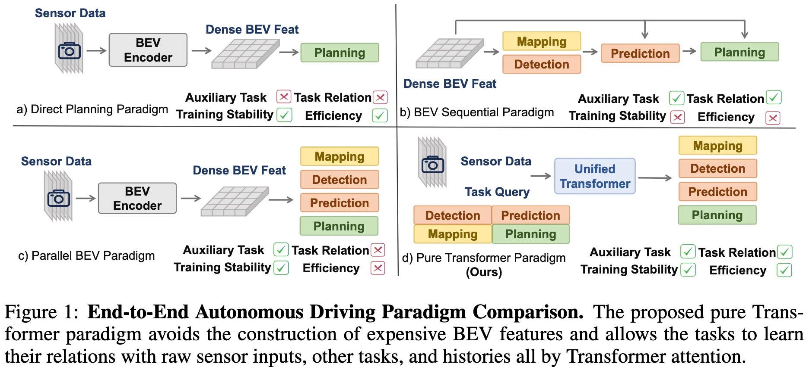

+++
date = '2025-06-10T21:53:08+08:00'
draft = false
title = 'DriveTransformer'
categories = []
tags = []
+++

[ICLR 2025](https://iclr.cc/virtual/2025/poster/29956) &middot; Shanghai AI Lab &middot; [arXiv](https://arxiv.org/abs/2503.07656) &middot; [GitHub](https://github.com/Thinklab-SJTU/DriveTransformer/) \
[OpenReview](https://openreview.net/forum?id=M42KR4W9P5)

## Motivations

## Contributions

## Method

## Experiments
Test content.

## References
-  
- 
- 

## Questions
