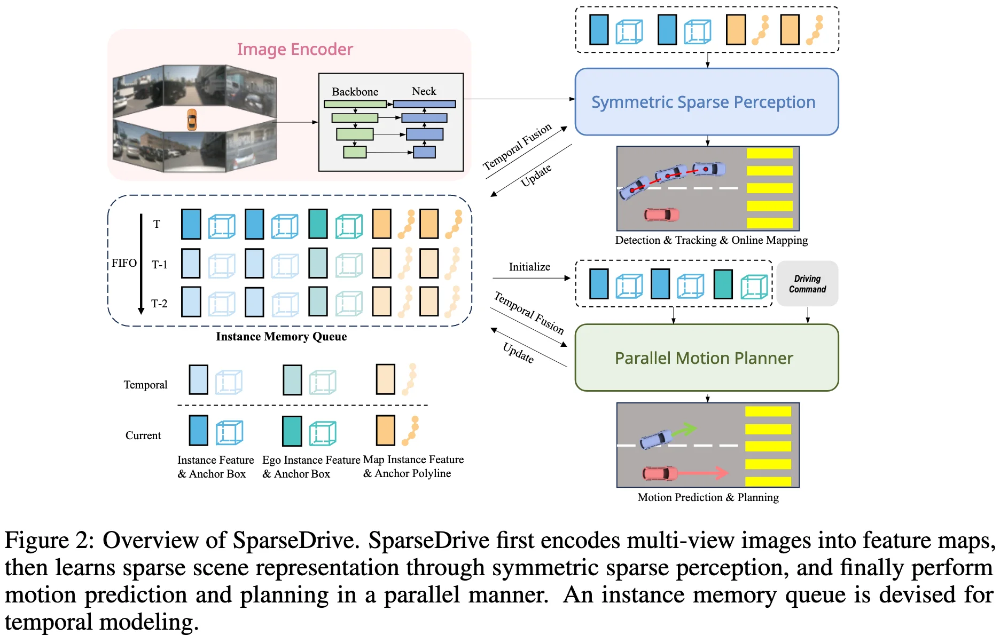

+++
date = '2025-06-10T22:20:18+08:00'
draft = false
title = 'SparseDrive'
categories = []
tags = []
+++

() &middot; [arXiv]() &middot; [Code]()

## Motivations

## Contributions

## Method

## Experiments
Test content.

## References
-  
- 
- 

## Questions
