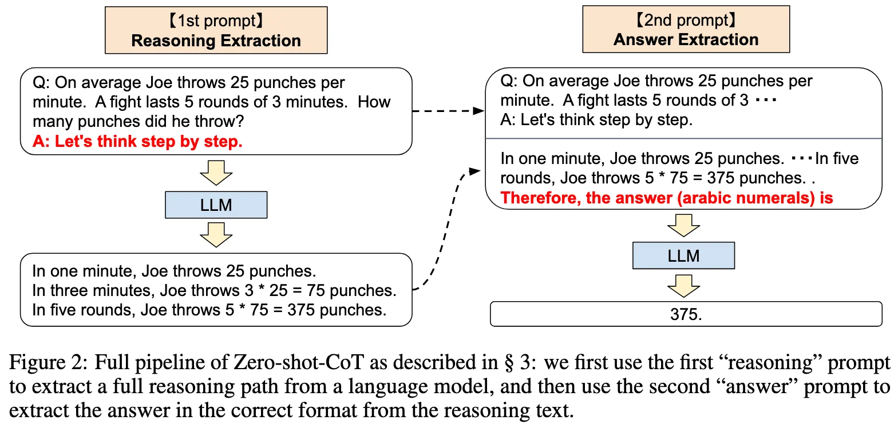
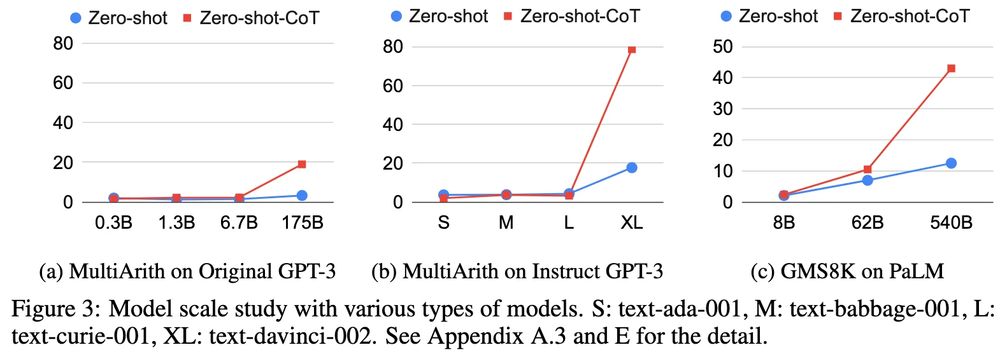

+++
date = '2022-05-24T17:41:26+08:00'
draft = false
title = 'Zero-shot-CoT: Large Language Models are Zero-Shot Reasoners'
categories = ['LLMs']
tags = ['LLMs', 'Chain-of-Thought']
+++

:(fas fa-award fa-fw):NeurIPS 2022
:(fas fa-building fa-fw):Google Research, Brain Team
:(fas fa-file-pdf fa-fw):[arXiv 2205.11916](https://arxiv.org/abs/2205.11916)

## TL;DR

Zero-shot-CoT, a zero-shot task-agnostic prompt (**Let's think step by step.**) without any step-by-step few-shot examples, elicits multi-hop reasoning ability.

## Motivations & Innovations

- The success of large language models is often attributed to (in-context) few-shot learning called "prompting".
- With CoT prompting, the reasoning performance satisfies the scaling laws better and jumps up with the size of the language model.

## Approach: Two-stage Prompting

### 1st Prompt: Reasoning Extraction

### 2nd Prompt: Answer Extraction

## Experiments

**Zero-shot-CoT vs Zero-shot**: 

**Comparison with other baselines**:

**Does model size matter for zero-shot reasoning?**: Yes

**How does prompt selection affect Few-shot-CoT**: 

