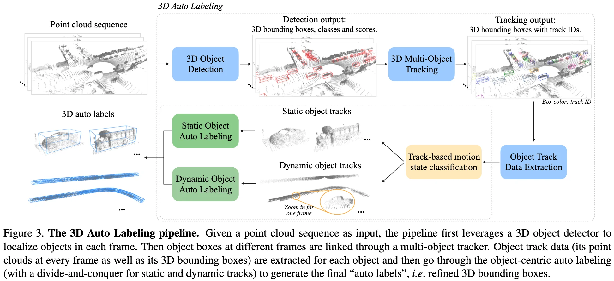
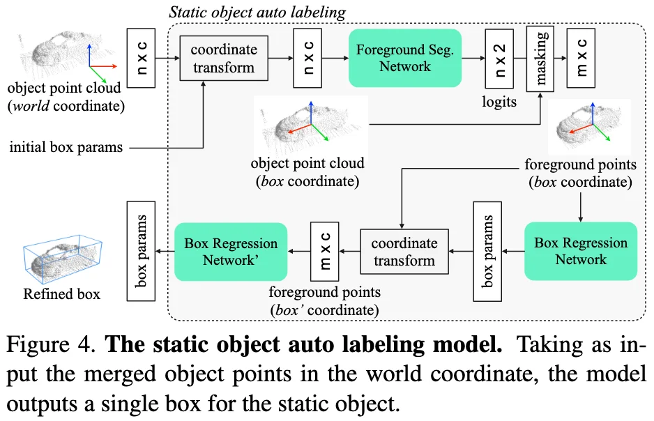
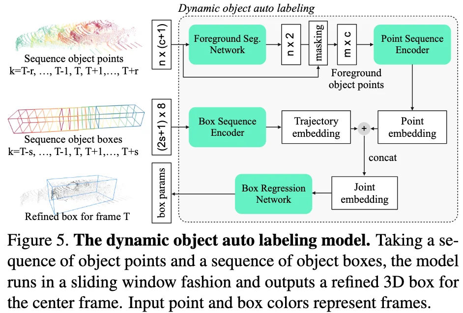

+++
date = '2021-03-08T11:38:25+08:00'
draft = false
title = '3DAL: Offboard 3D Object Detection from Point Cloud Sequences'
categories = ['Auto-GT']
tags = ['Auto-GT', 'Auto-GT-OD']
+++

:(fas fa-award fa-fw):
:(fas fa-building fa-fw):Waymo LLC
:(fas fa-file-pdf fa-fw):[arXiv 2103.13612](https://arxiv.org/abs/2103.13612)

## TL;DR

## Motivations & Innovations

## Approach

### Multi-frame 3D Object Detection

### Multi-object Tracking

tracking-by-detection: using detector boxes for associations and Kalman filter for state updates.

### Object Track Data Extraction

### Object-centric Auto Labeling
#### Divide and conquer: motion state estimation

A linear classifier using a few heuristic features from the object track’s boxes can already achieve 99%+ motion state classification accuracy for vehicles.

#### Static object auto labeling

#### Dynamic object auto labeling

