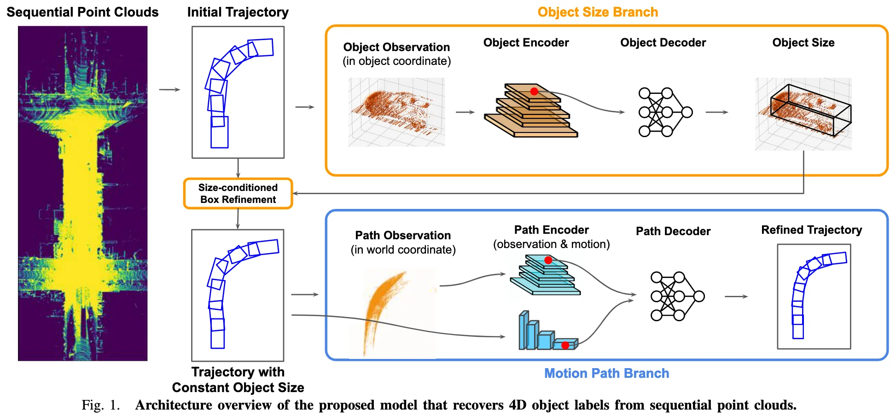

+++
date = '2021-01-17T11:56:49+08:00'
draft = true
title = 'Auto4D: Learning to Label 4D Objects from Sequential Point Clouds'
categories = ['Auto-GT']
tags = ['Auto-GT', 'Auto-GT-OD']
+++

:(fas fa-award fa-fw):
:(fas fa-building fa-fw):
:(fas fa-file-pdf fa-fw):[arXiv 2101.06586](https://arxiv.org/abs/2101.06586)
:(fab fa-github fa-fw):

## TL;DR

## Motivations & Innovations

## Approach

