+++
date = '2023-12-01T10:47:14+08:00'
draft = false
title = 'Horizon'
categories = ['Auto-GT']
tags = ['Auto-GT']
+++

【「你好，开发者」面向BEV感知的4D标注方案】https://www.bilibili.com/video/BV1JC4y1A7hp?vd_source=e05fafaa995c59e16affc059ba418214

4D: Temporal 3D

在3D 空间标注，需要3D重建

- 静态要素
- 动态要素
- 通用障碍物 (occupancy)

- 冷启动：4D 重建 -> 人工标注
- 自动化预标注：随着数据积累到一定程度，训练云端大模型进行预标注，大幅提升标注效率。

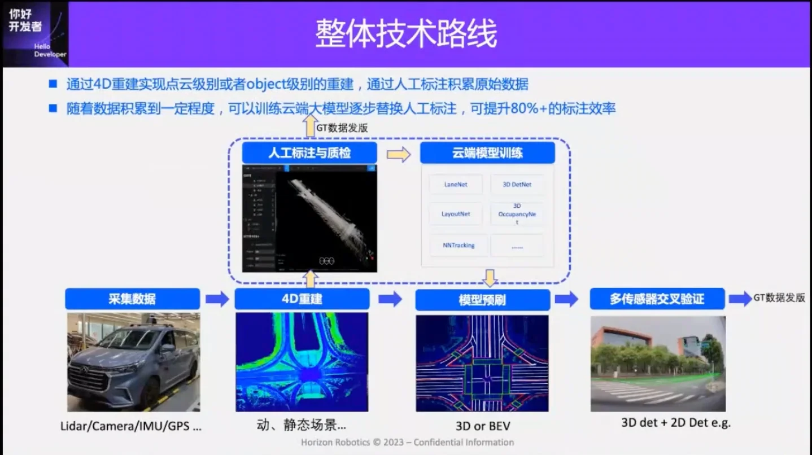

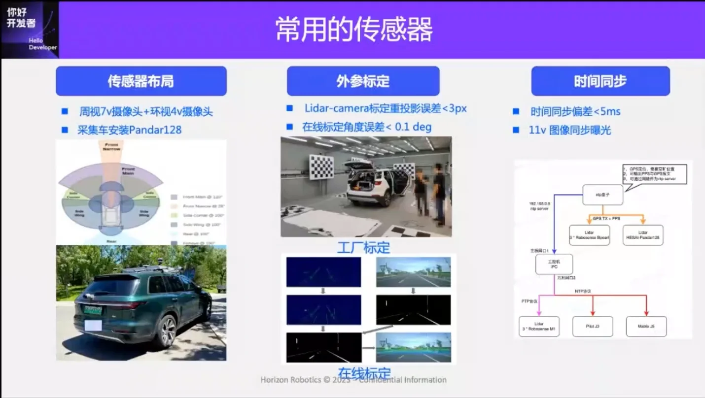

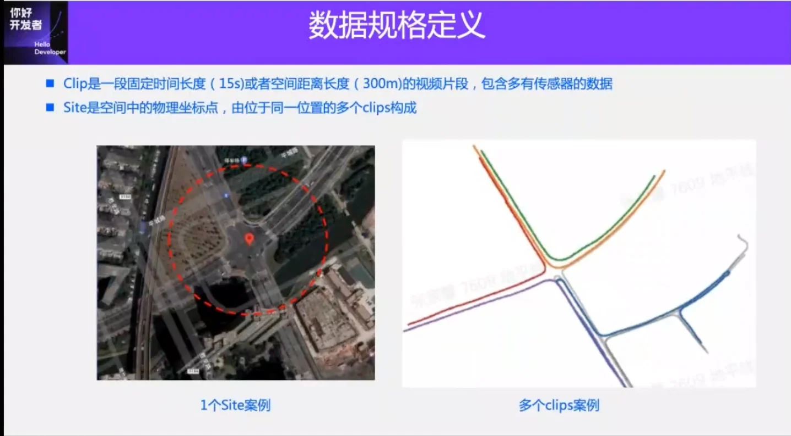

## 面向采集场景的多模态标注方案

### 静态要素

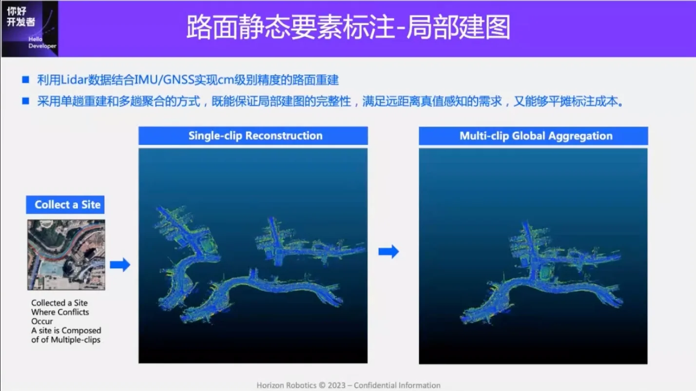

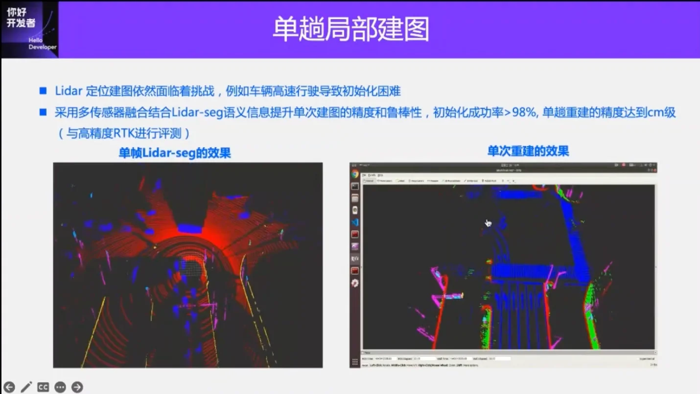

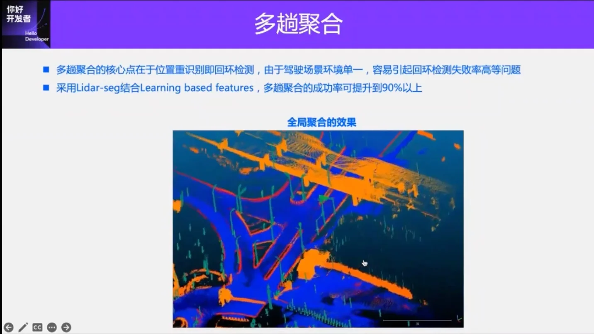

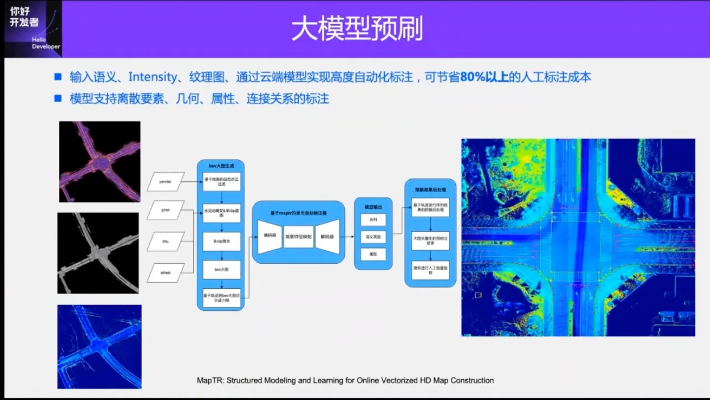

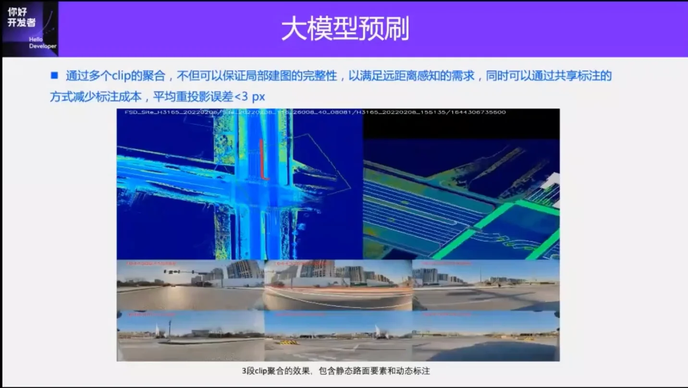

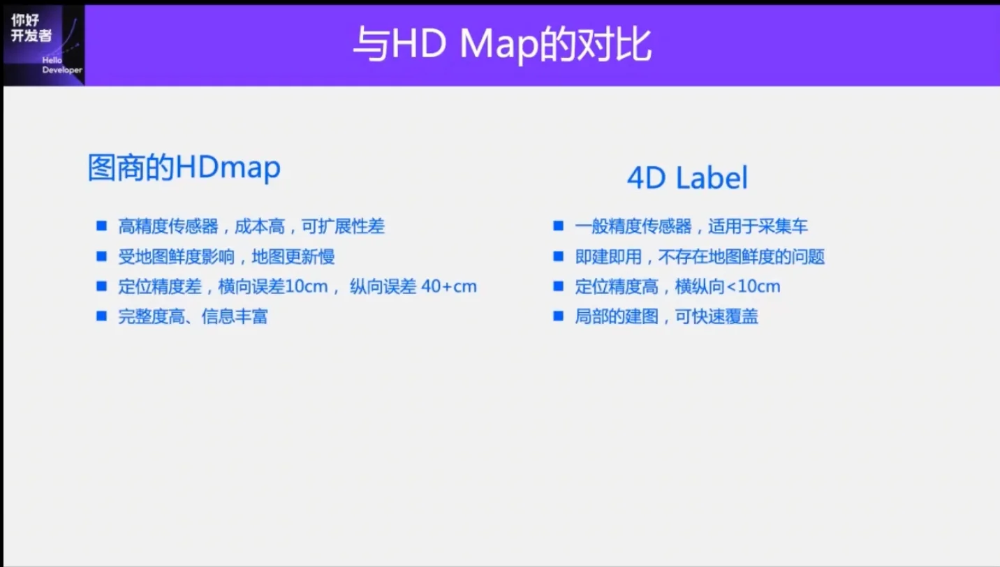

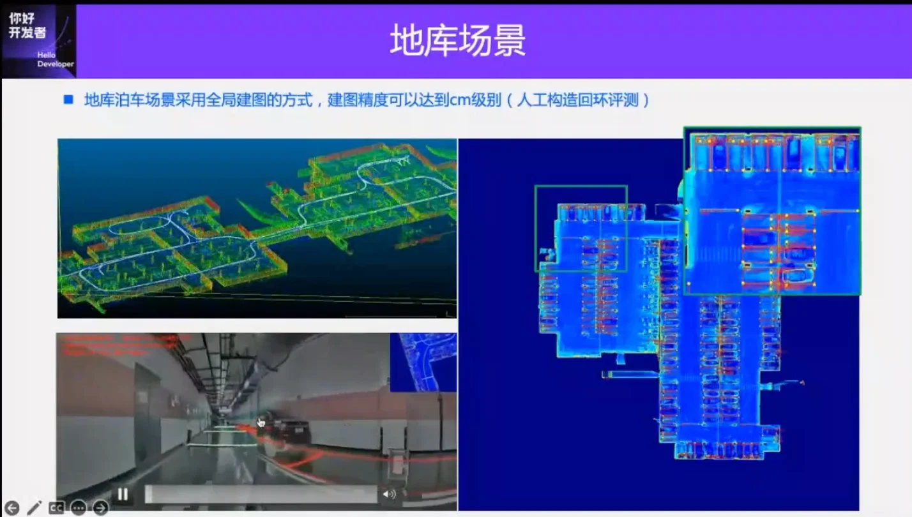

### 动态要素

LiDAR + 视觉 后融合，可以利用未来信息辅助当前标注；

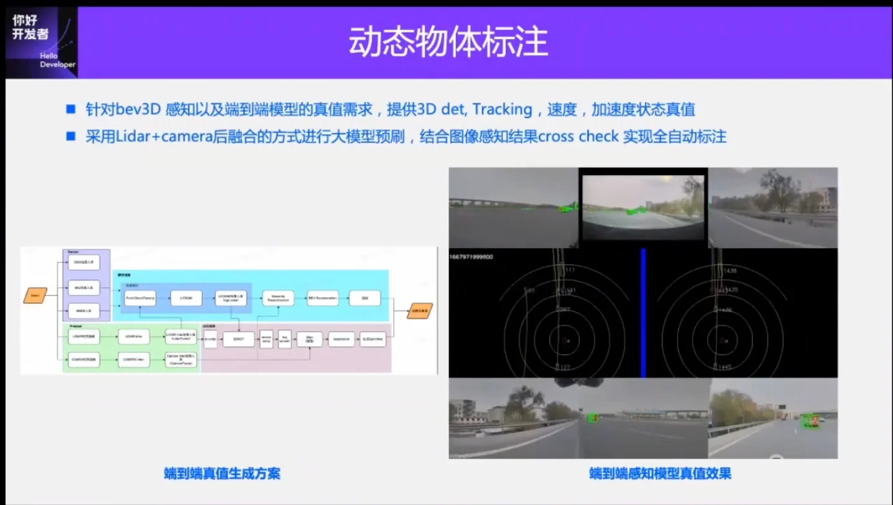

LiDAR 单帧感知 + tracking 后处理 + 结合ego pose 得到 global trajectory + 轨迹优化(轨迹的平滑性/动力学约束等) + 利用传感器时间同步信息做插值 + 3D&2D预刷自动质检

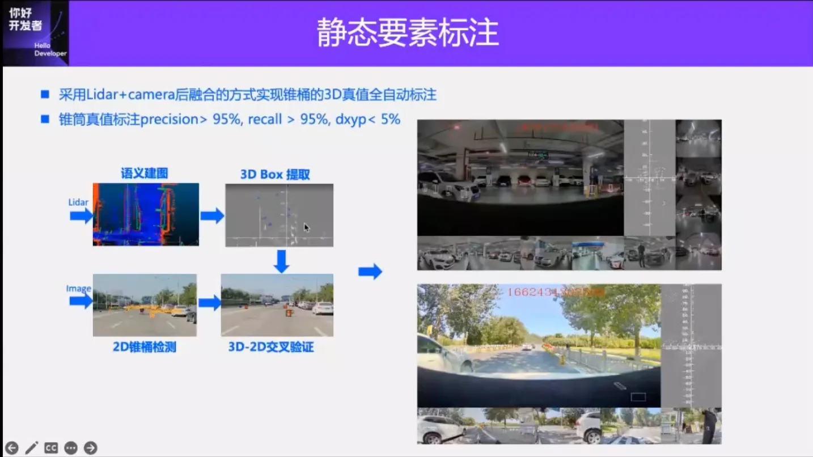
测距误差50m 内小于5%

## 通用障碍物

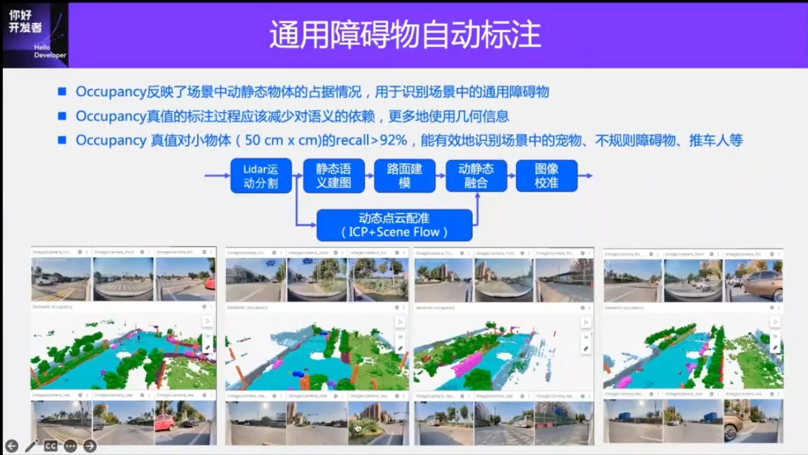

## 面向量产场景的纯视觉标注方案

