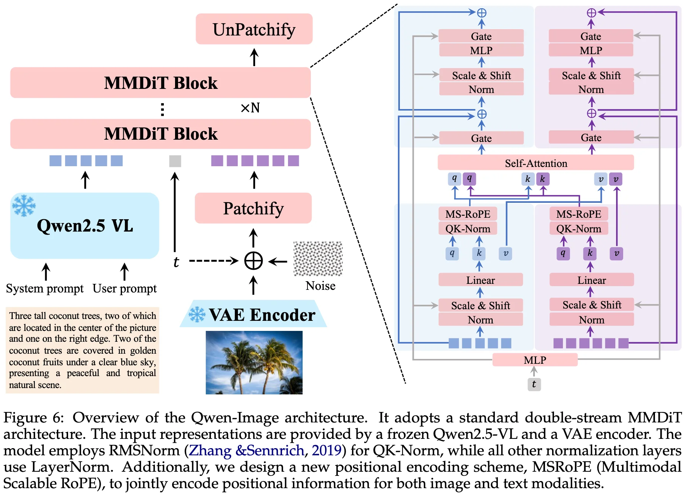
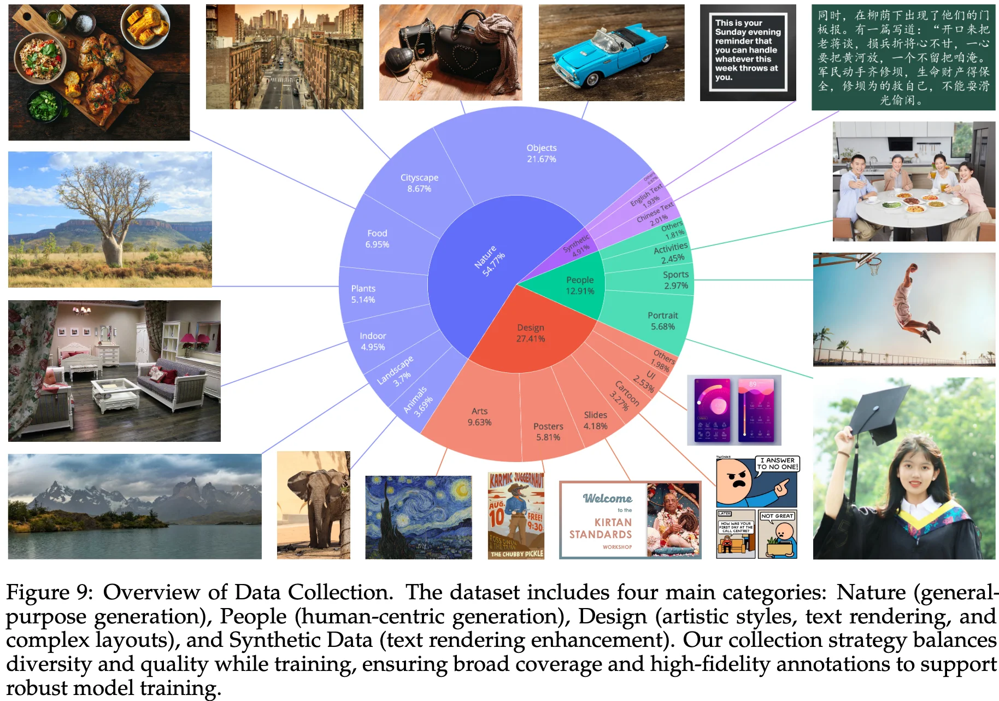
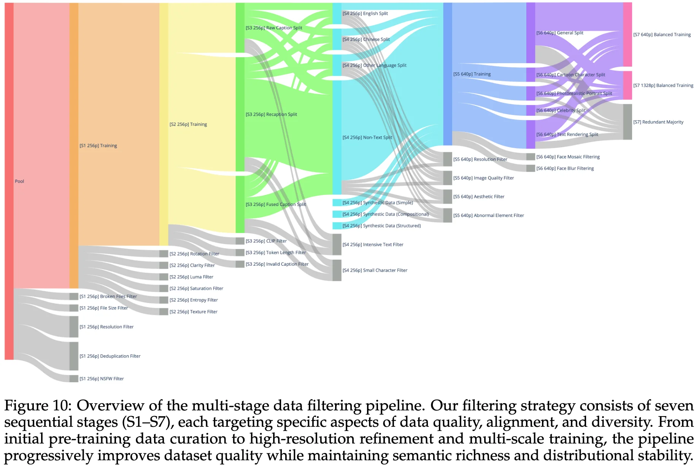
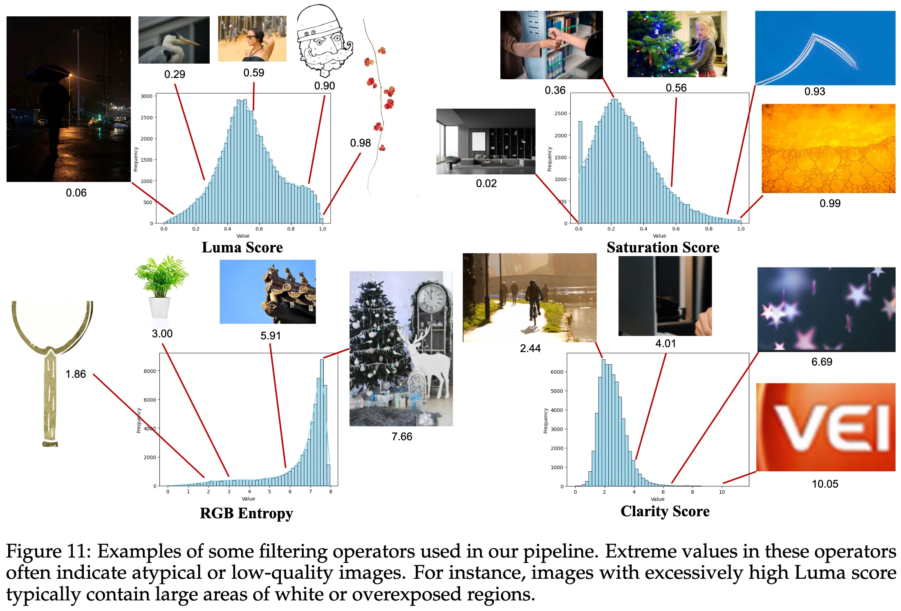
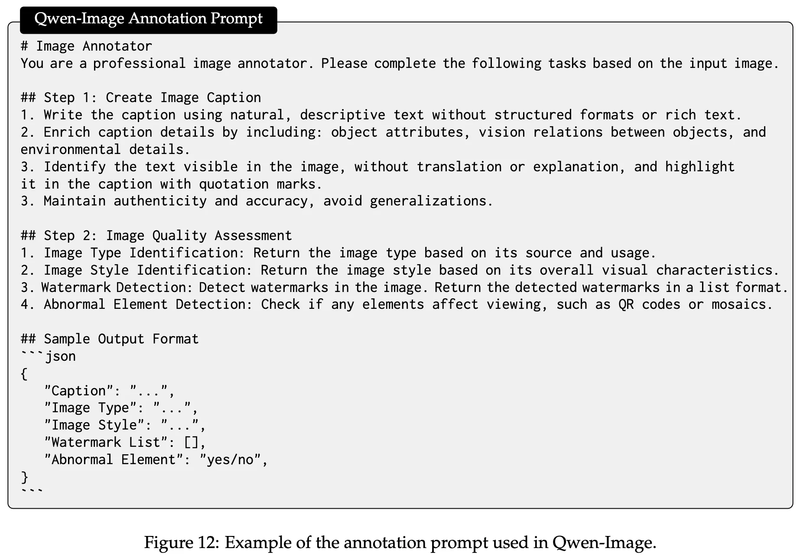
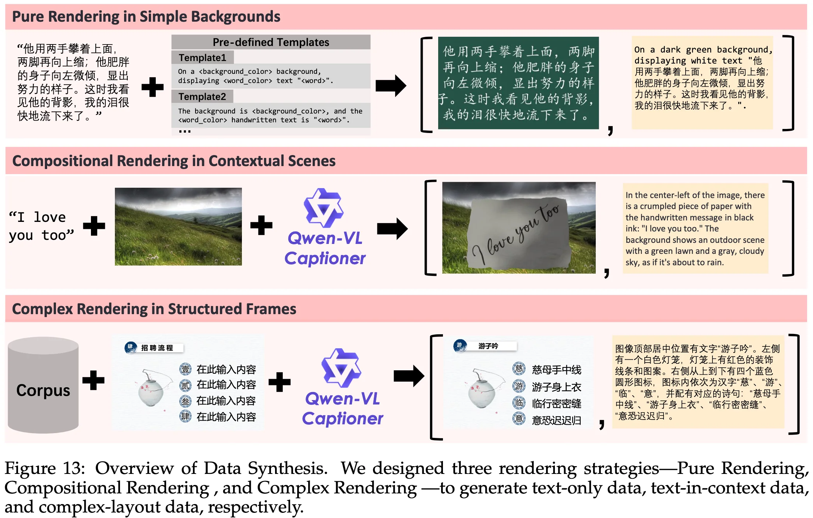

+++
date = '2025-11-24T16:33:51+08:00'
draft = false
title = 'Qwen-Image Technical Report'
organization = ['Qwen']
categories = []
tags = []
+++

[arXiv](https://arxiv.org/pdf/2508.02324) &middot; [GitHub](https://github.com/QwenLM/Qwen-Image) &middot; [HuggingFace](https://huggingface.co/Qwen/Qwen-Image) &middot; [ModelScope](https://modelscope.cn/models/Qwen/Qwen-Image)

Abstract

Motivations

20B

high-fidelity text rendering across diverse images.

O

## Model

### Multi-modal Large Language Model (MLLM)

serves as the condition encoder, respnsible extracting feature from textual inputs.

text tokenizer: Qwen2.5-VL

### Variational AutoEncoder (VAE)

acts as the image tokenizer, compressing input images into compact latent representations and decoding them back during inferenece.

### Multi-modal Diffusion Transformer (MMDiT)

function as the backbone diffusion model, modeling the complex joint distribution between noise and image latents under text guidance.

## Data

### Data Collection

The Qwen Image dataset, which contains billions of image-text paris, prioritizes **data quality** and **balanced data distribution** over **the scale of data**, and is organized into four primary domains:

- **Nature (~55%)**: **general-purpose generation**, includes Objects, Landscape, Cityscape, Plants, Animals, Indoor, Food and other categories that does not clearly belong to the People or Design categories.
- **Design (~27%)**: **artistic styles, text rendering, and complex layouts**, comprises structured visual content such as Posters, User Interfaces, and Presentation Slides, as well as various forms of art including Paintings, Sculptures, Art Crafts, and Digital Arts.
- **People (~13%)**: **human-centric generation**, encompasses Portrait, Sports, and Human Activities, and so on.
- **Synthetic Data (~5%)**: **text rendering enhancement**, solely includes synthetic data synthesized through controlled text rendering techniques, while explicitly excluding images synthesized by other AI models to mitigate risks such as visual artifacts, text distortions, biases, and hallucinations。

### Data Filtering

**Stage 1: Initial Pre-training Data Curation**: At this early stage, the model is trained on images resized to 256p (256x256 pixels with various aspect ratios including 1:1, 2:3, 3:2, 3:4, 4:3, 9:16, 16:9, 1:3 and 3:1).

- Broken Files Filter: identify and discard corrupted or partially damaged files.
- File Size Filter: detect images with abnormally small file size.
- Resolution Filter: remove images with original resolution below 256p.
- Deduplication Filter: eliminate duplicate or near-duplicate image-text pairs.
- NSFW Filter: exclude content containing sexual, violent, or other offensive materials.

**Stage 2: Image Quality Enhancement**:

- Rotation Filter: remove images with significant rotation or flipping, as indicated by the EXIF metadata.
- Clarity Filter: discard blurry or out-of-focus images, ensuring that only sharp and clear images are retained.
- Luma Filter: exclude images that are excessively bright or dark
- Saturation Filter: eliminate images with unnaturally high color saturation, which often suggests artificial rendering or unrealistic digital manipulations.
- Entropy Filter: identify and remove images with significantly low entropy, typically characterized by large uniform regions or minimal visual content.
- Texture Filter: discard images with overly complex textures, which are often associated with noise or non-semantic patterns.

**Stage 3: Image-Text Alignment Improvement**: To balance the training data distribution, the dataset is divided into three splits based on the source of captions:

- **Raw Caption Split**: includes captions provided by websites as well as metadata such as titles or tags originally associated with the images. Although raw captions may introduce noise, they contribute to the model's robustness in handling **short text inputs** and serve as a vital source of **real-world knowledge (e.g., plant names, cartoon IPs) often absent in datasets with synthesized captions**.
- **Recaption Split**: consist of captions generated by Qwen-VL Captioner, which provides more **descriptive and structured annotations**.
- **Fused Caption Split**: **To compensate for the model limitations in accuratedly identifying all IPs**, Fused Caption Split combines both raw captions and synthesized captions, offering a blend of general knowledge and detailed descriptions.

To improve the alignment between textual descriptions and visual content, we applied:

- Chinese CLIP Filter and SigLIP 2 Filter: remove mismatched image-text pairs.
- Token Length Filter: eliminate excessively long captions
- Invalid Caption Filter: discard captions with abnormal content, such as "Sorry, I can not provide a caption for this image."

**Stage 4: Text Rendering Enhancement**: To ensure balanced training across different linguistic contexts, we categorize the dataset based on the presence and language of text within images into four splits:

- English Split
- Chinese Split
- Other Language Split
- Non-Text Split

To address challenges such as low-frequency characters, mixed-language sceneiors, and font diversity, we incorporate synthetic text rendering data (reference to the Synthetic Data). Moreover, we apply:

- Intensive Text Filter: remove images with overly dense text
- Small Character Filter: remove images with excessively small text

**Stage 5: High-Resolution Refinement**: In this stage, the model transitions to training with images at 640p resolution. To further refine dataset, we apply:

- Resolution Filter: remove images meeting the minimum resolution requirements.
- Aesthetic Filter: exclude images with poor composition or visual appeal.
- Abnormal Element Filter: remove images containing watermarks, QR codes, barcodes, or other elements that can interfere with viewing.

**Stage 6: Category Balance and Portrait Augmentation**:

- **Category Balance**: After identifying underperformed categories through careful error analysis, this stage recategorizes the dataset into three primary categories: General, Portrait, Text Rendering to facilitate category-based rebalancing during training. Keyword-baswed retrieval and image retrieval techniques are employed to augment the coverage of underrepresented categories.
- **Portrait Augmentation**: We first retrieve photorealistic portraits, cartoon characters, and celebrity images from the People category. Synthesized captions are then generated to emphasize character-specific details, such as facial features, expressions, and clothing, as well as contextual elements such as background, lighting, and mood.

**Stage 7: Balanced Multi-Scale Training**: In the final stage, the model is trained jointly on images with resolution of 640p and 1328p. Imposing a strict resolution threhold of 1328p would lead to significant data loss and distort the underlying data distribution. To improve training efficiency and ensure balanced data distribution, we design a hierarchical taxonomy system for image categorization. Within each category, we retain only images with the highest quality and aesthetic appeal. Such balanced multi-scale training allows the model to retain previously learned general knowledge and ensure stable convergence while adapting to higher-resolution inputs.

### Data Annotation

We build an efficient and scalable annotation pieline with a capable image captioner (e.g., **Qwen2.5-VL**) to generate not only comprehensive image descriptions, but also structured metadata that captures essential image properties and quality attributes.

### Data Synthesis

To **address the challenge of the long-tail distribution of textual content in real-world images and improve the robustness of text rendering across diverse contexts**, we propose a multi-stage text-aware image synthesis pipeline:

- **Pure Rendering in Simple Backgrounds**: **This strategy represents the most straightforward and effective method**. Text paragraphs are extracted from large-scale corpora and rendered onto clean backgrounds using dynamic layout algorithms that adapt font size and spacing based on canvas size. To guarantee high fidelity in character-level text rendering, if any character within a paragraph cannot be rendered, the entire paragraph is discarded.
- **Compositional Rendering in Contextual Scenes**: **This strategy focuses on embedding synthetic text into realistic visual contexts, mimicking its appearance in everyday environment**. Text is simulated as being written or printed onto various physical media, such as paper or wooden boards, and then seamlessly composited into diverse background images. We employ the **Qwen-VL Captioner** to generate descriptive captions for each synthesized image, capturing contextual relationships between the text and its surrouding visual elements.
- **Complex Rendering in Structured Templates**: To **improve the model’s capacity to follow complex, structured prompts involving layout-sensitive content**, we propose a synthesis strategy based on **programmatic editing of pre-defined templates, such as PowerPoint slides or User Interface Mockups.**

## Training

Patrick Esser, Sumith Kulal, Andreas Blattmann, Rahim Entezari, Jonas Müller, Harry Saini, Yam Levi, Dominik Lorenz, Axel Sauer, Frederic Boesel, et al. Scaling rectified flow transformers for highresolution image synthesis. In ICML, 2024.

### Pre-training

#### Training Strategy

123

### Post-training

#### Supervised Fine-Tuning (SFT)

#### Reinforcement Learning (RL)

**Direct Preference Optimization (DPO)**:

**Group Relative Policy Optimization (GRPO)**

### Multi-task training

## Qwen Image Editing (TI2I)
