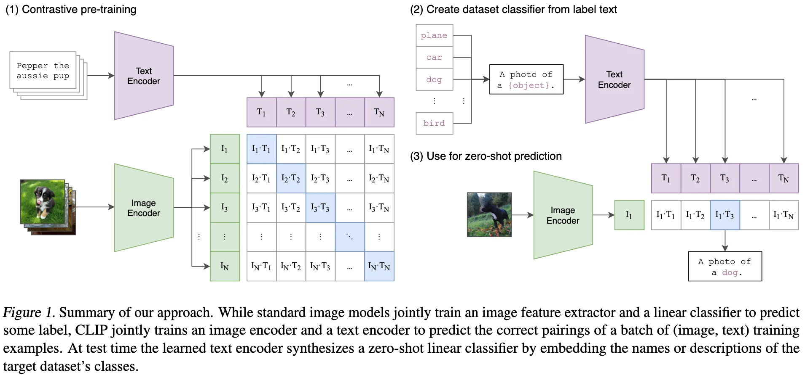

+++
date = '2021-03-01T15:15:52+08:00'
draft = false
title = 'CLIP: Learning Transferable Visual Models From Natural Language Supervision'
categories = ['CLIPs']
tags = ['CLIP123', 'abc', 'dce']
+++

OpenAI &middot; [arXiv](https://arxiv.org/abs/2103.00020) &middot; [GitHub](https://github.com/OpenAI/CLIP)

123fgdffsadf
dfasdf
fdsaasdf
sdfas
fdas

fasd

## Motivation

## Contribution

## Method

## Experiment

Test content.

## References

## Question
