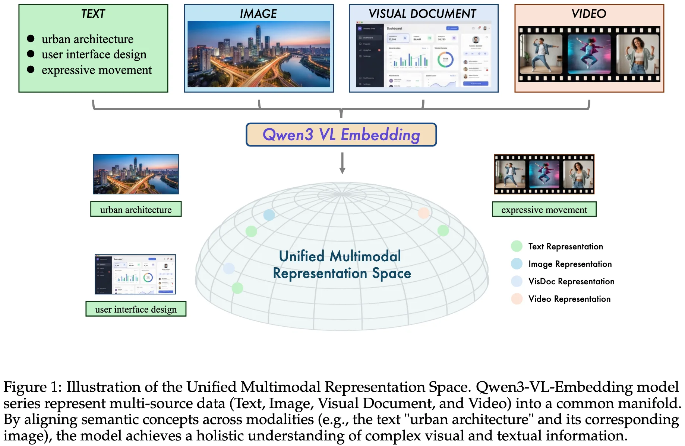
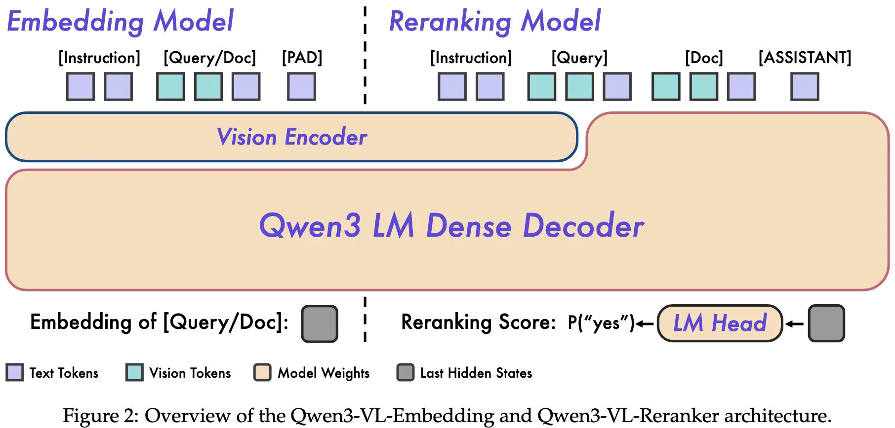
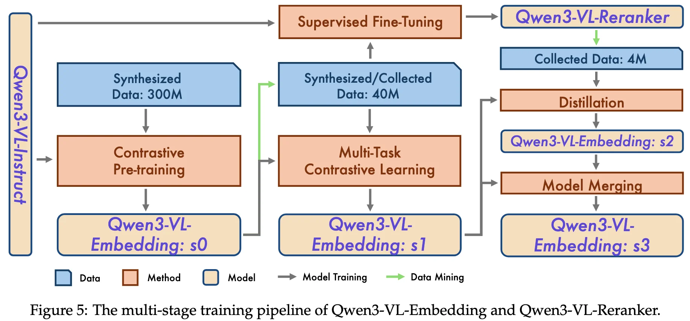

+++
date = '2026-01-08T16:44:10+08:00'
draft = false
title = 'Qwen3-VL-Embedding and Qwen3-VL-Reranker: A Unified Framework for State-of-the-Art Multimodal Retrieval and Ranking'
categories = ['CLIPs']
tags = ['CLIPs', 'Qwen3-VL-Embedding', 'Qwen3-VL-Reranker']
+++

:(fas fa-award fa-fw):
:(fas fa-building fa-fw):Tongyi Lab, Alibaba Group
:(fas fa-file-pdf fa-fw):[arXiv 2601.04720](https://arxiv.org/abs/2601.04720)
:(fab fa-github fa-fw):[QwenLM/Qwen3-VL-Embedding](https://github.com/QwenLM/Qwen3-VL-Embedding)

:(fas fa-globe fa-fw):
:(fas fa-blog fa-fw):[blog](https://qwen.ai/blog?id=qwen3-vl-embedding)

## TL;DR

## Motivations & Innovations

## Approach

### Model Architecture

### Training Recipe

### Data Recipe

## Experiments

