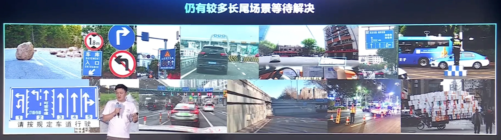
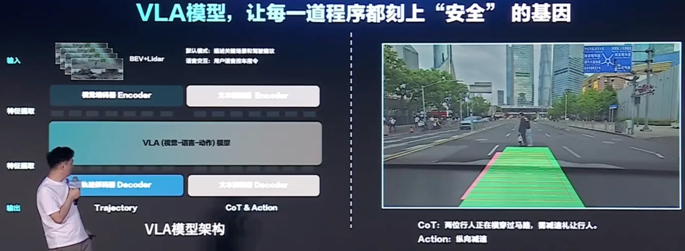
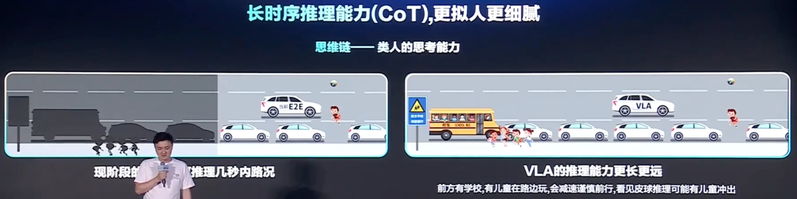
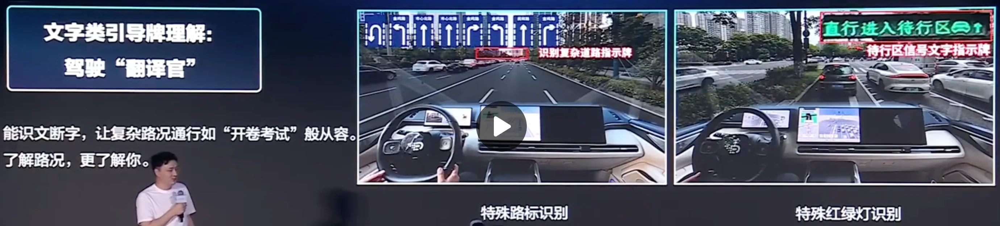
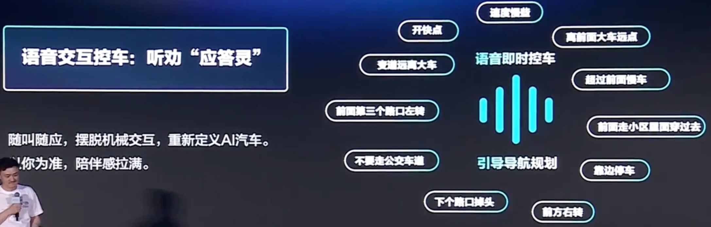
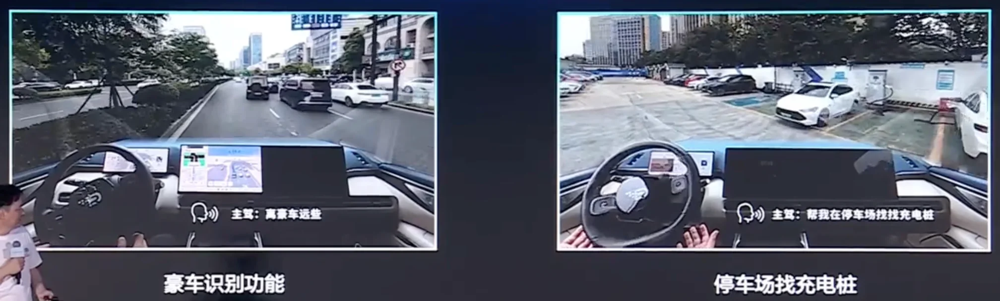

+++
date = '2025-06-18T13:54:15+08:00'
draft = false
title = '更AI 更安全'
organization = ['Deep Route']
categories = []
tags = []
+++

关于新一代的VLA模型有什么功能，理想在今年3月份的GTC上已经给了一些小小的剧透；
理想已经在一季度的财报会上预告：7月理想将发布纯电SUV i8，并同步推出基于VLA模型的辅助驾驶系统。
理想 AI Talk：他们内部认为：如果规则算法都做不好，根本不知道怎么去做端到端；如果端到端没有做到一个非常极致的水平，那连VLA（视觉语言行动模型）怎么去训练都不知道。换句话说，在端到端上取得大规模成功量产经验，是探索VLA的一个门槛。
理想已经预告了除了Thor U版本，VLA也将在双OrinX版上能跑起来。
关于新一代的VLA模型有什么功能，理想在今年3月份的GTC上已经给了一些小小的剧透；

6月11日刚刚揭幕了全新的G7，G7首发了自研的图灵芯片，并且一次就搭载3颗，拥有超过2200 Tops的算力。基于这个级别的算力，小鹏正在云端训练超大规模的VLA模型，称之为VLA-OL（Online Reenforcement Learning）；接下来，小鹏将通过蒸馏的方式将VLA部署到车端。

元戎启行可能是对VLA推进得最早、最快的一家公司，其在去年6月份第一次对外公开谈到在开发VLA，其预计今年将有至少5款车搭载元戎启行提供的VLA模型上市，其中最早的车型预计在三季度量产并上线功能。
元戎启行的CEO周光在火山引擎Force大会上披露了更多细节。元戎重点展示了基于VLA 4个主要的能力：

- 潮汐车道
- 异形障碍物
- 空间理解

黑盒 -> 可解释性
防御性驾驶不够
人机交互过于"机械"

语言带来的思考和逻辑思维能力；

1. 空间语义理解
2. 异形障碍物识别
3. 文字类引导牌理解: 
4. [模糊]语音控车

云端大模型，离线实时推理

首次搭载 VLA 模型的车型即将上市 (预计超5款车陆续上市)，适配不同平台，2025年预期20w+量产车搭载。通过蒸馏方式适配更多的芯片平台
支持激光雷达和纯视觉辅助驾驶方案

## References
- https://www.volcengine.com/live/event/force-2506-session-AIVehicle (58:00)