+++
date = '2025-11-18T12:22:50+08:00'
draft = false
title = 'Building an Autonomous Future (ICCV 2025 WDFM-AD)'
organization = ['Tesla']
categories = []
tags = []
+++

Ashok Elluswamy, VP, Tesla

## Recently Achievements

- 2025.06, launch robotaxi service
- deliver the first self-driving production vehicle from the tesla factory in austin to customer's home in austin (20-30 minutes).
- in the us, the production vehicle delivers itself from the manufacturing line to the loding docks (a couple miles away).

## End-to-End Foundation Model at Scale

- Map raw sensor inputs directly to control signal (next steering and acceleration (two tokens) -> steering angle, throttle, brake)
- Runs at 36Hz
- Perception can be implicit and can be trained as auxiliary things

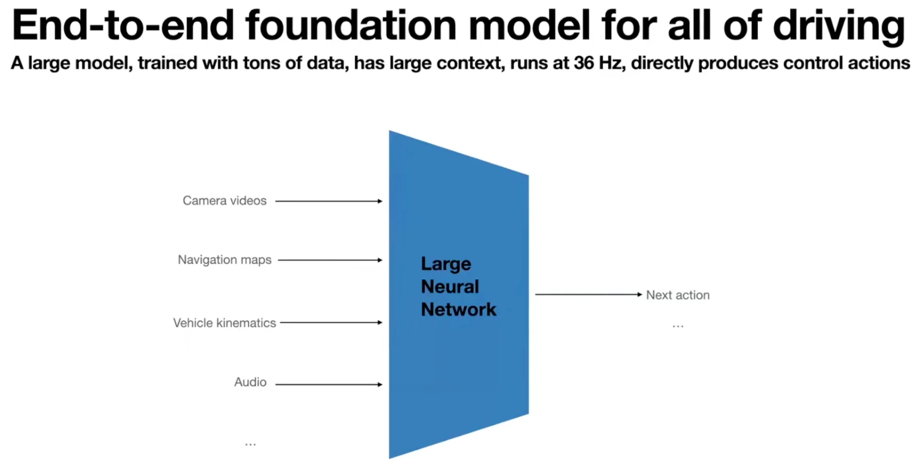

## Why End-to-End?

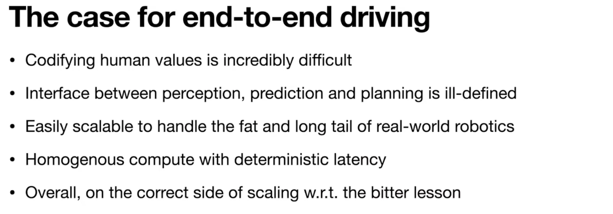

### Codifying human values is incredibly difficult

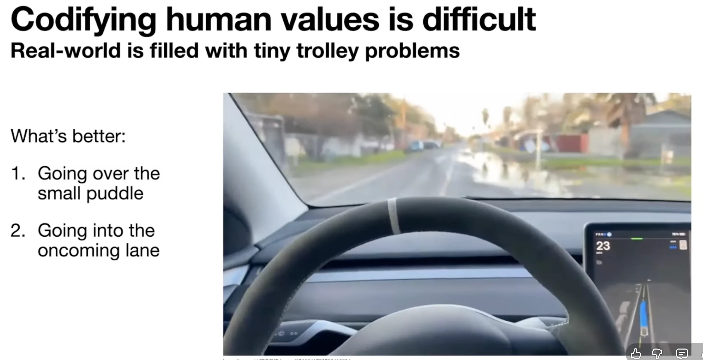

### Interface between perception, prediction and planning is ill-defined

  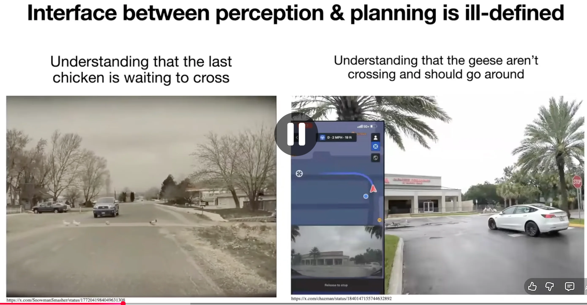

## Challenges of End-to-End

### Curse of dimensionality

- Problem: scale mismatch between input and output
- Solution:
  - large data: Tesla fleet can provide 500 years of driving data every single day.
  - data engine

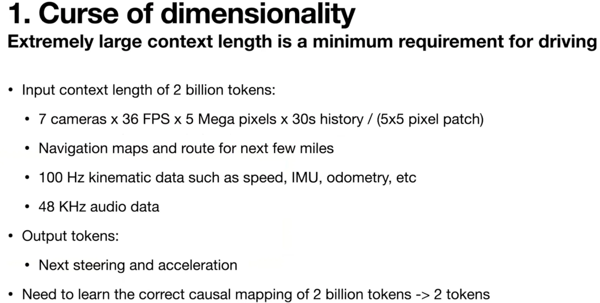

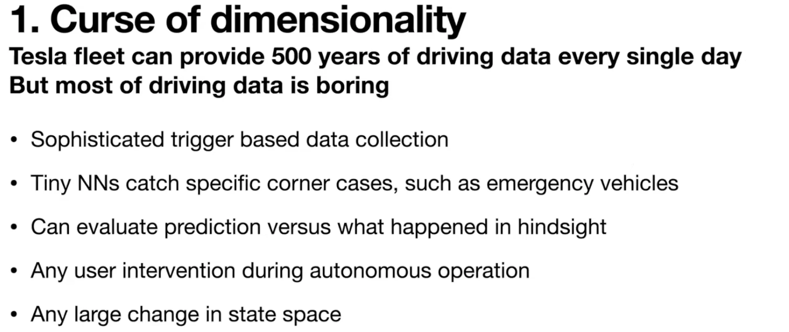

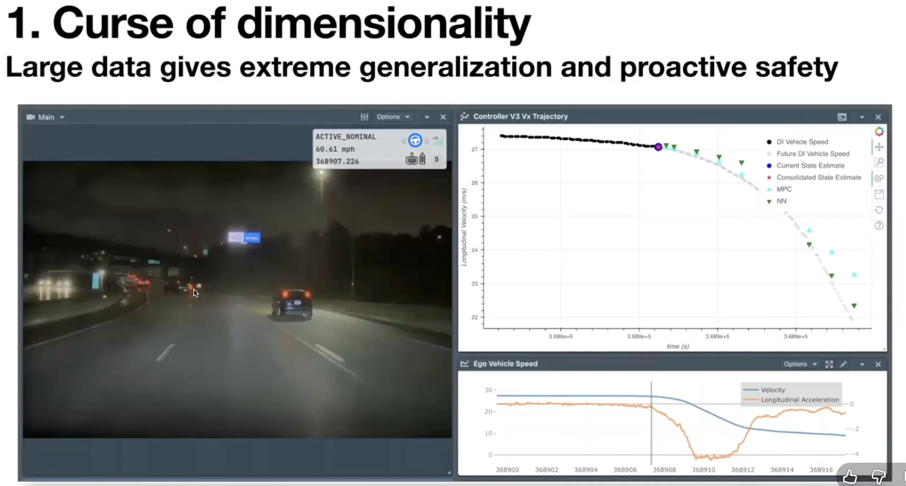

### Interpretability, Safety Guarantees and Internal Supervision

#### Rich Intermediate Outputs: Perception, 3DGS, Language

- with prompts
- auxiliary but helpful

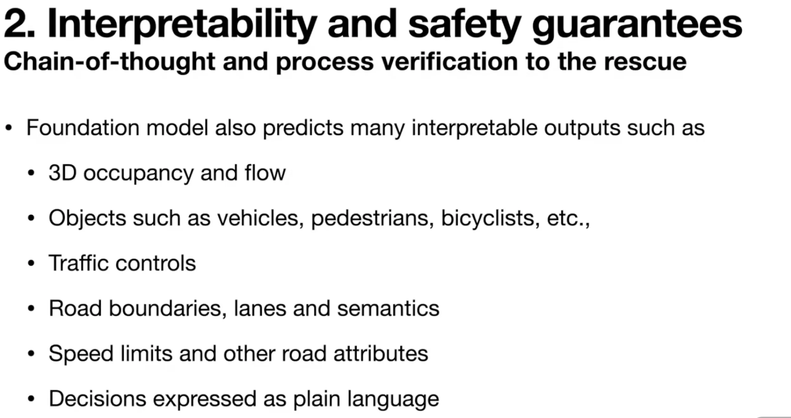

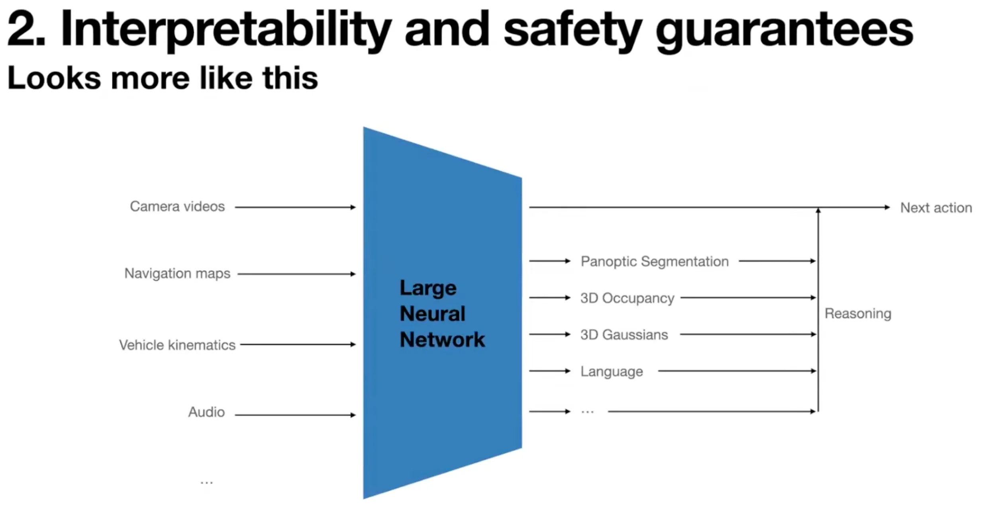

#### Efficient 3D Gaussian Splatting for System Debugging

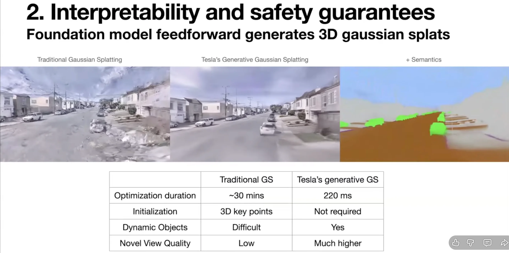

#### Real-Time and Reflective Modes in a Single Model （Dual-Mode）

- A fast path for low-lattency control, used in normal driving
- [optional] A reflective mode for introspection, where the model can emit reasoning tokens and natural language summaries of its decision logic when more time is available.

### Evaluation (Hardest of All)

- Training loss and open-loop metrics can not indicate closed-loop performance.
- Safety-critical driving policy is multi-modal, and can not be judged by distance-to-ground-truth alone.

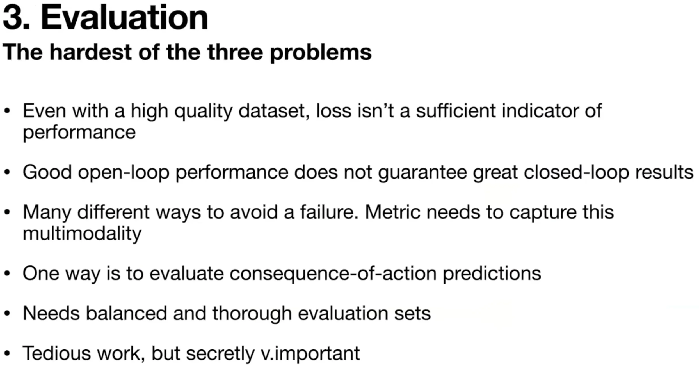

#### Neural Network Closed-loop World Simulator

- closed-loop evaluation
- closed-loop reinforcement learning

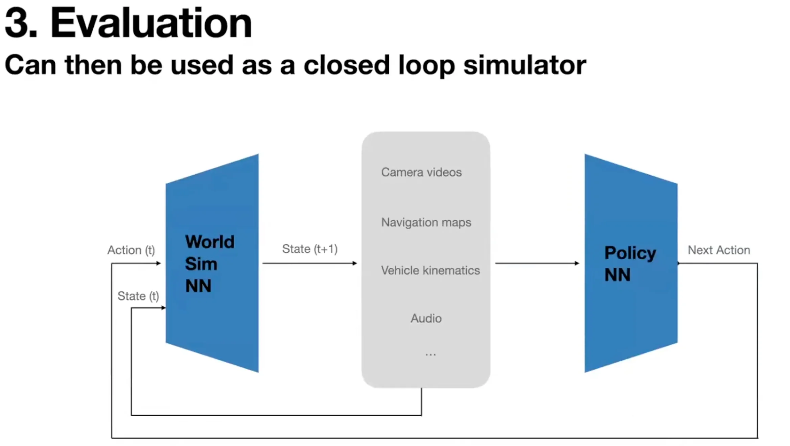

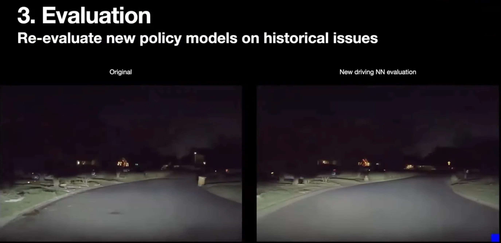

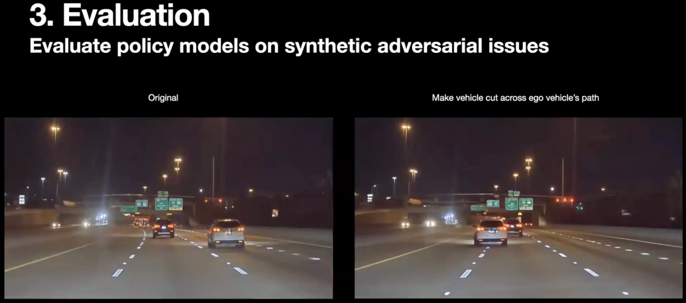

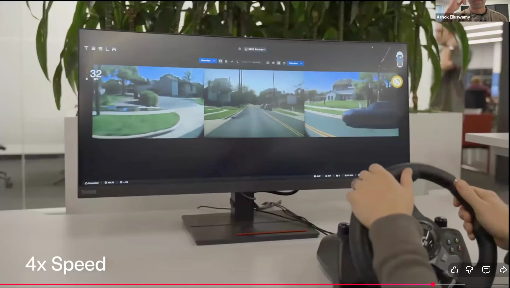

## What's Next

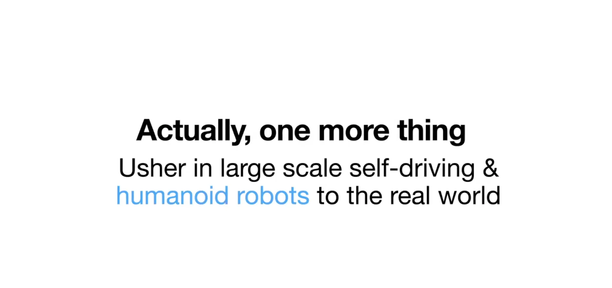

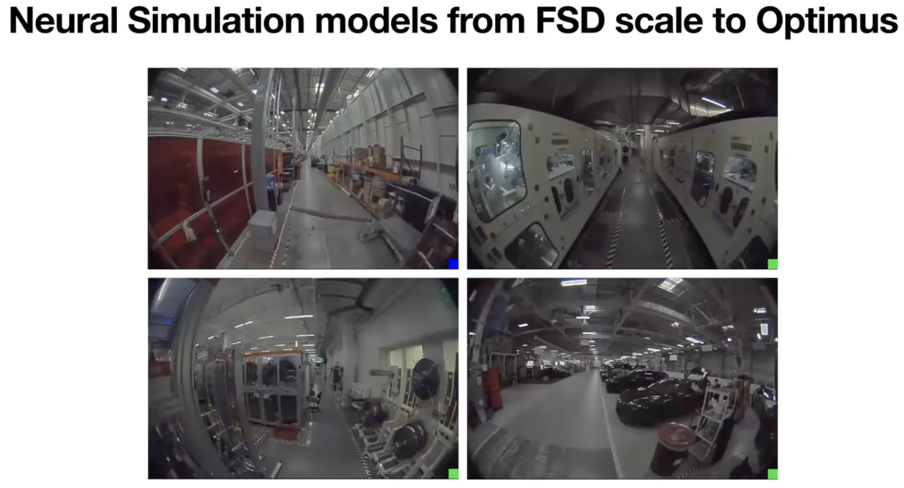

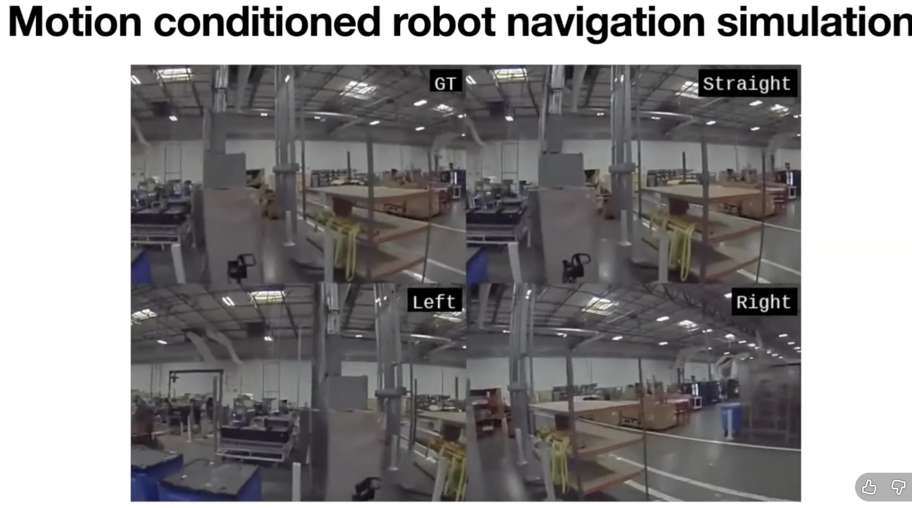

## References

- [The 2nd Workshop on Distillation of Foundation Models for Autonomous Driving (WDFM-AD)](https://wdfm-ad.github.io/iccv25/)
- [Medium](https://medium.com/@byaman019/a-peek-into-teslas-autonomous-future-core-tech-revealed-by-vp-ashok-elluswamy-at-iccv-2025-906df7ae95de)
- [Youtube](https://www.youtube.com/watch?v=IRu-cPkpiFk)
