+++
date = '2025-11-18T17:26:49+08:00'
draft = false
title = 'Scaling and Distillation for Motion Forecasting and Planning (ICCV 2025 WDFM-AD)'
organization = []
categories = []
tags = []
+++

Kratarth Goel,Research Scientist, AI Foundations Team, Waymo

## From Product Scaling to Model Scaling

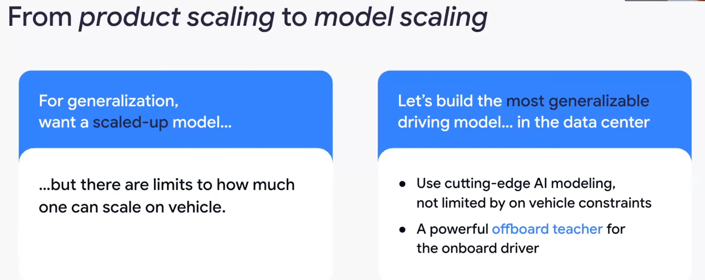

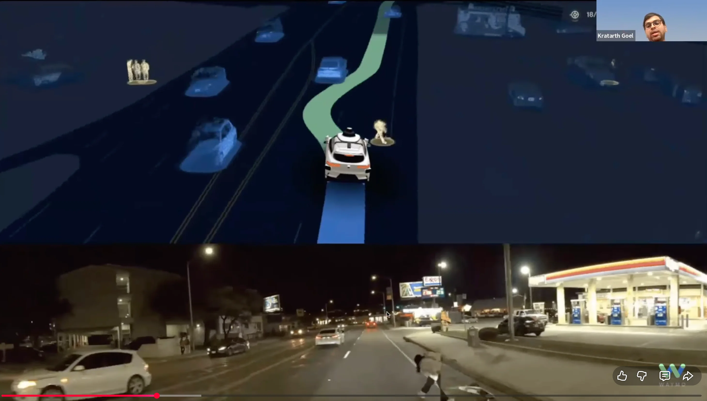

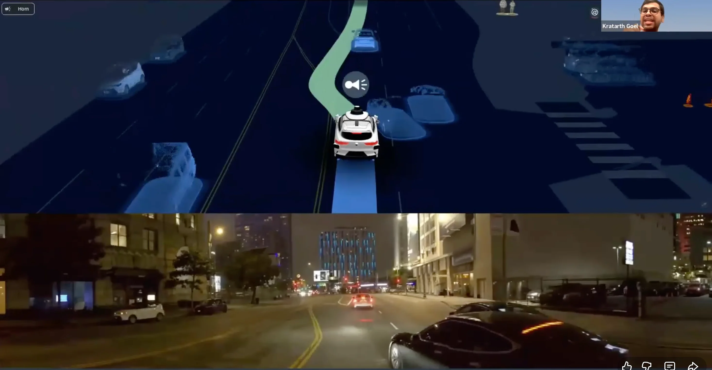

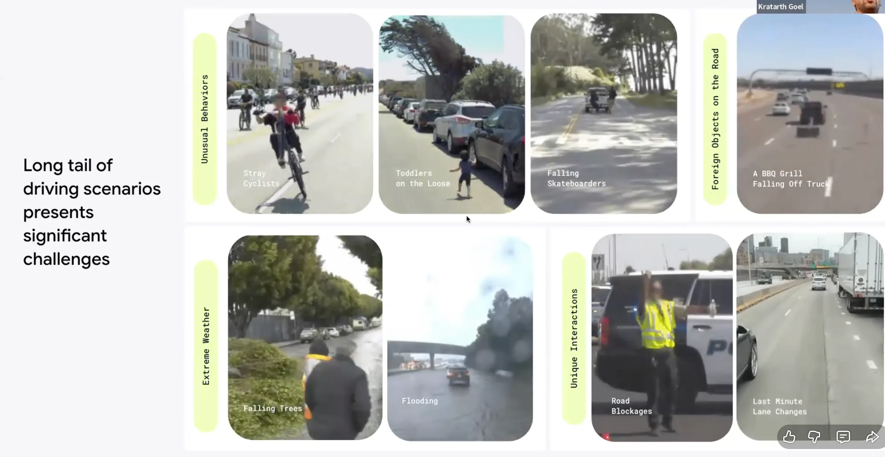

## Key Ingredients to Model Scaling

### Scalable Model
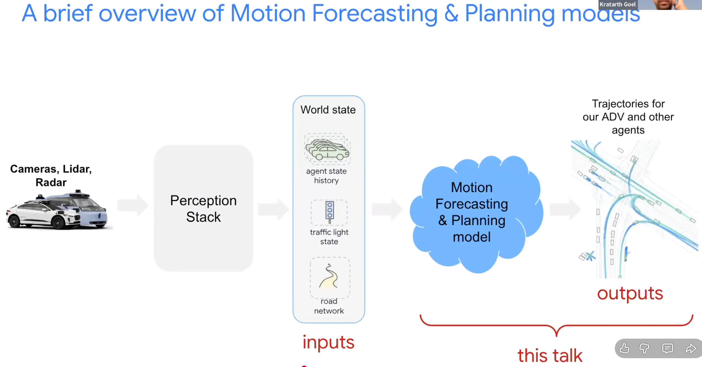

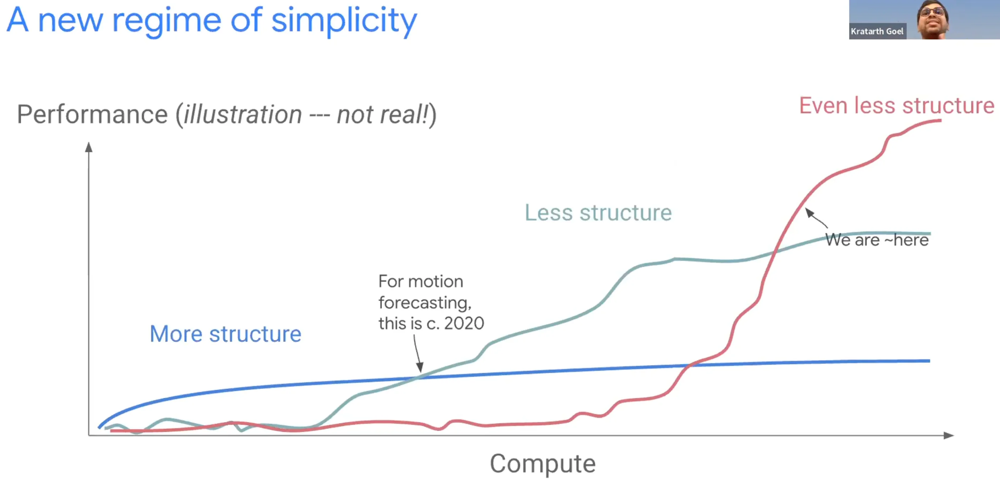

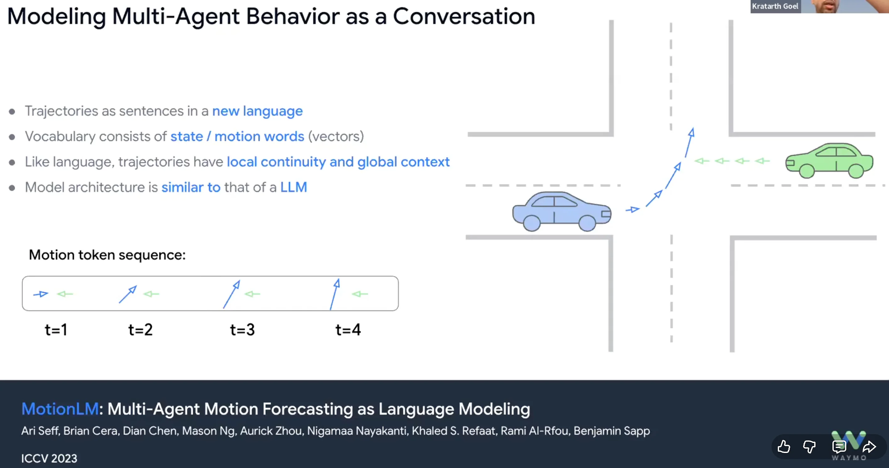

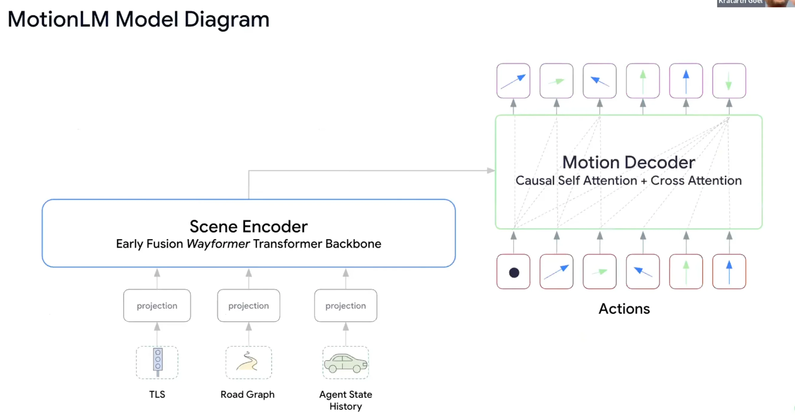

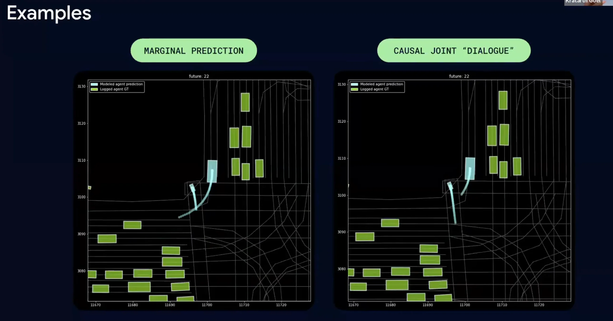

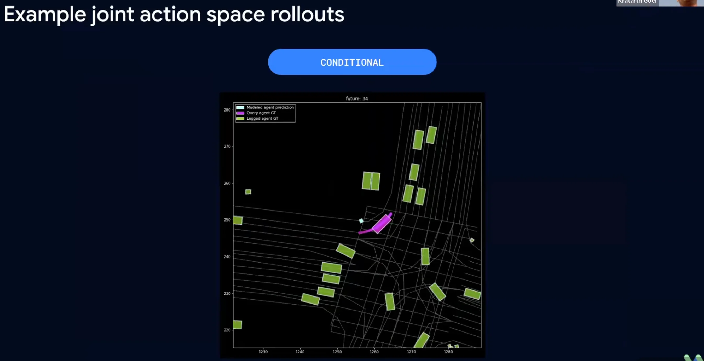

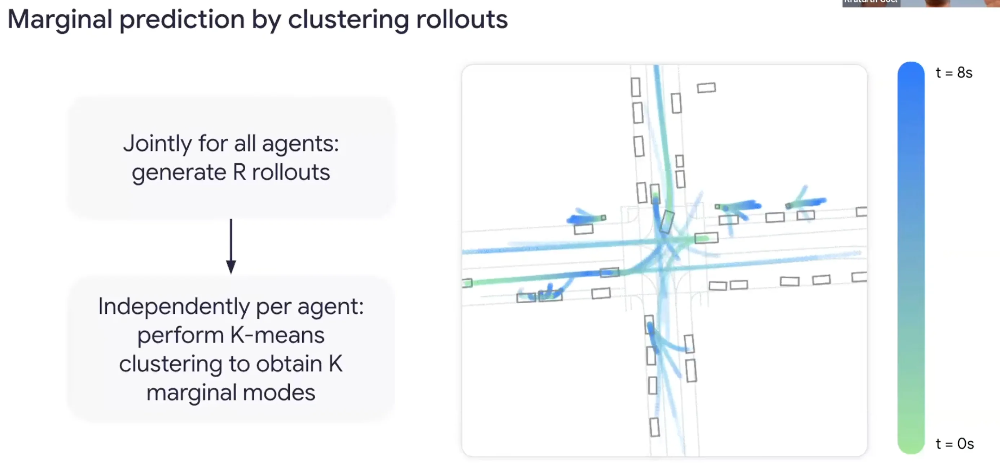

### Scaling Law
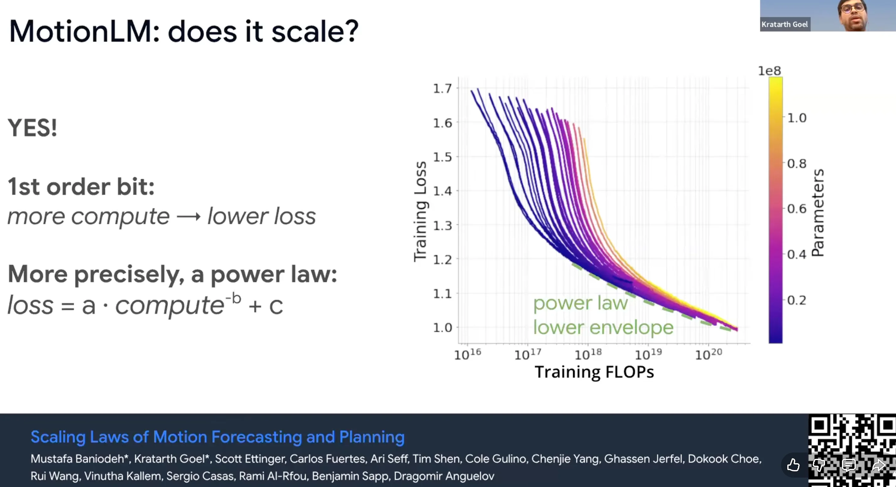

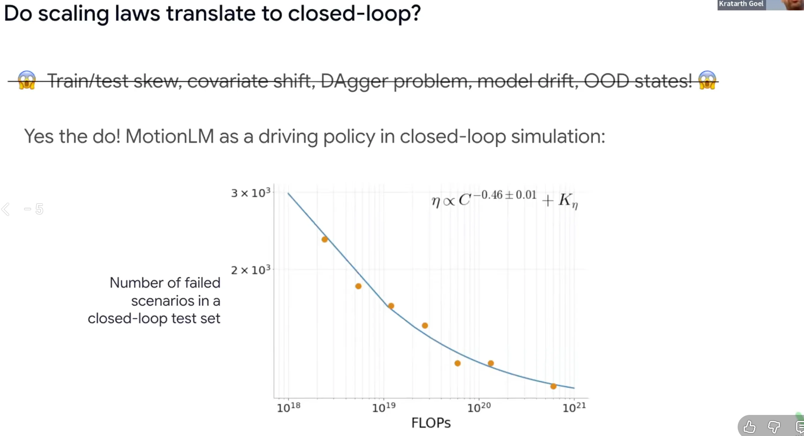

### Closed-loop Simulator
- only with imitation learning, we can see these emergent behaviors.

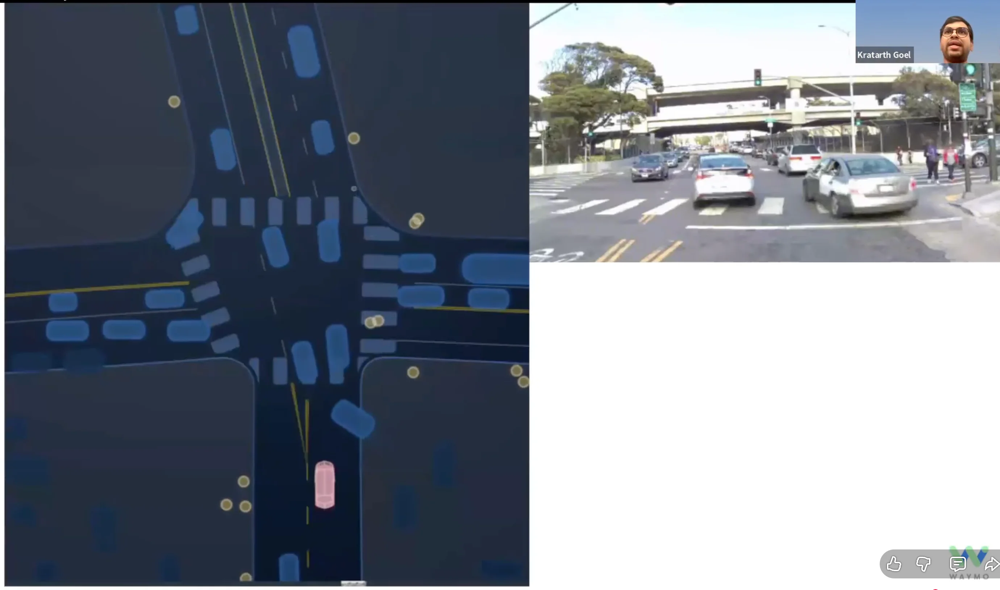

### Distillation
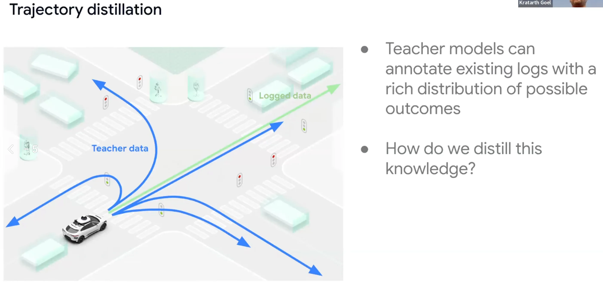

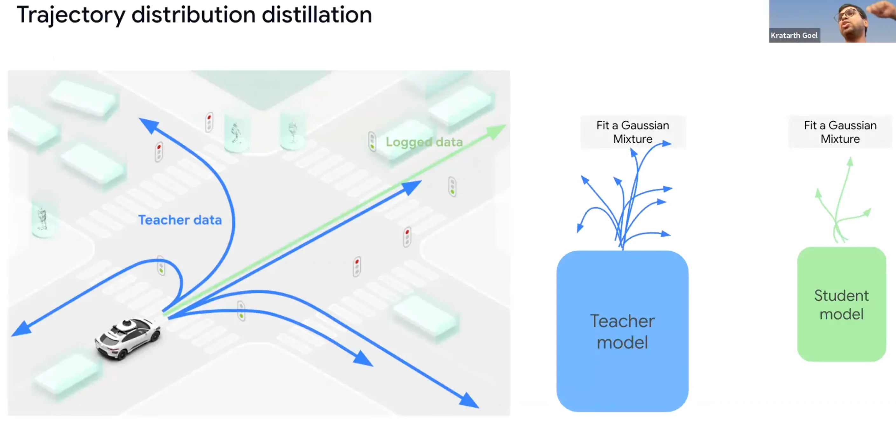

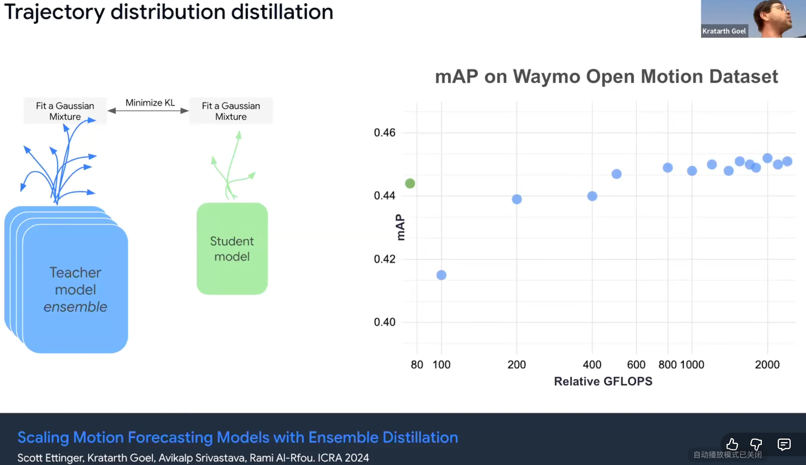

### Summary
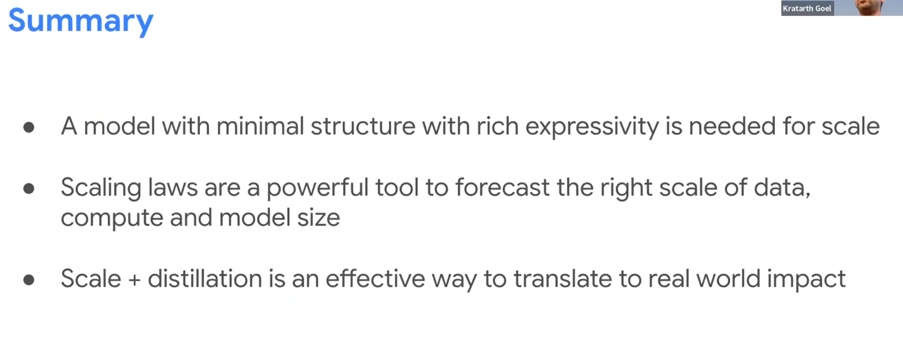

## References
- https://wdfm-ad.github.io/iccv25/
- [Youtube](https://www.youtube.com/watch?v=xFlgeirFC90)