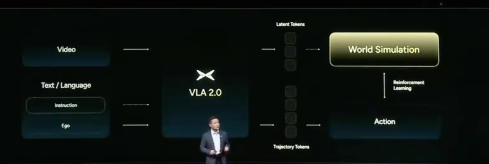

+++
date = '2025-11-05T17:34:36+08:00'
draft = false
title = 'Ai Day 2025 Emergence'
organization = []
categories = []
tags = []
+++

## E2E(VA)

一亿 clips
阿里云，3w 卡，72B 基座大模型，每5天迭代1次

milestones：
25年11月，媒体体验
25年12月，先锋体验
26年 Q1，Ultra 车型全量推送

## 开源
小鹏面向全球商业伙伴开源新模型，EE 架构等；新 VA 模型和图灵芯片首发大众
一套模型，应用于汽车，robotaxi, 机器人, 飞行汽车

## Robotaxi
26年推出三款 robotaxi
两套硬件冗余：算力，转向，感知，能源，刹车，通讯
3000TOPS，4颗图灵芯片，3颗计算，1颗冗余
高德成为小鹏 robotaxi 首个全球生态合作伙伴

## 人形机器人
数据问题是最大的问题
26年底量产

## 飞行汽车
汇天陆地航母正式进入量产前夕