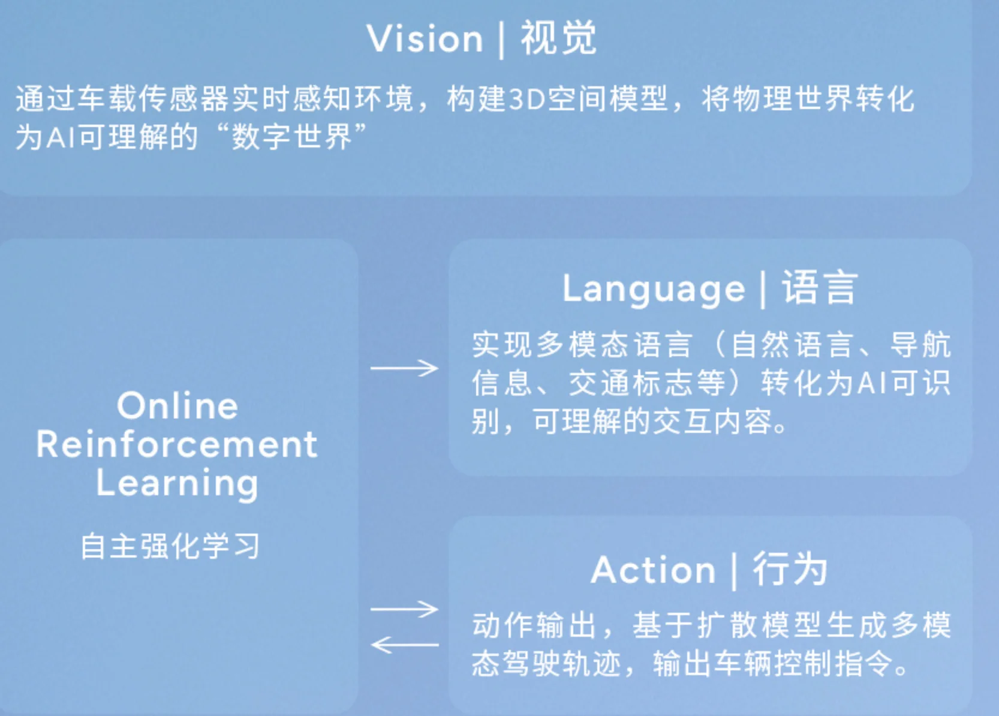
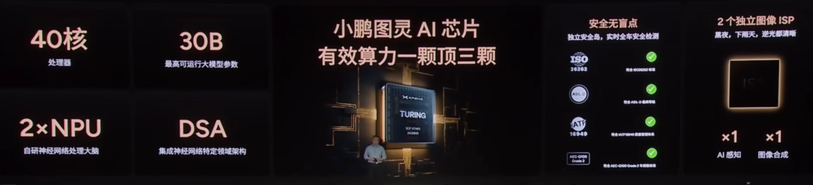

+++
date = '2025-06-17T17:19:55+08:00'
draft = false
title = 'Scaling up Autonomous Driving via Large Foundation Models'
categories = []
tags = []
+++

Xpeng
今年 4 月发布 720 亿参数的“世界基座模型”以来
“扩展法则”（Scaling Law）在自动驾驶领域的系统性验证，结合“云端基座模型 + 强化学习”的方法论，还公开了已被 DeepSeek 验证的“知识蒸馏”路径，将 VLA（Visual-Language-Action）模型高效部署在自研芯片上的最新实践。

- 软件1.0: rule-based
- 软件2.0: 模型即软件
- 软件3.0: 模型生产模型
    - 云端大模型(72B, 行业主流VLA 模型的35倍以上) -> 蒸馏到车端小模型
    - 算力: 10 EFLOPS, 1w+ GPUs
    - 数据传输架构，训练速度提升5倍
    - 数据飞轮
    - 5000万 clips (30s), 共计40w hours+，平均每天上传数据600TB，超100种触发机制驱动
    - 基座模型是动态的，持续学习，循环进化。
        - 内循环: 预训练、后训练(包含监督精调 SFT, 强化学习 RL) 和蒸馏部署
        - 外循环: 量产数据飞轮
    - Scaling Law: 

自研芯片的摊销门槛至少是100万片起步；图灵芯片不光会用在车上，也会用在小鹏的飞行汽车以及机器人上。
对于大模型的研发来说，其投入规模也是巨大的，预计今年底/明年头部厂商为辅助驾驶大模型的云端算力投入可能就是以1亿美金作为门槛。

VLA本身最早就是由DeepMind提出来，用于机器人的模型范式。语言模型加入之后对推理能力的增加，能极大地帮助机器系统建立对世界的认知，从而形成更加通用化的能力。

- 小鹏 G7全球首秀:
L3级别算力
图灵芯片 x3, 2200TOPS+, 216GB内存容量
图灵 AI 芯片 + 高通8295P 智能座舱芯片
近20000张卡
本地部署 VLA+VLM
图灵AI芯片

40核心
最高可运行大模型参数: 30B
2xNPU
DSA

VLA-OL模型
1. 路面塌陷避让
2. 救护车识别让行
3. 拥堵道路合理变道加塞
4. 积水路面，主动减速
5. 遮挡推理
6. 识别交警手势
上车节奏：
VLA 软件 OTA，思考推理可视化展示-09
VLM 硬件免费升级-11
主动推荐，语音控车，记录学习个性驾驶习惯-12

全本地端运行

VLM 整车 AI 大脑
1. 本地聊天
2. 本地控车
3. 主动服务
4. 变身家人
5. 多语言对话

芯片研发：100w 片是门槛
AI 算力：将2w 张卡
72B 基座模型

online reinforcement learning: 

Vision-Language-Action - Online Reinforcement Learning (VLA-OL)
TURING x2
高帧率
低时延
长时序

人机共驾+强化学习

VLM
TURING x1 + 高通8295P

## References
- https://cvpr2025.wad.vision/
- https://weibo.com/ttarticle/x/m/show/id/2309405178106696040457?_wb_client_=1
- https://mp.weixin.qq.com/s/u_vREBzJ7Qeckn4OEWtoMQ
- https://mp.weixin.qq.com/s/od2qG1Q8REGMwg6C5QW-Fg
- https://user.guancha.cn/main/content?id=1464995
- 【跨时代 小鹏G7上市发布会】https://www.bilibili.com/video/BV1Jg37zfE3t?p=2&vd_source=e05fafaa995c59e16affc059ba418214
- 【AI科技 AI家庭 小鹏G7 全球首秀】https://www.bilibili.com/video/BV1ArTozTExV?vd_source=e05fafaa995c59e16affc059ba418214
