+++
date = '2025-11-18T17:27:02+08:00'
draft = false
title = 'ML and Validation: Scenario Encoding, Organization, and Generation (ICCV 2025 WDFM-AD)'
organization = []
categories = []
tags = []
+++

## Validation (Hardest Thing)

### Behavior Foundation Model and Scenario Sampling Application

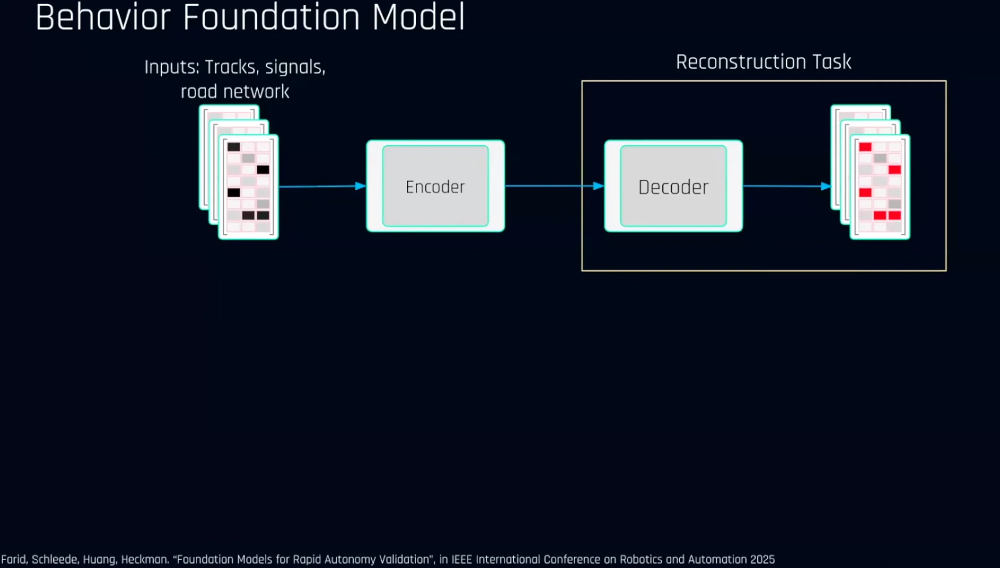

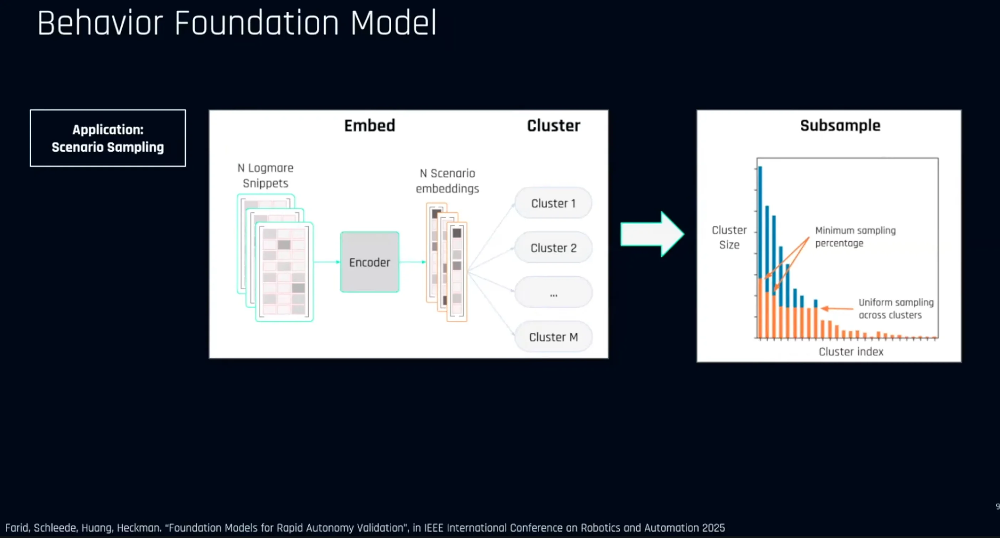

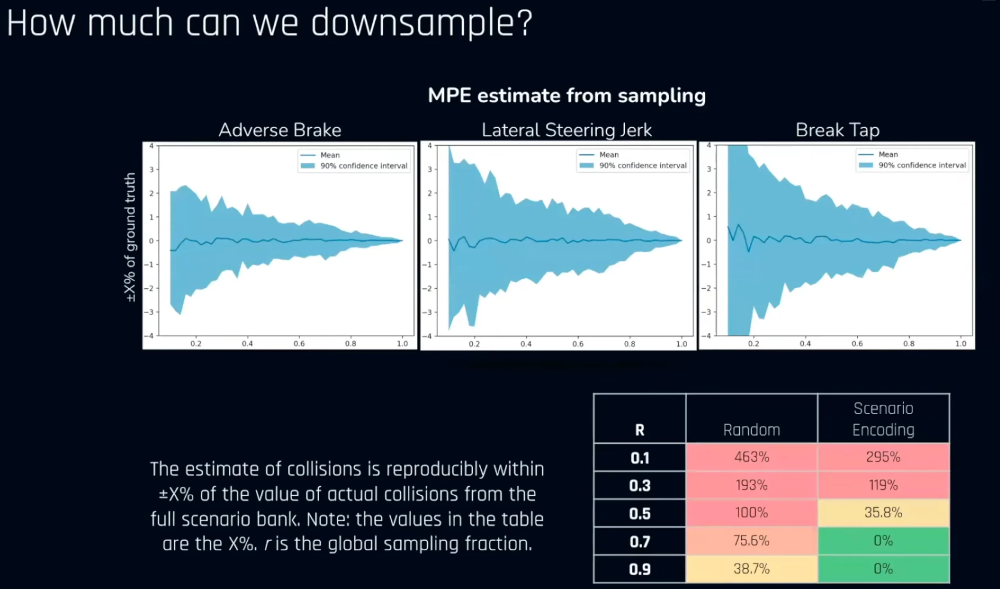

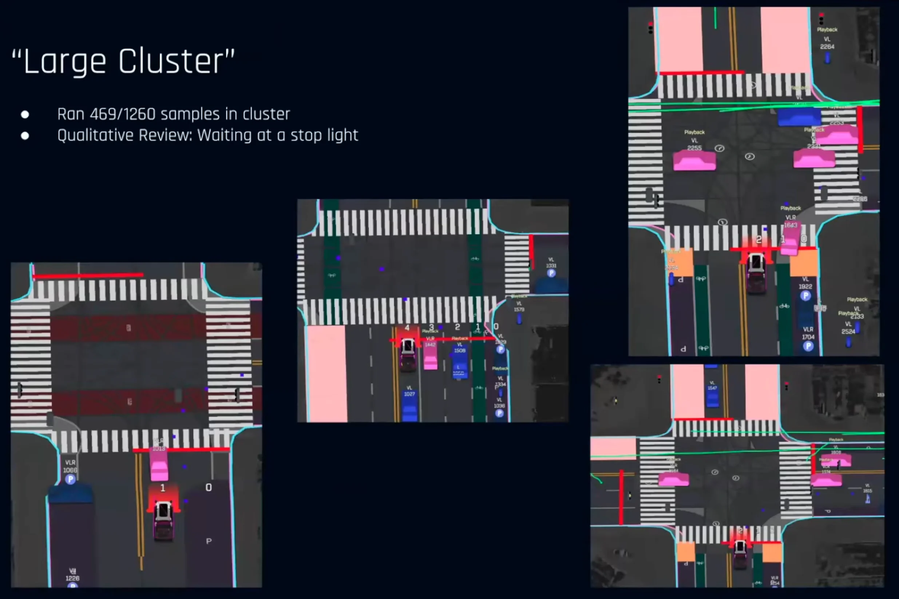

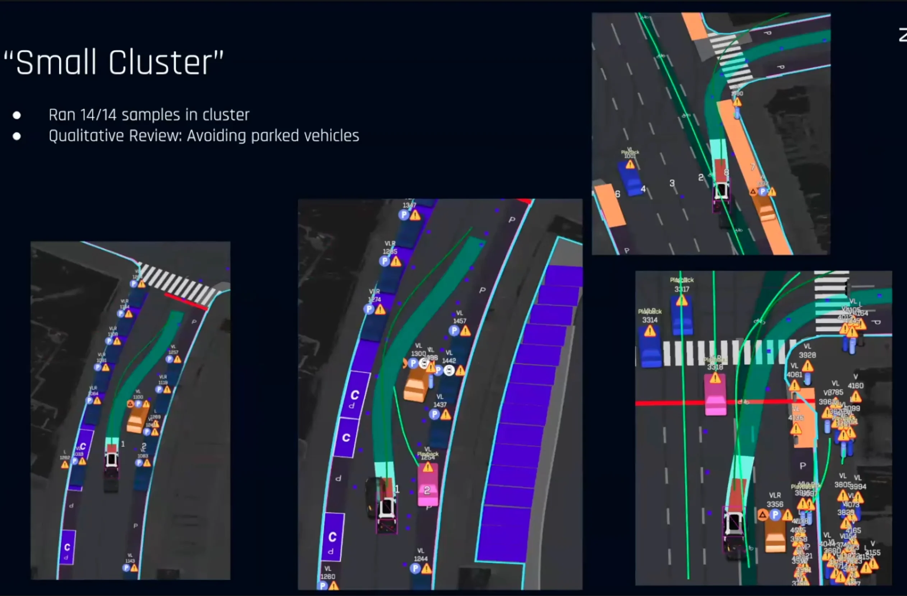

### Scene Diffusion

#### Generating Driving Scenarios for Validation

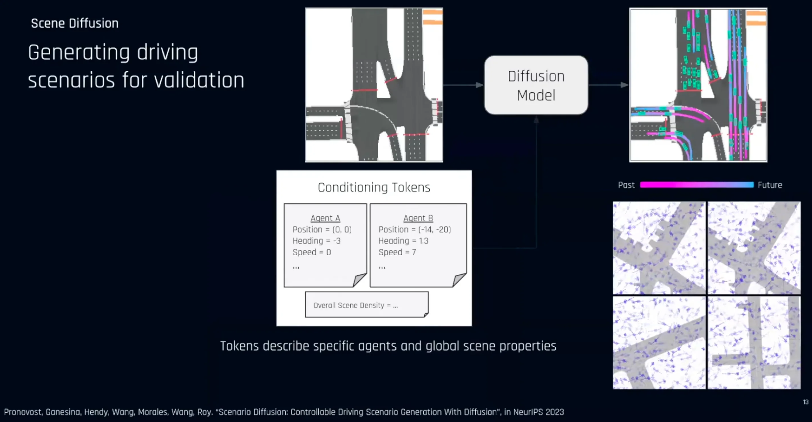

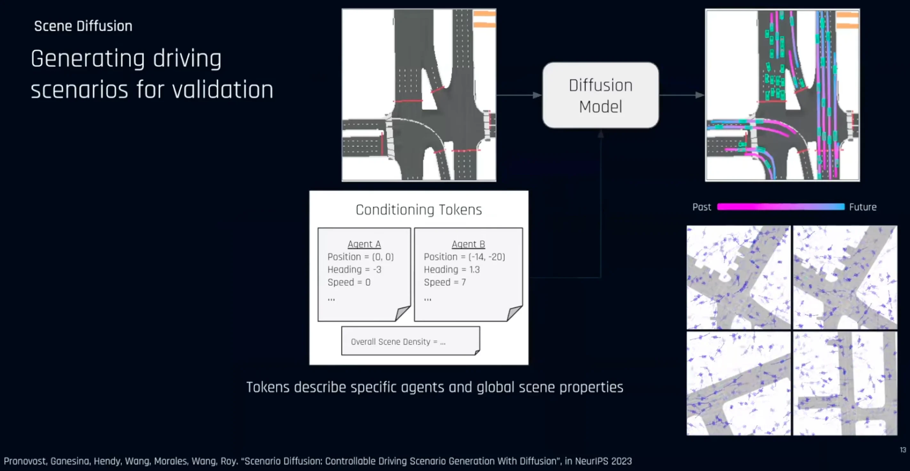

#### End-to-End Synthetic Simulation

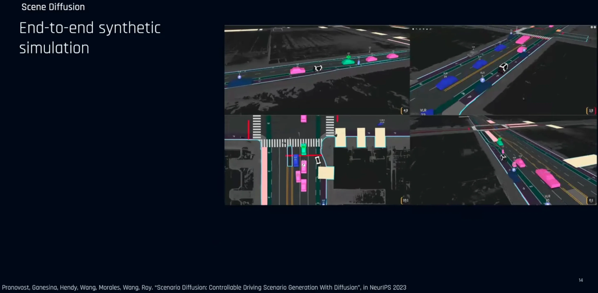

## Machine Learning and Planning
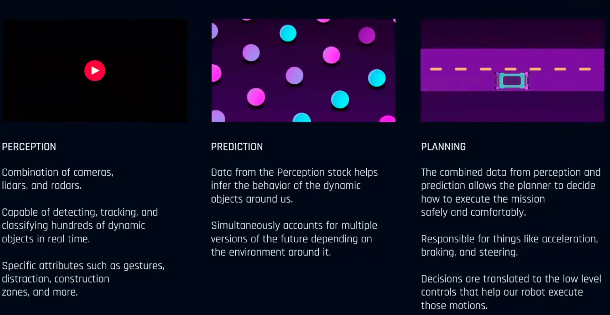

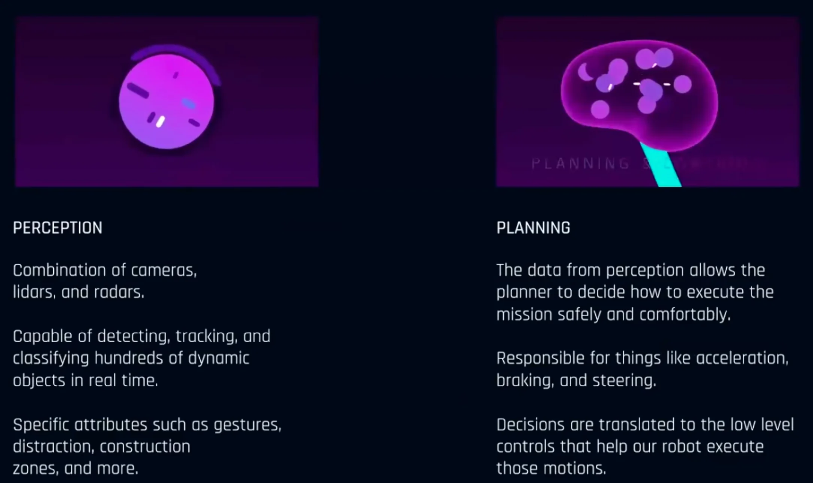

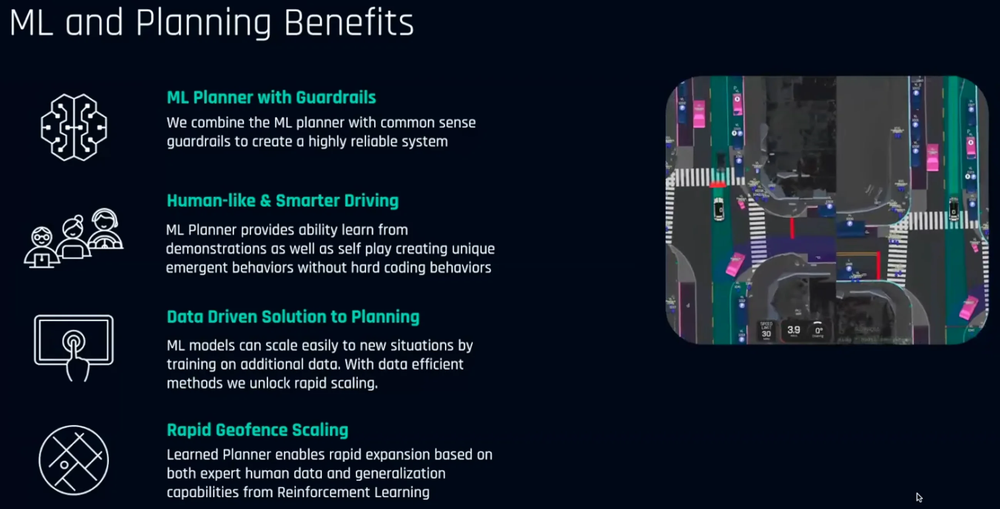

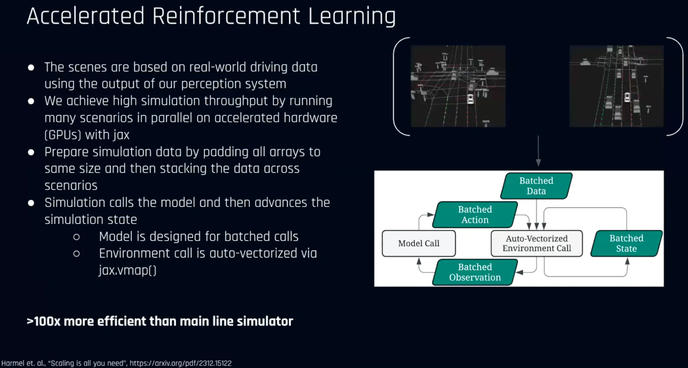

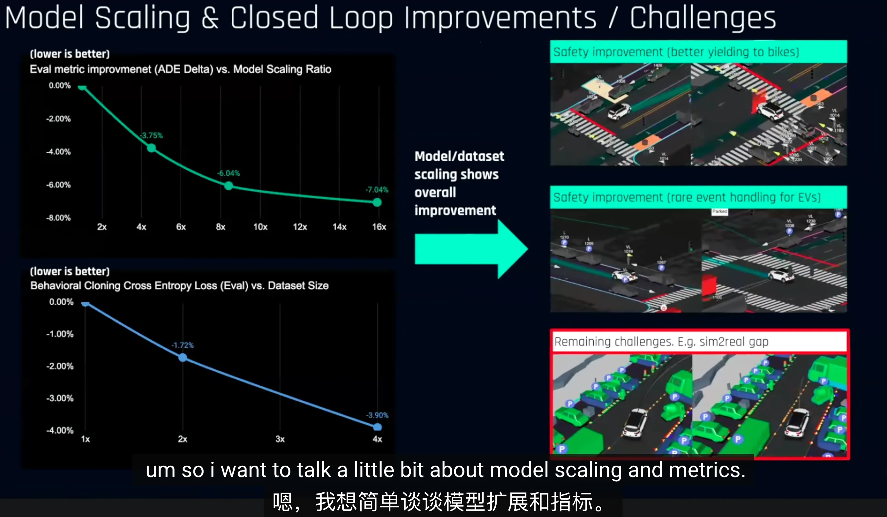

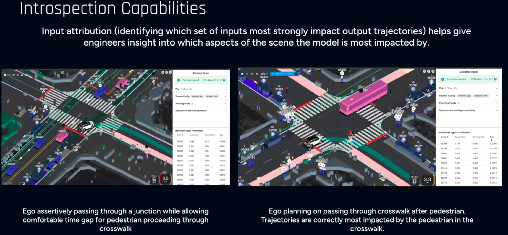

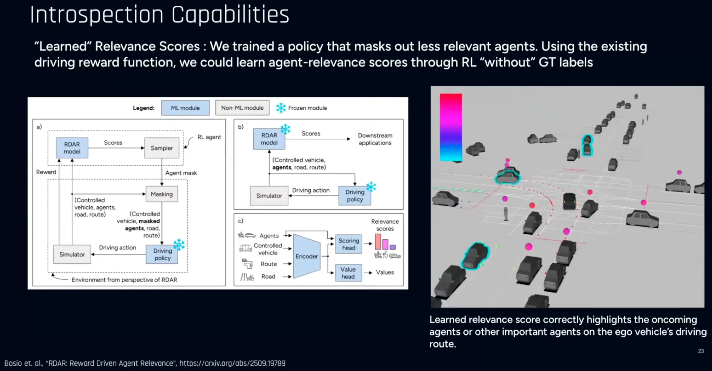

## References

- [The 2nd Workshop on Distillation of Foundation Models for Autonomous Driving (WDFM-AD)](https://wdfm-ad.github.io/iccv25/)
- [Youtube](https://www.youtube.com/watch?v=kmbRXEE6jsc)
