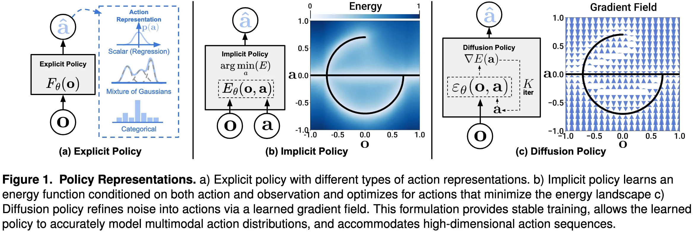

+++
date = '2025-06-12T15:32:01+08:00'
draft = false
title = 'Diffusion Policy: Visuomotor Policy Learning via Action Diffusion'
categories = []
tags = []
+++

123 &middot; [arXiv]() &middot; [GitHub]()

## Motivation

Action representations:
- Explicit policy
    - Regression
    - Mixtures of Gaussians
    - Categorical representations of discrete actions
- Implicit policy
    - energy-based
- Diffusion policy
    - switch from explicit to implicit to better capture multi-modal distributions.

**=> Reformulate robot policy as Denoising Diffusion Probabilistic Model (DDPM)**

## Contribution

## Method

## Experiment
Test content.

## References
-  
- 
- 

## Question
