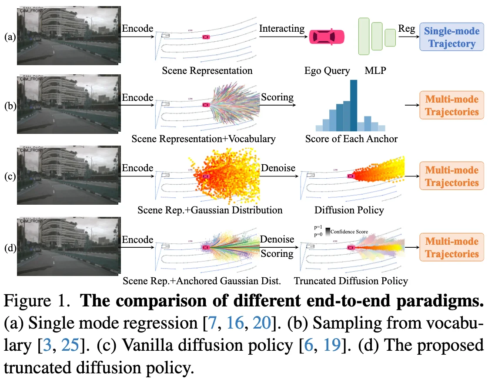
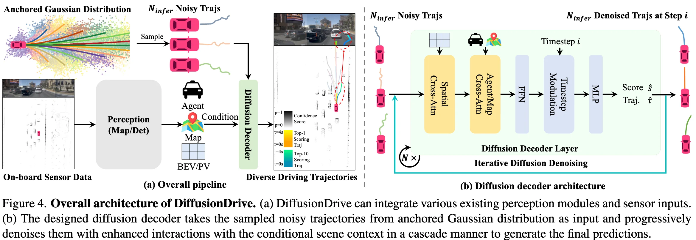
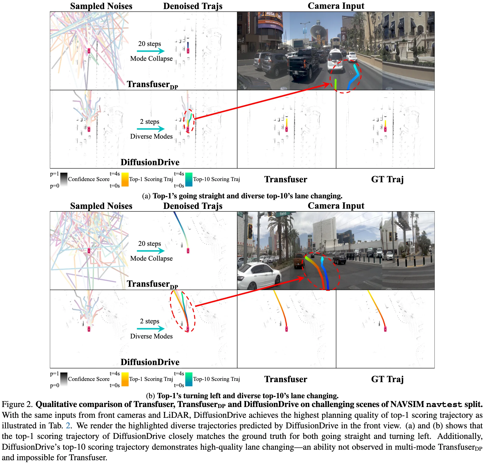

+++
date = '2025-05-19T17:29:15+08:00'
draft = false
title = 'DiffusionDrive: Truncated Diffusion Model for End-to-End Autonomous Driving'
categories = ['E2E']
tags = ['Diffusion-based Planner']
+++

CVPR 2025 (Highlight) &middot; Horizon Robotics &middot; [arXiv](https://arxiv.org/abs/2411.15139) &middot; [Code](https://github.com/hustvl/DiffusionDrive)

## Motivation

1. The unimodal regression planner (Transfuser, UniAD, VAD, PPAD, GenAD) do not account for the multimodal nature of the driving behaviors.
2. Existing multimodal planners (VADv2, Hydra-MDP, Hydra-MDP++, SparseDrive) discretize the continuous action space, reformulate the planner in the continuous space as a classification problem, but fail in out-of-vocabulary scenarios and consume large computation cost.

Diffusion model has proven to be a powerful generative technique for robotic policy learning, capable of modeling multimodal action distributions. 
**=> Replicate the success of the diffusion model in the robotics domain to end-to-end autonomous driving.**

## Contributions
- We firstly introduce the diffusion model to end-to-end autonomous driving.
- We propose DiffusionDrive, a novel truncated diffusion policy that incorporates prior multi-mode anchors and truncates the diffusion schedule to address the issues of mode collapse and heavy computational overhead found in direct adaptation of vanilla diffusion policy.
- We design an efficient transformer-based diffusion decoder for enhanced interaction with conditional scene context in a cascaded manner. 
- DiffuisonDrive demonstrates 10× reduction in denoising steps compared to vanilla diffusion policy, delivering superior diversity and quality in just 2 steps.
- DiffuisonDrive achieves a record-breaking 88.1 PDMS on the NAVSIM navtest split dataset while maintaining real-time performance at 45 FPS on an NVIDIA 4090.

## Method
### Architecture

### Vanilla Diffusion Model

We simply replace the regression MLP layers with the conditional diffusion model UNet following vanilla diffusion policy.
- **Mode collapse.** The different random noises converge to similar trajectories after the denoising process. 
- **Heavy denoising overhead.** The DDIM diffusion policy requires 20 denoising steps to transform random noise into a feasible trajectory.

### Truncated Diffusion Model
**Anchored Gaussian distribution.** We sample the noise from an anchored Gaussian distribution instead of a vanilla Gaussion distribution.

**Diffusion decoder.**
1. Interact with BEV or PV features based on the trajectory coordinates with deformable spatial cross-attention.
2. Interact with the agent/map queries with cross attention, followed by a FFN.
3. Encode the diffusion timestep information with a Timestep Modulation layer.
4. Predict the confidence score and the offset relative to the initial noisy trajectory coordinates.
5. The output from this diffusion decoder layer serves as the input for the subsequent cascade diffusion layer with parameters shared across the different denoising timesteps.
6. The final trajectory with the highest confidence score is selected as the output.

**Forward pass.** The diffusion decoder takes N noisy trajectories as input and predicts classification scores and denoised trajectories based on the conditional scene context.

**Label assignment.** Assign the noisy trajectory around the closest anchor to the ground truth trajectory as positive sample and others as negative samples.

**Training objectives.** L1 regression loss and BCE classification loss.

**Inference.** 

**Inference flexibility.** While the model is trained with N trajectories, the inference process can accommodate an arbitrary number of trajectory samples.

## Experiment
## Questions
Dec 表示什么

