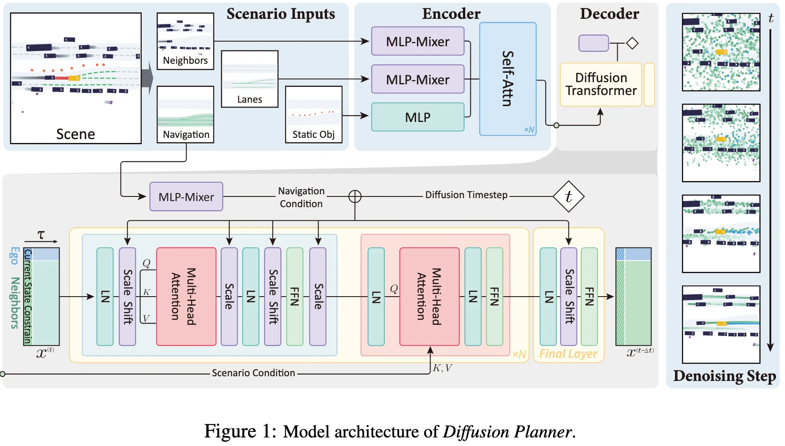

+++
date = '2025-05-20T23:59:49+08:00'
draft = false
title = 'Diffusion-based Planning for Autonomous Driving with Flexible Guidance'
categories = ['E2E']
tags = ['Diffusion Planner', 'E2E Decoder', 'HAOMO.AI']
+++

 ICLR 2025, Oral &middot; [Project](https://zhengyinan-air.github.io/Diffusion-Planner/) &middot; [arXiv]() &middot; [GitHub](https://github.com/ZhengYinan-AIR/Diffusion-Planner) &middot; [HuggingFace](https://huggingface.co/ZhengYinan2001/Diffusion-Planner)

## Motivations
:hugging_face:

## Contributions

## Method

## Experiments
Test content.

## References
-  
- 
- 

## Questions
