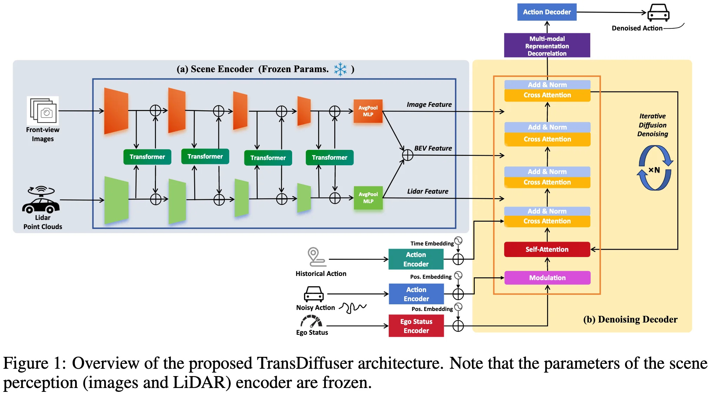

+++
date = '2025-05-20T23:27:33+08:00'
draft = false
title = 'TransDiffuser: End-to-end Trajectory Generation with Decorrelated Multi-modal Representation for Autonomous Driving'
categories = ['E2E']
tags = ['E2E', 'DiffAD']
+++

 &middot; [arXiv](http://arxiv.org/abs/2505.09315) &middot; [GitHub]()

## Motivations

## Contributions

## Method

## Experiments

## References
- 
- 
- 

## Questions

