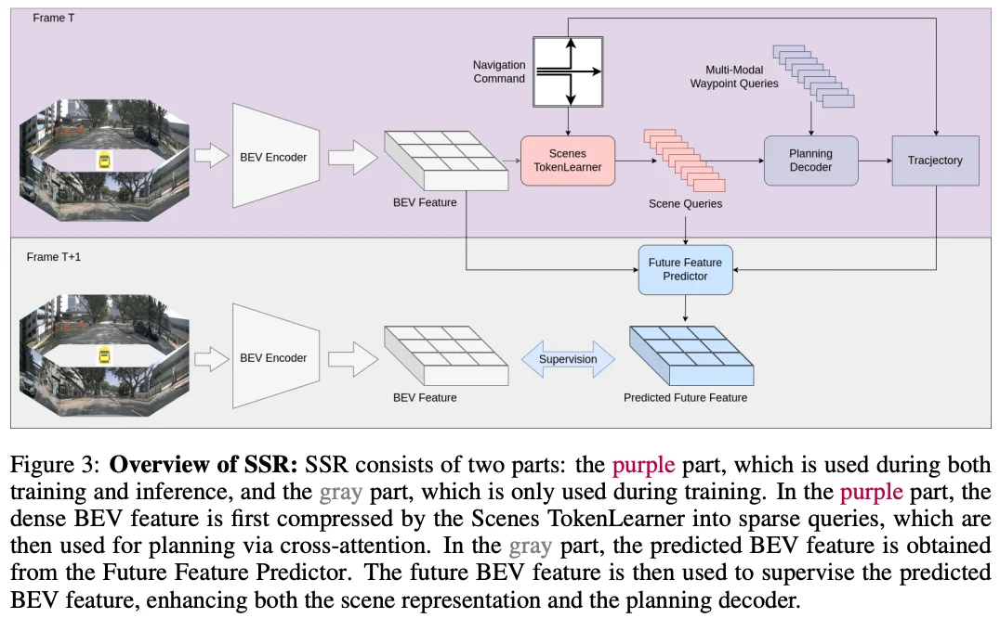

+++
date = '2025-11-20T21:51:49+08:00'
draft = false
title = 'SSR: Navigation-guided Sparse Scene Representation For End-to-End Autonomous Driving'
organization = ['Zhijia']
categories = []
tags = []
+++

ICLR &middot; [arXiv](https://arxiv.org/pdf/2409.18341) &middot; [GitHub](https://github.com/PeidongLi/SSR)

## Motivation

## Contribution

## Method

## Experiment

## References

## Question
