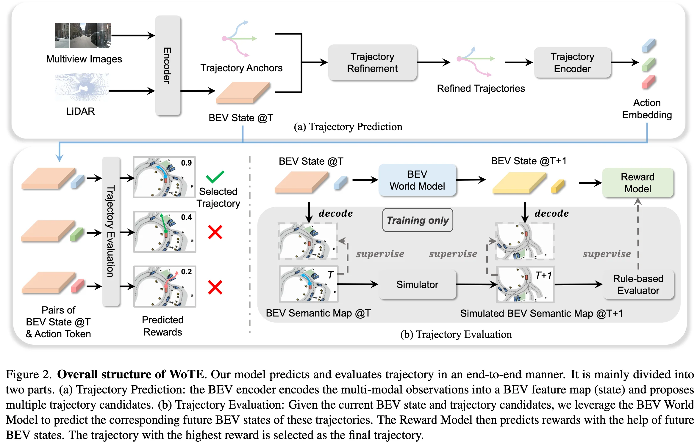
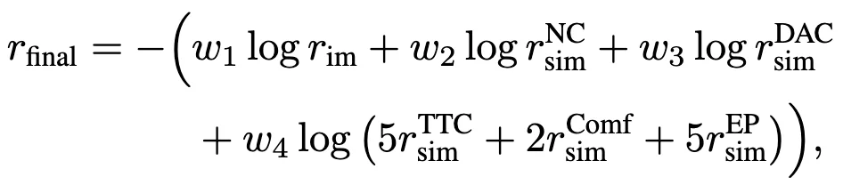

+++
date = '2025-11-20T19:43:16+08:00'
draft = false
title = 'WoTE: End-to-End Driving with Online Trajectory Evaluation via BEV World Model'
organization = []
categories = []
tags = ['dense bev', 'world model', 'e2e']
+++

123 &middot; [arXiv]() &middot; [GitHub]()

## Motivation

## Contribution

## Method

### Anchor-based Trajectory Proposal

- multi-modaly BEV encoder
- anchor(K-Means)-based trajectory proposal
  - trajectory(anchor) encoder: MLP
  - BEV interaction: cross attention
  - offset prediction: MLP
  - trajectory proposal: anchor + offset
- Question: sparse trajectory supervised?

### Efficient BEV World Model

- Input: $(B_t, a^i_t)$, where $i \in \lbrace 1, ..., N \rbrace$
    - $B_t$: BEV state at time $t$
    - $a^i_t$: action embedding encoded from the trajectory encoder with shared parameters
- Output: $(B_{t+1}, a^i_{t+1})$, where $i \in \lbrace 1, ..., N \rbrace$
- Model:
  - flatten BEV states (the size of BEV states is small (e.g., h = w = 8))
  - concatenate with action embedding
  - BEV world model: transformer encoder
- Recurrent BEV World Model Prediction

### Reward Model

Reward Types:

- imitation reward
- simulation reward (following Navsim)
  - no collisions (NC)
  - drivable area compliance (DAC)
  - time-to-collision (TTC)
  - comfort (Comf)
  - ego progress (EP)

Reward Prediction

### BEV Space Supervision

## Experiment

## References

## Question
