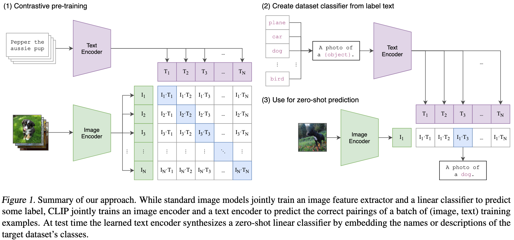

+++
date = '2025-06-12T15:15:52+08:00'
draft = true
title = 'Learning Transferable Visual Models From Natural Language Supervision（CLIP）'
categories = []
tags = []
+++

123 &middot; [arXiv](https://arxiv.org/abs/2103.00020) &middot; [GitHub](https://github.com/OpenAI/CLIP)

## Motivation

## Contribution

## Method

## Experiment
Test content.

## References
-  
- 
- 

## Question
