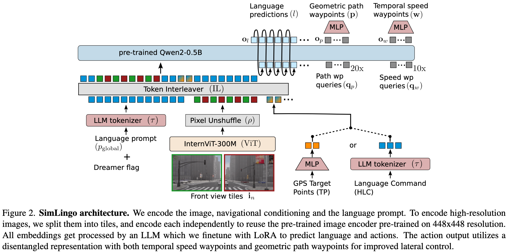

+++
date = '2025-06-18T17:04:13+08:00'
draft = true
title = 'SimLingo: Vision-Only Closed-Loop Autonomous Driving with  Language-Action Alignment'
organization = ['Wayve']
categories = []
tags = []
+++

123 &middot; [arXiv]() &middot; [GitHub]()

## Motivation

## Contribution

## Method

**Task.**
- Driving
- Vision-Language Understanding
    - Commentary: describe the current decision and action in natural language.
    - VQA: answer a question about the simulated driving scene.
- Action Dreaming (language-action alignment): a form of instruction following, to improve the alignment of language and action

**Input.**
- image
- navigational information: 
- ego's speed
- a task prompt with information about the current task
    - Driving without language predictions: "Predict the waypoints"
    - Commentary + Driving: "What should the ego do next?"
    - VQA + Driving: "Q: <question>?>"
    - Action Dreaming: "<Dreamer flag><instruction>"

**Output.**
- action represention: a disentangled representation
    - temporal speed waypoints -> target speed
    - geometric path waypoints -> target angle
- language: auto-regressive token prediction

We noticed that:
1. using only temporal waypoints for steering and speed led to steering problems, especially during turns or when swerving around obstacles.
2. by using path waypoints, we achieve denser supervision.
3. we also predict the path when the vehicle is stationary, leading to improved steering behavior.

**Architecture.**
InternVL-2-1B.
- Vision Encoder (pretrained): InternViT-300M-448px (ViT)
    - To be able to encode dynamic and higher resolutions, we split the input image into 448x448 pixel tiles and extract features for each tile independently.
    - To reduce computational overhead due to the quadratic complexity of the LLM, we uses the pixel unshuffle technique to downsample the number of tokens by a factor of 4.
- LLM (pretrained): Qwen2-0.5B-Instruct
    - Navigational information
        - the next two GPS target points: encode with an MLP to obtain two navigational embeddings.
        - or a high-level language command: use the standard LLM tokenizer to obtain the embeddings.
        - during training, we randomly switch between the two input modalities.
    - Speed v: use the speed v in natural language as part of the global LLM prompt.
- Token Interleaver: replace the placeholder tokens with the corresponding embeddings.

**Training.**

1. First, it auto-regressively generates the language predictions. (CE)
2. Then in one additional forward pass, it generates the actions consisting of path and waypoints. (smooth-L1)

**Inference.**
two PID controllers to get the steering angle and acceleration.

## Experiments
### Dataset
### Benchmarks and Metrics
Leaderboard 2.0:
- Driving Score (DS)
- Route Completion (RC)
- Infraction Score (IS)

Bench2Drive
- driving score
- success rate
- efficiency
- comfortness

DriveLM-hard (VQA) and Commentary
- driving score
- success rate
- efficiency
- comfortness

Action Dreaming

## References
-  
- 
- 

## Question
