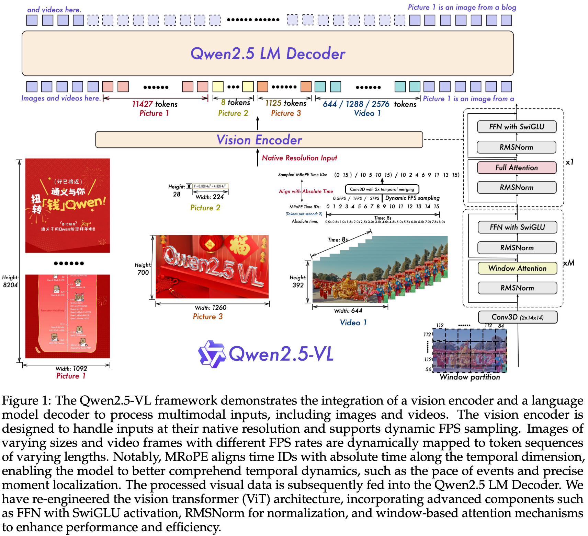

+++
date = '2025-07-01T14:45:33+08:00'
draft = true
title = 'Qwen2.5-VL'
organization = []
categories = []
tags = []
+++

[Chat](https://chat.qwen.ai/) &middot; [arXiv](https://arxiv.org/abs/2502.13923) &middot; [Blog](https://qwenlm.github.io/blog/qwen2.5-vl/) &middot; [GitHub](https://github.com/QwenLM/Qwen2.5-VL) &middot; [HuggingFace](https://huggingface.co/collections/Qwen/qwen25-vl-6795ffac22b334a837c0f9a5)

## Motivation

Qwen2-VL -> Qwen2.5-VL

## Contribution

||Qwen2-VL|Qwen2.5-VL|
|---|---|---|
|Pre-training|1.2B|approximately 4B|
|Post-training|1.5B|2.5B|
|Pre-training|1.5B|2.5B|

## Method
### Architecture

- Vision Encoder: a redesigned Vision Transformer (ViT)
- LLM
    - initialized with pre-trained weights from the Qwen2.5-LLM
    - modify the 1D RoPE (Rotary Positional Embedding) to Multimodal RoPE aligned to absolute time.

### Pre-training
**Pre-training Data**
- image captions
- interleaved image-text pairs
- optical character recognition (OCR) data
    - synthetic data
    - open-sourced data
    - in-house collected data
- visual knowledge (e.g., celebrity, landmark, flora, and fauna identification)
- multi-modal academic questions
- localization data
- document parsing data
- video descriptions
- video localization
- agent-based interaction data

**data method**
- clean raw web data
- synthesize data

**Training Recipe**
### Post-training
**Post-training Data**

**Training Recipe**
## Experiments

## References
- 
- 
- 

## Question
