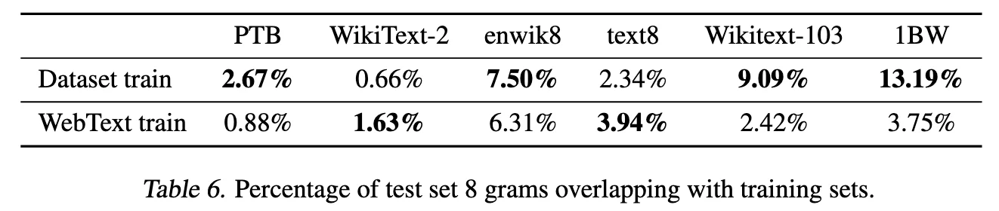
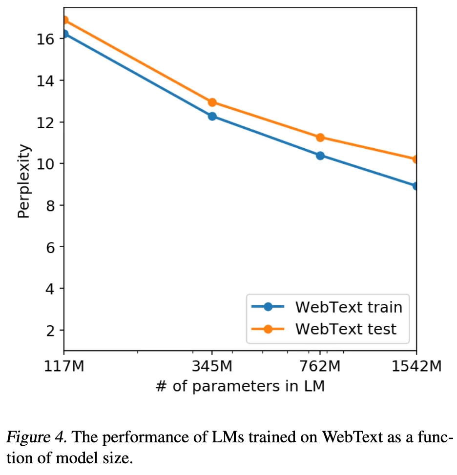

+++
date = '2019-02-14T16:56:13+08:00'
draft = false
title = 'GPT-2: Language Models are Unsupervised Multitask Learners'
categories = ['LLMs']
tags = ['LLMs', 'GPTs']
+++

:(fas fa-award fa-fw):
:(fas fa-building fa-fw):OpenAI
:(fas fa-file-pdf fa-fw):[pdf ](https://cdn.openai.com/better-language-models/language_models_are_unsupervised_multitask_learners.pdf)
:(fab fa-github fa-fw):[openai/gpt-2](https://github.com/openai/gpt-2)
:(fas fa-blog fa-fw):[Better Language Models and Their Implications](https://openai.com/index/better-language-models/)
:(fas fa-blog fa-fw):[GPT-2: 6-month follow-up](https://openai.com/index/gpt-2-6-month-follow-up/)
:(fas fa-blog fa-fw):[GPT-2: 1.5B release](https://openai.com/index/gpt-2-1-5b-release/)

## TL;DR

GPT-2 redefines language modeling as unsupervised multi-task learning, demonstrating that massive scaling enabling models to solve diverse downstream tasks in a zero-shot setting (without any parameter or architecture modification) through natural language prompts alone.

## Motivations & Innovations

- Current systems are better characterized as narrow experts rather than general systems. -> **unsupervised multi-task learning**
- Despite the success of combining pre-training with supervised fine-tuning (SFT), SOTA language models still need task-specific SFT. -> **zero-shot transfer**

## Approach
**Language Modeling:** Given an **unsupervised corpus** of tokens $U = \lbrace u_1, \ldots, u_n \rbrace$, we use a standard **language modeling objective** with a multi-layer **Transformer** decoder (**decode-only**) to maximize the following likelihood:

$$
L_1(U) = \sum_i \log P(u_i | u_{i-k}, \ldots, u_{i-1}; \Theta)$$

where:
- $k$ is the size of the context window
- $P$ is the conditional probability modeled using a neural network with parameters $\Theta$

**General Multi-task Conditioning via Unified Language Prompts:** Task conditioning is implemented with language prompts rather than at the traditional architectural level, for example:

$$p(\text{output} | \text{input, task})$$

- translation: (translate to french, english text, french text)
- Reading Comprehension: (answer the question, document, question, answer)

**Speculation: a language model with sufficient capacity will begin to learn to infer and perform the tasks demonstrated in natural language sequences in order to better predict them.**

### Model
- Transformer architecture
- vocabulary size: 50,257
- context size: 1024
- batch size: 512

### Byte-level BPE (BBPE)
Motivations:
- pre-processing steps such as lower-casing, tokenization, etc.
- out-of-vocabulary tokens -> byte-level
- Current byte-level LMs are not competitive with word-level LMs on large scale datasets. -> word-level

-> Byte-level BPE (BBPE): reference BPE implementations often operate on Unicode code points (over 130,000 base vocabulary) rather than bytes (256 base vocabulary).
- prvent BPE from merging across character categories.
- an exception for spaces which significantly improves the compression efficiency while adding only minimal fragmentation of words across multiple vocab tokens.

### Data Recipe
Our approach motivates building as large and diverse a dataset as possible in various domains. -> **WebText**
- emphasize document quality
- slightly over 8 million documents for a total of 40 GB of text
- remove Wikipedia documents from WebText in case of overlapping training data with test evaluation tasks.

## Experiments
### Language Modeling
Our largest model, GPT-2, is a 1.5B parrameter Transformer that achieves SOTA results on 7 out of 8 tested language modeling datasets in a zero-shot setting but still underfits WebText.

### Generalization vs Memorization
- Quantitative analysis shows that while data overlap provides a minor performance boost, GPT-2's gains primarily stem from generalization rather than memorization.

- The model remains underfit on its own training data, suggesting that its emergent capabilities are driven by scale and diversity rather than simple data leakage.

## Discussion
- GPT-2 demonstrates that massive language models can transition from learning representations to performing tasks directly via zero-shot transfer without explicit supervision.

- While achieving SOTA in reading comprehension, its zero-shot performance on complex tasks like summarization remains rudimentary, leaving the ceiling of its fine-tuning potential and architectural efficiency yet to be fully explored.

