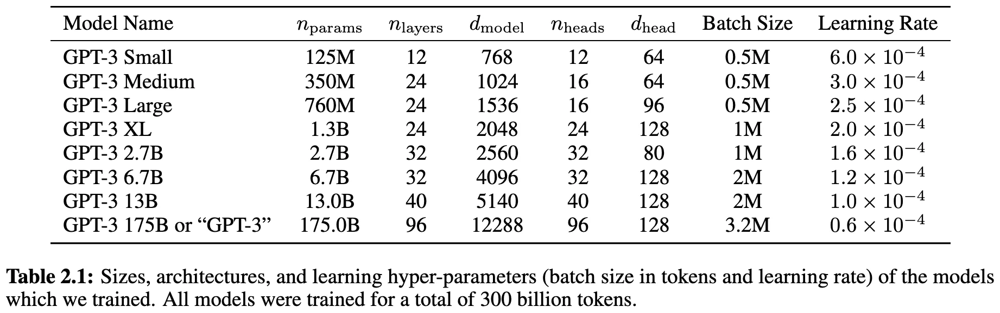
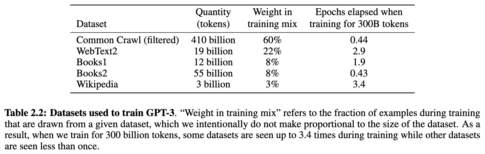

+++
date = '2020-05-28T17:43:54+08:00'
draft = false
title = 'GPT-3: Language Models are Few-Shot Learners'
categories = ['LLMs']
tags = ['LLMs', 'GPTs']
+++

:(fas fa-building fa-fw):OpenAI
:(fas fa-file-pdf fa-fw):[arXiv 2005.14165](https://arxiv.org/abs/2005.14165)

## TL;DR

## Motivations & Innovations

## Approach

### Model

same model and architecture as GPT-2

### Training Recipe

### Data Recipe

GPT-3 通过对海量互联网数据（Common Crawl）进行深度清洗和去重，并提高高质量垂直语料（如书籍、维基百科）的采样比例，以“质量优先”的原则构建了 3000 亿 token 的训练集。

## Experiments
