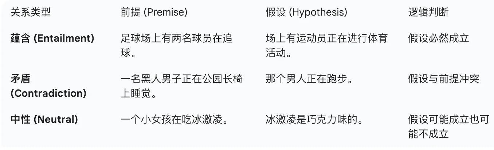

+++
date = '2017-06-12T13:59:55+08:00'
draft = false
title = 'Taxonomy of Natural Language Processing Tasks'
categories = ['LLMs']
tags = ['LLMs']
+++

## Natural Language Inference(NLI) / Textual Entailment
**Definition**: Given a premise sentence and a hypothesis sentence, determine whether the hypothesis can be inferred from the premise (entailment), contradicts the premise (contradiction), or is neutral (neither supported nor contradicted by the premise).

## Reading Comprehension

## Commonsense Reasoning

## Sentiment Analysis

## Closed-book QA

## Paraphrase Detection

## Coreference Resolution

## Reading Comprehension with Commonsense

## Struct to Text

## Translation

## Summarization

## 

## Question Answering (QA)

## Semantic Similarity
**Definition**: Predict whether two sentences are semantically equivalent or not.

## Text Classification