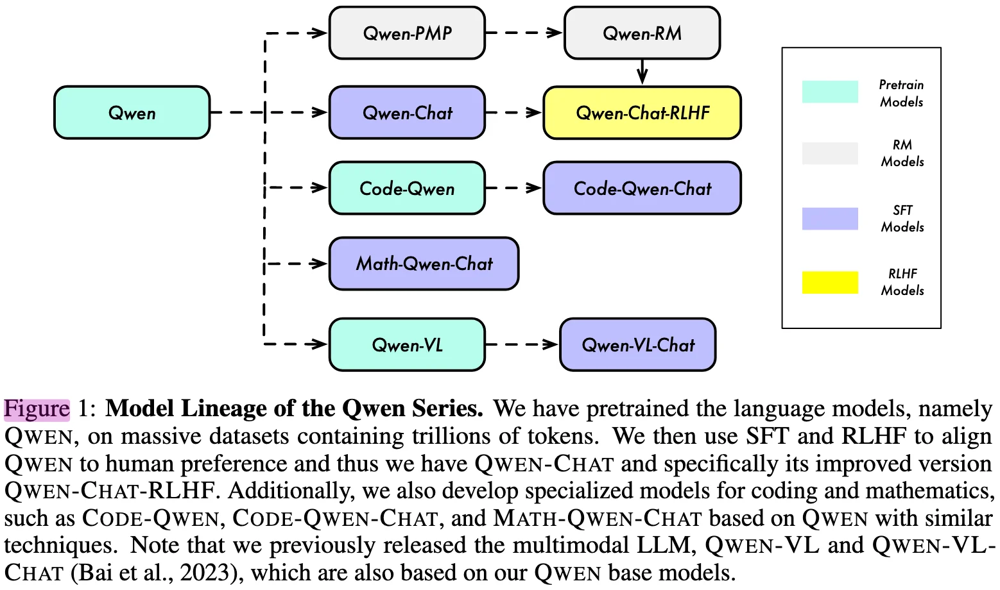
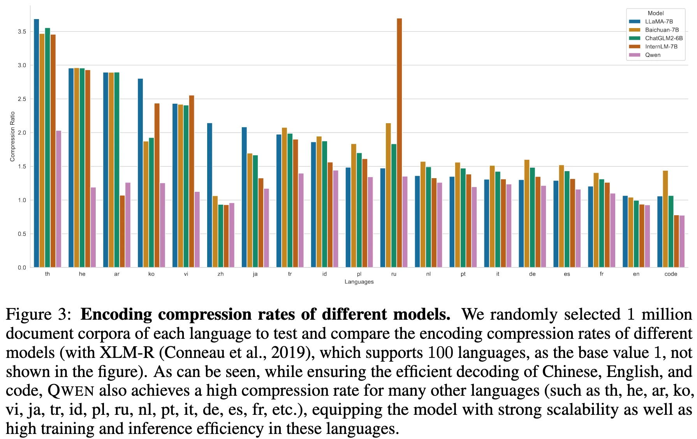
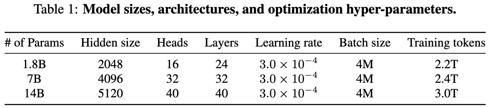

+++
date = '2023-09-28T10:28:38+08:00'
draft = false
title = 'Qwen Technical Report'
categories = ['LLMs']
tags = ['LLMs', 'Qwens']
+++

:(fas fa-building fa-fw):Qwen Team, Alibaba Group
:(fas fa-file-pdf fa-fw):[arXiv 2309.16609](https://arxiv.org/abs/2309.16609)
:(fab fa-github fa-fw):[QwenLM/Qwen](https://github.com/QwenLM/Qwen)
[Qwen/qwen](https://huggingface.co/collections/Qwen/qwen)

## TL;DR

## Motivation

## Key Innovations
Qwen:  the base pretrained language models
Qwen-Chat (RLHF): the chat models finetuned with human alignment techniques.
Code-Qwen: coding-specialized models
Code-Qwen-Chat: coding-specialized model
Math-Qwen-Chat: mathematics-focused:

## Approach

### Tokenization

- **Tokenizer**: tiktoken (BBPE)
- **Base Vocabulary**: cl100k_base
- **Augmentation**: Multilingual (Primary Chinese) Augmentation
- **Special Handling**: Single digit Split
- **Vocabulary Size**: approximately 152k

**Encoding Compression Rate**: Qwen achieves higher compression efficiency than its competitors in most languages. 

Despite the increase in vocabulary size, Qwen matains its performance levels in downstream evaluation.

### Model Architecture

Qwen is derived from the open-source LLaMA, incorporating the following modifications:
- **Untied Embedding between Input Embedding and Output Projection**: higher memory cost.
- **RoPE Positional Embedding**: use FP32 precision for the inverse frequency matrix, rather than BF16 or FP16, in order to prioritize model performance and achieve higher accuracy.
- **Bias**: For most layers, we remove biases following Chowdhery et al. (2022), but we add biases in the QKV layer of attention to enhance the extrapolation ability of the model (Su, 2023b).
- **Pre-Norm & RMSNorm**:
    - improve training stability compared to post-norm.
    - RMSNorm maintains equivalent performance while improving efficiency.
- **Activation function**: 
    - use SwiGLU, a combination of Swish and Gated Linear Unit.
    - As is common practice in previous research, we have reduced the dimension of the feed-forward network (FFN) from 4 times the hidden size to 8  3 of the hidden size.
- **Flash Attention**: employ Flash Attention in the attention modules to improve computational efficiency and reduce memory usage.

#### Model Parameters

Qwen provides multiple model scales with the following architecture parameters:

- **Parameters**: 0.5B, 1.8B, 7B, 14B, 72B
- **Hidden Size**:
  - 0.5B: 1024
  - 1.8B: 2048
  - 7B: 4096
  - 14B: 5120
  - 72B: 8192
- **Attention Heads**:
  - 0.5B: 16
  - 1.8B: 16
  - 7B: 32
  - 14B: 40
  - 72B: 64
- **Layers**:
  - 0.5B: 24
  - 1.8B: 24
  - 7B: 32
  - 14B: 40
  - 72B: 80
- **FFN Dimension**: 8/3 × hidden size
  - 0.5B: 8/3 × 1024 ≈ 2731
  - 1.8B: 8/3 × 2048 ≈ 5461
  - 7B: 8/3 × 4096 ≈ 10923
  - 14B: 8/3 × 5120 ≈ 13653
  - 72B: 8/3 × 8192 ≈ 21845

### Context Length Extension
todo 

### Pre-training
#### Pre-training Data
- Multi-source Heterogeneous Data, including public web documents, encyclopedia, books, codes, etc.
- Multilingual Corpus: primiarily English and Chinese
- Data Preprocessing:
    - Deduplication
    - Hybrid Quality Scrubbing: rule-based and machine-learning-based method
    - Selective Up-sampling
    - Instruction-Augmented Pretraining
    - Data Decontamination

### Alignment
#### Supervised Fintuning (SFT)
- training objective: next-token prediction
- apply the loss masks for the system and user inputs.

finetunes a pretrained LLM on chat-style data.

#### Reinforcement Learning from Human Feedback (RLHF)
##### Reward Model

##### Reinforcement Learning

<table class="grouped-table">
  <thead>
    <tr>
      <th rowspan="2">Stages</th>
      <th rowspan="2">Pre-training</th>
      <th rowspan="2">SFT</th>
      <th rowspan="2">Reinforcement Learning</th>
    </tr>
  </thead>
  
  <!-- 第一组：超参数 -->
  <tbody>
    <tr class="section-header">
      <td colspan="4">Hyperparameters</td>
    </tr>
    <tr>
      <td><strong>Purpose</strong></td>
      <td style="white-space: nowrap;">Language Foundations & World Knowledge</td>
      <td>Chat-style Alignment & Instruction Following</td>
      <td>Human Preference Alignment</td>
    </tr>
    <tr>
      <td><strong>Training Objective</strong></td>
      <td colspan="2">Next-token prediction</td>
      <td>Reward Maximization (PPO)</td>
    </tr>
    <tr>
      <td><strong>Vocabulary Size</strong></td>
      <td>152k</td>
      <td></td>
      <td>-</td>
    </tr>
    <tr>
      <td><strong>Optimizer</strong></td>
      <td colspan="2">AdamW (β₁=0.9, β₂=0.95, ε=10⁻⁸)</td>
      <td>-</td>
    </tr>
    <tr>
      <td><strong>Learning Rate</strong></td>
      <td>Cosine schedule (peak → 10% peak)</td>
      <td>Warmup to 2×10⁻⁶ (1430 steps)</td>
      <td>-</td>
    </tr>
    <tr>
      <td><strong>Precision</strong></td>
      <td colspan="2">BFloat16 mixed precision</td>
      <td>-</td>
    </tr>
    <tr>
      <td><strong>Batch Size</strong></td>
      <td></td>
      <td>128</td>
      <td>-</td>
    </tr>
    <tr>
      <td><strong>Training Steps</strong></td>
      <td></td>
      <td>4000</td>
      <td>-</td>
    </tr>
    <tr>
      <td><strong>Weight Decay</strong></td>
      <td></td>
      <td>0.1</td>
      <td>-</td>
    </tr>
    <tr>
      <td><strong>Dropout</strong></td>
      <td></td>
      <td>0.1</td>
      <td>-</td>
    </tr>
    <tr>
      <td><strong>Gradient Clipping</strong></td>
      <td></td>
      <td>1.0</td>
      <td>-</td>
    </tr>
    <tr>
      <td><strong>Context Length</strong></td>
      <td colspan="2">2048</td>
      <td></td>
    </tr>
  </tbody>
  
  <!-- 第三组：数据 -->
  <tbody>
    <tr class="section-header">
      <td colspan="4">Data</td>
    </tr>
    <tr>
      <td><strong>Training Corpus</strong></td>
      <td>Up to 3 trillion tokens</td>
      <td></td>
      <td>-</td>
    </tr>
  </tbody>
</table>

## Code-Qwen: Specialized Model for Coding
- Code-Qwen: continual pre-training
- Code-Qwen-Chat: supervised finetuned model

## Math-Qwen: Specialized Model for Mathematics Reasoning

## Experiments

## References

