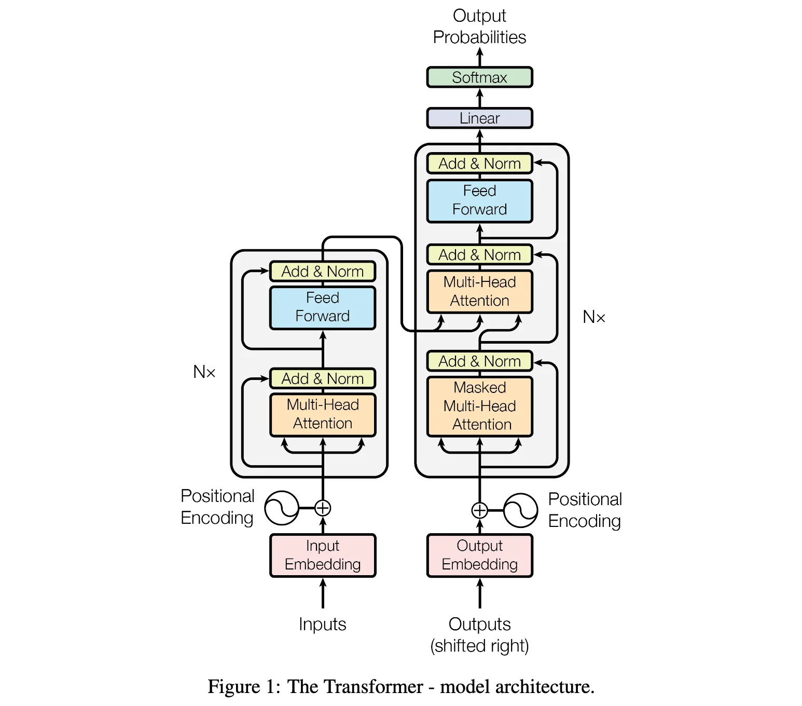
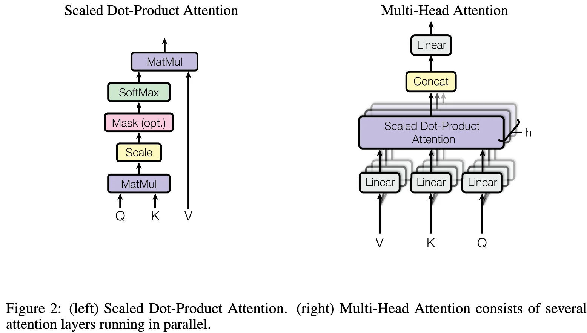

+++
date = '2017-06-12T17:11:59+08:00'
draft = false
title = 'Transformer: Attention Is All You Need'
categories = ['LLMs']
tags = ['LLMs', 'Transformer']
featured = true
+++

:(fas fa-award fa-fw):<span style="color:gray">NeurIPS 2017</span>
:(fas fa-building fa-fw):<span style="color:gray">Google</span>
:(fas fa-file-pdf fa-fw):[arXiv 1706.03762](https://arxiv.org/abs/1706.03762)
:(fab fa-github fa-fw):[tensorflow/tensor2tensor](https://github.com/tensorflow/tensor2tensor)

## TL;DR

## Motivation

## Contribution

## Approach

### Model Architecture



### Transformer

```python
class Transformer(nn.Module):
    def __init__(
        self,
        d_model: int = 512,
        nhead: int = 8,
        num_encoder_layers: int = 6,
        num_decoder_layers: int = 6,
        dim_feedforward: int = 2048,
        dropout: float = 0.1,
    ) -> None:
        super().__init__()
        encoder_layer = nn.TransformerEncoderLayer(
            d_model=d_model,
            nhead=nhead,
            dim_feedforward=dim_feedforward,
            dropout=dropout,
        )
        self.encoder = nn.TransformerEncoder(encoder_layer, num_layers=num_encoder_layers)
        
        decoder_layer = nn.TransformerDecoderLayer(
            d_model=d_model,
            nhead=nhead,
            dim_feedforward=dim_feedforward,
            dropout=dropout,
        )
        self.decoder = nn.TransformerDecoder(decoder_layer, num_layers=num_decoder_layers)

    def forward(self, src: Tensor, tgt: Tensor) -> Tensor:
        memory = self.encoder(src)
        output = self.decoder(tgt, memory)
        return output
```

### TransformerEncoder
```python
class TransformerEncoder(nn.Module):
    def __init__(self, encoder_layer: nn.TransformerEncoderLayer, num_layers: int):
        super().__init__()
        self.layers = ModuleList([copy.deepcopy(encoder_layer) for _ in range(num_layers)])
    
    def forward(self, src: Tensor) -> Tensor:
        output = src
        for mod in self.layers:
            output = mod(output)
        return output
```

### TransformerEncoderLayer
```python
class TransformerEncoderLayer(nn.Module):
    r"""TransformerEncoderLayer is made up of self-attn and feedforward network."""

    def __init__(self, d_model: int, nhead: int, dim_feedforward: int, dropout: float):
        super().__init__()
        # Implementation of self-attention
        self.self_attn = MultiheadAttention(d_model, nhead, dropout=dropout)
        self.dropout1 = Dropout(dropout)

        # Implementation of Feedforward model
        self.linear1 = Linear(d_model, dim_feedforward)
        self.activation = ReLU()
        self.dropout = Dropout(dropout)
        self.linear2 = Linear(dim_feedforward, d_model)
        self.dropout2 = Dropout(dropout)

        self.norm1 = LayerNorm(d_model)
        self.norm2 = LayerNorm(d_model)
    
    def forward(self, src: Tensor) -> Tensor:
        x = src
        x = self.norm1(x + self._sa_block(x))
        x = self.norm2(x + self._ff_block(x))
        return x

    # self-attention block
    def _sa_block(self, x: Tensor) -> Tensor:
        x = self.self_attn(x, x, x)[0]
        return self.dropout1(x)

```
### Attention



#### Scaled Dot-Product Attention

$$
\text{Attention}(Q, K, V) = \text{softmax}\left(\frac{QK^\top}{\sqrt{d_k}}\right)V
$$

where $Q \in \mathbb{R}^{n_q \times d_k}$, $K \in \mathbb{R}^{n_k \times d_k}$, $V \in \mathbb{R}^{n_k \times d_v}$, $n_q$ is the query sequence length, $n_k$ is the key/value sequence length, $d_k$ is the dimension of keys/queries, and $d_v$ is the dimension of values.

**Why scale by $\sqrt{d_k}$?** When $d_k$ is large, the dot product $QK^\top$ can have large magnitude, pushing the softmax into regions with extremely small gradients. Scaling by $\sqrt{d_k}$ prevents this by normalizing the variance of the dot products. Assuming $q_i$ and $k_i$ are independent random variables with mean 0 and variance 1, the dot product $q \cdot k = \sum_{i=1}^{d_k} q_i k_i$ has variance $d_k$, so dividing by $\sqrt{d_k}$ normalizes the variance to 1.

Common attention mechanisms:

**1. Additive Attention (Bahdanau attention):**

$$
\text{Attention}(Q, K, V) = \text{softmax}(v_a^\top \tanh(W_q Q^\top + W_k K^\top))V
$$

where $Q \in \mathbb{R}^{n_q \times d_k}$, $K \in \mathbb{R}^{n_k \times d_k}$, $W_q \in \mathbb{R}^{d_a \times d_k}$ and $W_k \in \mathbb{R}^{d_a \times d_k}$ are learnable weight matrices, $v_a \in \mathbb{R}^{d_a}$ is a learnable vector. 

**Dimension analysis with broadcasting:** The addition $W_q Q^\top + W_k K^\top$ uses **broadcasting mechanism** to increase dimensionality:
- $W_q Q^\top: \mathbb{R}^{d_a \times d_k} \times \mathbb{R}^{d_k \times n_q} \rightarrow \mathbb{R}^{d_a \times n_q}$
- $W_k K^\top: \mathbb{R}^{d_a \times d_k} \times \mathbb{R}^{d_k \times n_k} \rightarrow \mathbb{R}^{d_a \times n_k}$
- Through broadcasting: $\mathbb{R}^{d_a \times n_q} + \mathbb{R}^{d_a \times n_k} \rightarrow \mathbb{R}^{d_a \times n_q \times n_k}$

The broadcasting expands both tensors to shape $(d_a, n_q, n_k)$, where each element $(i, j)$ corresponds to the attention score for query-key pair $(q_i, k_j)$: $\text{score}(q_i, k_j) = v_a^\top \tanh(W_q q_i + W_k k_j)$.

**2. Dot-Product Attention:**

$$
\text{Attention}(Q, K, V) = \text{softmax}(QK^\top)V
$$

#### Multi-Head Attention
```python
class MultiheadAttention(nn.Module):
    r"""Allows the model to jointly attend to information from different representation subspaces."""
    def __init__(self, embed_dim: int, num_heads: int, dropout: float):
        super().__init__()
        self.embed_dim = embed_dim
        self.num_heads = num_heads
        self.dropout = dropout
        self.head_dim = embed_dim // num_heads
        self.scale = self.head_dim ** -0.5
        self.qkv = Linear(embed_dim, embed_dim * 3)
        self.out = Linear(embed_dim, embed_dim)
        self.dropout = Dropout(dropout) 

    def forward(self, query: Tensor, key: Tensor, value: Tensor) -> Tensor:
        qkv = self.qkv(query)
        qkv = qkv.view(qkv.size(0), qkv.size(1), self.num_heads, 3 * self.head_dim)
        qkv = qkv.permute(0, 2, 1, 3)
        return qkv

        q, k, v = qkv.chunk(3, dim=-1)
        attn = (q @ k.transpose(-2, -1)) * self.scale
        attn = attn.softmax(dim=-1)
        attn = self.dropout(attn)
        return self.out(attn @ v)

def multi_head_attention_forward(query: Tensor, key: Tensor, value: Tensor, embed_dim: int, num_heads: int, dropout: float) -> Tensor:
    tgt_len, bsz, embed_dim = query.shape
    src_len, _, _ = key.shape
    head_dim = embed_dim // num_heads

    # compute in-projection
    # reshape q, k, v for multihead attention and make them batch first
    q = query.view(tgt_len, bsz * num_heads, head_dim).transpose(0, 1)
    k = key.view(src_len, bsz * num_heads, head_dim).transpose(0, 1)
    v = value.view(src_len, bsz * num_heads, head_dim).transpose(0, 1)

    # calculate attention and out projection
    attn_weights = (q @ k.transpose(-2, -1)) * head_dim ** -0.5
    attn_weights = attn_weights.softmax(dim=-1)
    attn_weights = self.dropout(attn_weights)
    return attn_weights @ v
```


### Point-wise Feed-Forward Network

$$ \text{FFN}(x) = \text{Linear}(\text{ReLU}(\text{Linear}(x))) $$

```python
# feed forward block
def _ff_block(self, x: Tensor) -> Tensor:
    x = self.linear2(self.dropout(self.activation(self.linear1(x)))) # [batch_size, seq_len, d_model]
    return self.dropout2(x)
```


```python


class TransformerDecoder(nn.Module):
    def __init__(self, decoder_layer: nn.TransformerDecoderLayer, num_layers: int):
        super().__init__()
        self.layers = ModuleList([copy.deepcopy(decoder_layer) for _ in range(num_layers)])
    
    def forward(self, tgt: Tensor, memory: Tensor) -> Tensor:
        output = tgt
        for mod in self.layers:
            output = mod(output, memory)
        return output


class MultiheadAttention(nn.Module):
    def __init__(self, d_model: int, nhead: int, dropout: float):
        super().__init__()
        self.d_model = d_model
        self.nhead = nhead
        self.dropout = dropout
        self.head_dim = d_model // nhead
        self.scale = self.head_dim ** -0.5
        self.qkv = Linear(d_model, d_model * 3)
        self.out = Linear(d_model, d_model)
        self.dropout = Dropout(dropout)

    def forward(self, query: Tensor, key: Tensor, value: Tensor) -> Tensor:
        qkv = self.qkv(query)
        qkv = qkv.view(qkv.size(0), qkv.size(1), self.nhead, 3 * self.head_dim)
        qkv = qkv.permute(0, 2, 1, 3)
        return qkv

        q, k, v = qkv.chunk(3, dim=-1)
        attn = (q @ k.transpose(-2, -1)) * self.scale
        attn = attn.softmax(dim=-1)
        attn = self.dropout(attn)
        return self.out(attn @ v)

class TransformerDecoderLayer(nn.Module):
    def __init__(self, decoder_layer: nn.TransformerDecoderLayer):
        super().__init__()
        self.layer = decoder_layer
    
    def forward(self, tgt: Tensor, memory: Tensor) -> Tensor:
        return self.layer(tgt, memory)

```

def TransformerEncoder(x):
    num_layers = 6
    d_model = 512
    nhead = 8
    dim_feedforward = 2048
    dropout = 0.1
    transformer_encoder_layer = TransformerEncoderLayer(d_model, nhead, dim_feedforward, dropout)
    for layer in range(num_layers):
        x = transformer_encoder_layer(x)

```


Transformer: A basic transformer layer.
```python


```

TransformerEncoder: a stack of N TransformerEncoderLayer.

TransformerDecoder: a stack of N TransformerDecoderLayer.

TransformerEncoderLayer: made up of self-attn and feedforward network.
https://docs.pytorch.org/docs/stable/generated/torch.nn.TransformerEncoderLayer.html
https://github.com/pytorch/pytorch/blob/v2.9.1/torch/nn/modules/transformer.py#L645

TransformerDecoderLayer: made up of self-attn, cross-attn and feedforward network.


```python
# self-attention block

from torch.nn import MultiheadAttention, Dropout, Linear

self_attn = MultiheadAttention(d_model, nhead)
linear1 = Linear(d_model, dim_feedforward)
dropout = Dropout(dropout)
linear2 = Linear(dim_feedforward, d_model)
dropout1 = Dropout(dropout)
dropout2 = Dropout(dropout)
activation = ReLU()

def self_attention_block(x):
    x = MultiheadAttention(query=x, key=x, value=x)
    return Dropout(x)

# feed forward block
def feed_forward_block(x):
    x = dropout2(linear2(dropout(activation(Linear(x)))))
    return x
```


## Experiments

## References

