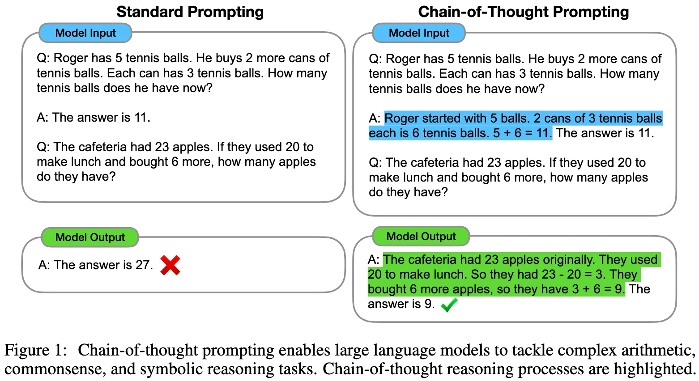
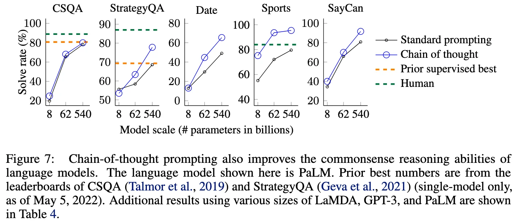
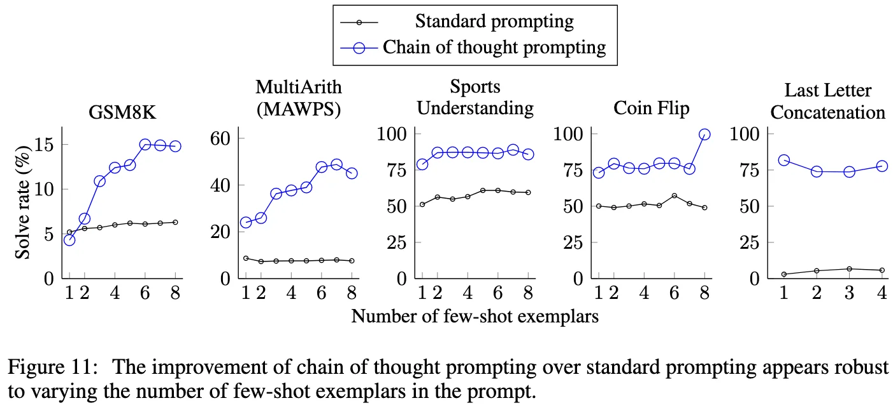
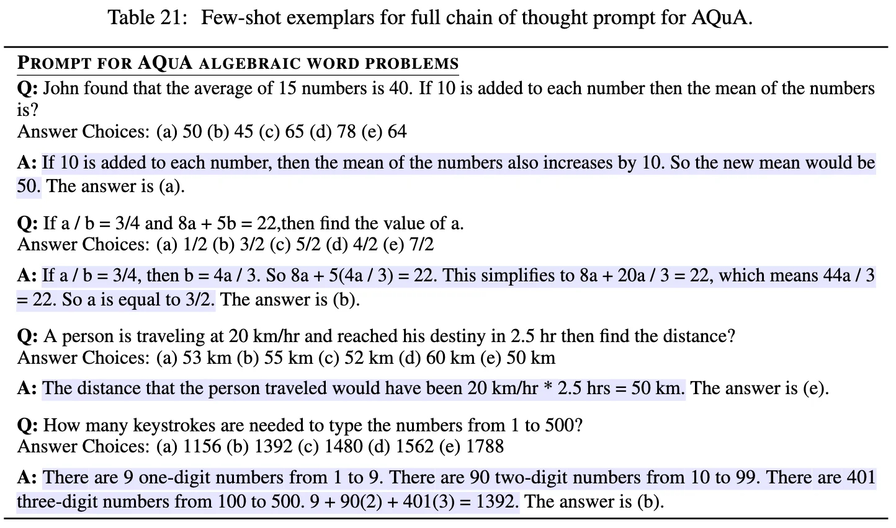
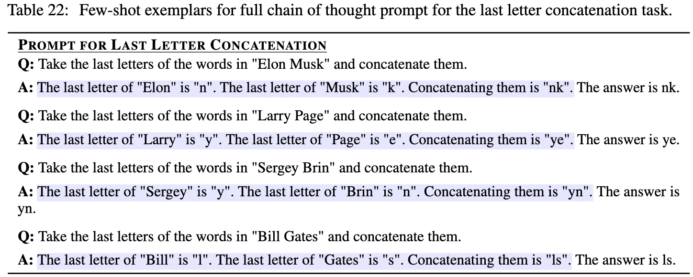
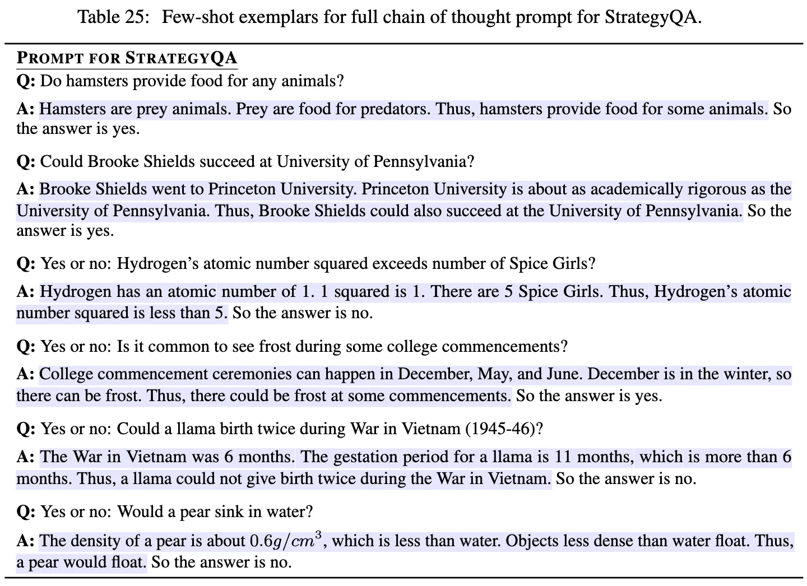
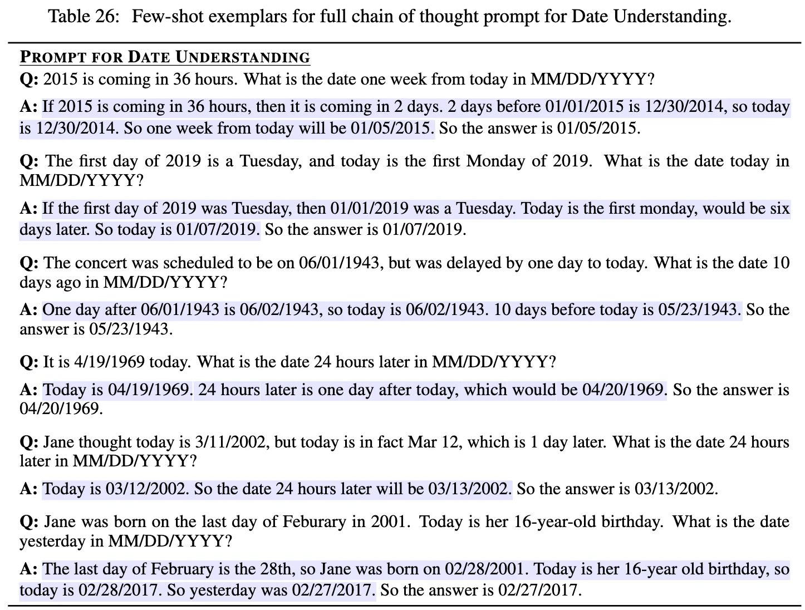
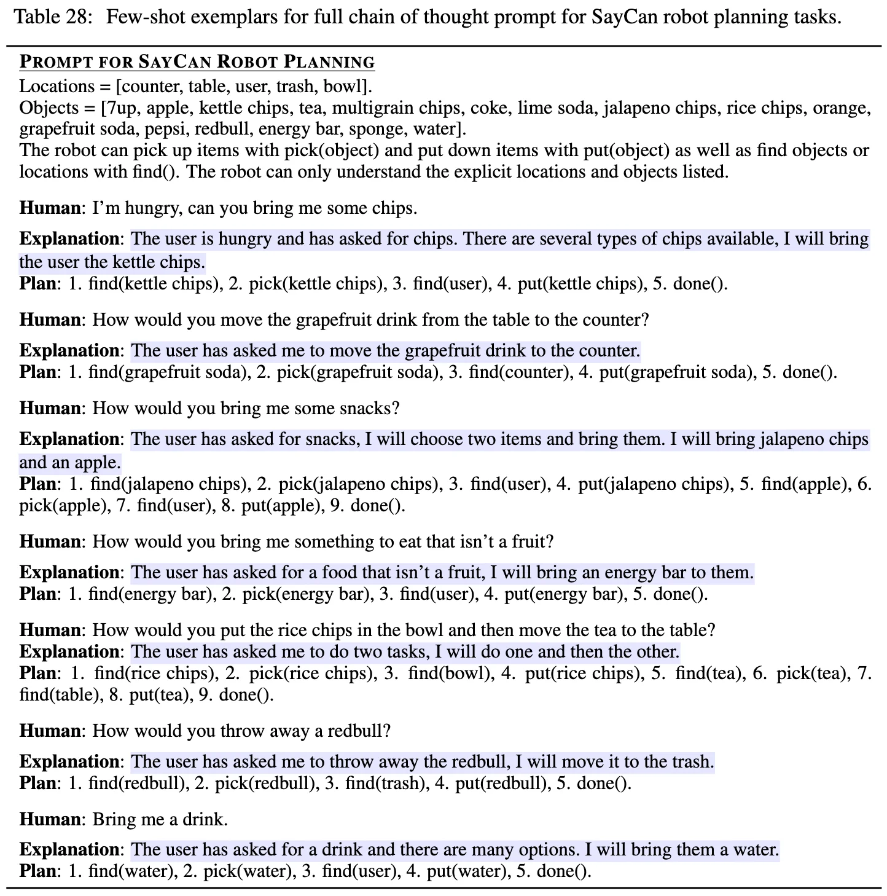

+++
date = '2022-01-28T17:43:33+08:00'
draft = false
title = 'Chain-of-Thought Prompting Elicits Reasoning in Large Language Models'
categories = ['LLMs']
tags = ['LLMs', 'Chain-of-Thought']
+++

:(fas fa-award fa-fw):NeurIPS 2022
:(fas fa-building fa-fw):Google Research, Brain Team
:(fas fa-file-pdf fa-fw):[arXiv 2201.11903](https://arxiv.org/abs/2201.11903)

## TL;DR

By incorporating a few chain of thought exemplars in prompting, **CoT Prompting** elicits reasoning abilities that emerge naturally in sufficiently large language models.

## Motivations & Innovations

- While scaling up model size improves general performance, it alone is  insufficient for complex reasoning tasks.
- Prior work has proven that natural language rationales through series of intermediate steps that lead to the final answer can benifit arithmetic reasoning through supervised training or rigid neuro-symbolic coding. -> **chain-of-thought**
- Large language models offer the exciting prospect of in-context few-shot learning via prompting. -> **prompting**

## Approach

- Chain-of-thought prompting, in principle, allows models to decompose complex problems into intermediate steps, which means that additional computation can be allocated to problems that require more reasoning steps.
- Chain-of-thought prompting provides an interpretable window into the behavior of the model, suggesting how it might have arrived at a particular answer and providing opportunities to debug where the reasoning path went wrong.

## Experiments
### Conclusions

  
  

- Figure 4 shows:
    - chain-of-thought prompting is a **scale-dependent emergent ability**: it backfires in smaller models due to fluent and illogical chains of thought, only yielding performance gains once models exceed approximately **~100B parameters**.
    - chain-of-thought prompting has larger performance gains for more-complicated problems.
        - GSM8K: complicate problems
        - SingleOp: the easiest subset of MAWPS only requires a single step to solve.
- Figure 7 shows scaling up model size improves the performance of standard prompting; **chain-of-thought prompting leads to further gains**.
    

- Figure 8 shows chain-of-thought prompting also facilitates **length generalization** to inference-time inputs longer than those seen in the few-shot examplars.
    - in-domain test set: for which examples have the same number of steps as the training/few-shot exemplars.
    - out-of-domain(OOD) test set: examples have more steps than those in the exemplars. For last letter concatenation, the model only sees exemplars ofr names with two words, and then performs last letter concatenation on names with 3 or 4 words.

### Why chain-of-thought prompting works?
- We manually examined modelgenerated chains of thought by LaMDA 137B for GSM8K. Of 50 random examples where the model returned the correct final answer, all of the generated chains of thought were also logically and mathematically correct except two that coincidentally arrived at the correct answer.
- We also randomly examined 50 random samples for which the model gave the wrong answer. The summary of this analysis is that 46% of the chains of thought were almost correct, barring minor mistakes (calculator error, symbol mapping error, or one reasoning step missing), and that the other 54% of the chains of thought had major errors in semantic understanding or coherence.

### Robustness of Chain-of-Thought

  
  

Althought CoT prompting exhibits some variance (which is typical for few-shot prompting), it demonstrates strong robustness across different annotators variation (independent on a particular linguistic styple), prompting styles, exemplar selection strategies, numbers of few-shot exemplars and different models.

## Exemplars for Chain-of-Thought Prompting

### Math Word Problems
#### Math Word Problems except AQuA

#### AQuA

### Symbolic Reasoning
#### Last Letter Concatenation
This task asks the model to concatenate the last letters of words in a name (e.g., “Amy Brown” → “yn”).

#### Coin Flip
This task asks the model to answer whether a coin is still heads up after people either flip or don’t flip the coin

### Commonsense Reasoning
reason about physical and human interactions under the presumption of general background knowledge

#### CSQA

#### StrategyQA

#### Date Understanding

#### Sports Understanding

#### SayCan Robot Planning

