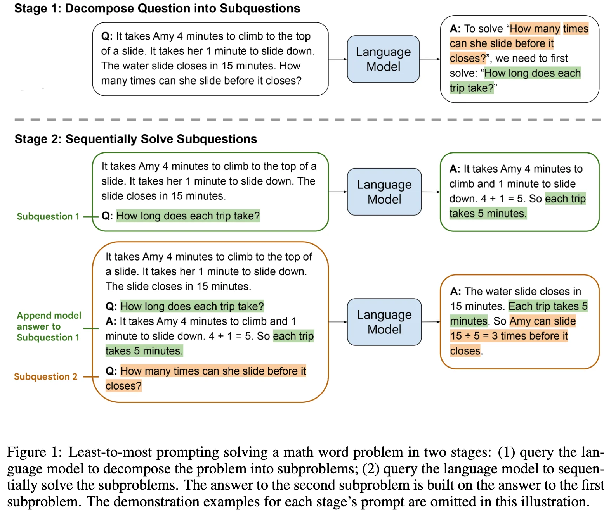

+++
date = '2022-05-21T17:46:22+08:00'
draft = false
title = 'Least-to-Most Prompting Enables Complex Reasoning in Large Language Models'
categories = ['LLMs']
tags = ['LLMs', 'Chain-of-Thought']
+++

:(fas fa-award fa-fw):ICLR 2023
:(fas fa-building fa-fw):Google Research, Brain Team
:(fas fa-file-pdf fa-fw):[arXiv 2205.10625](https://arxiv.org/abs/2205.10625)

## TL;DR

## Motivations & Innovations

## Approach

- **Decomposition.**
- **Subproblem Solving.**

## Experiments

