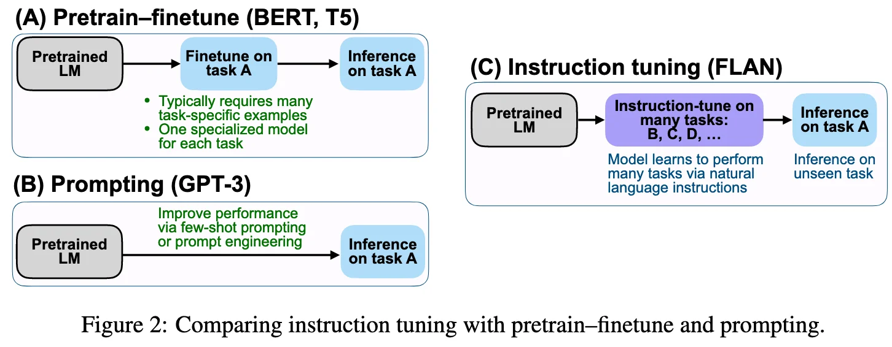
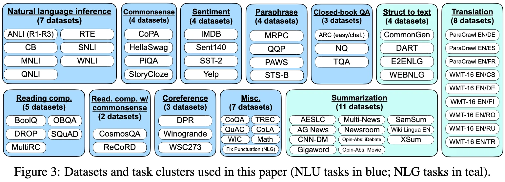
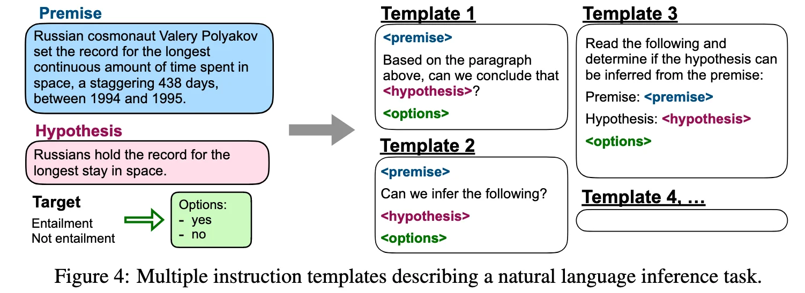
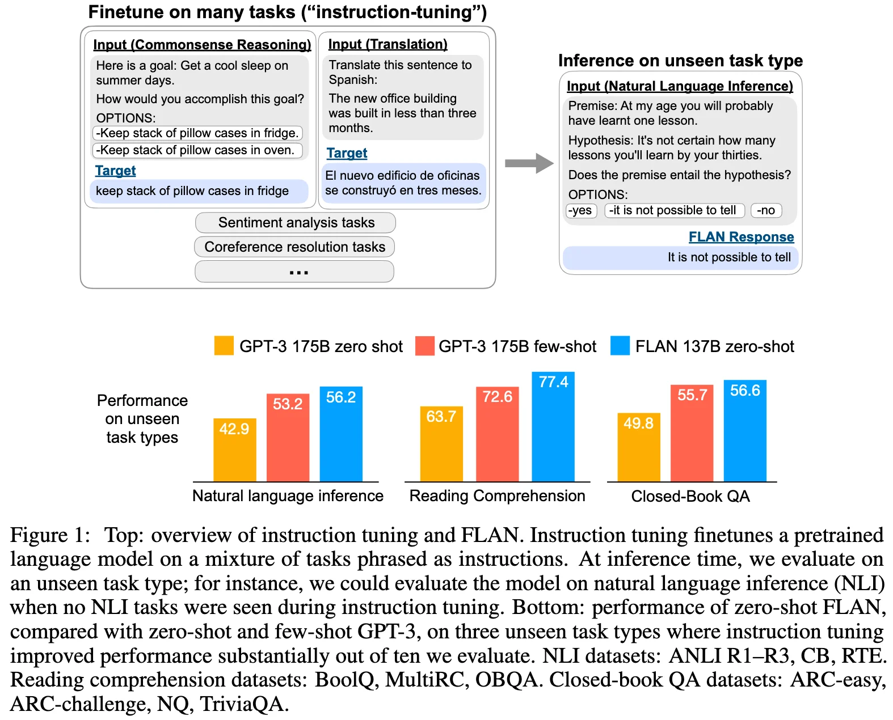

+++
date = '2021-09-03T20:11:50+08:00'
draft = false
title = 'FLAN: Finetuned Language Models Are Zero-Shot Learners'
categories = ['LLMs']
tags = ['LLMs', 'Instruction Tuning']
+++

:(fas fa-award fa-fw):ICLR 2022
:(fas fa-building fa-fw):Google Research
:(fas fa-file-pdf fa-fw):[arXiv 2109.01652](https://arxiv.org/abs/2109.01652)
:(fab fa-github fa-fw):[google-research/flan](https://github.com/google-research/flan)

## TL;DR

FLAN pioneered the instruction tuning paradigm -- finetuning language models on datasets expressed via natural language instructions, substantially improves zero-short performance of large language models.

## Motivations & Innovations
- While languages models at scale, such as GPT-3, excel at few-shot learning, their zero-shot performance remain a significant challenge. -> **improve zero-shot performance via instruction tuning (combine appealing aspects of both the pretrain-finetune and prompting paradigms) -> FLAN, for Finetuned Language Net.**
    
    

## Approach

### Model

base model: LaMDA-PT, a decoder-only pretrained transformer language model.
- 137B parameters
- 2.49T BPE tokens with a 32k vocabulary using the SentencePiece library.
- 

### Training Recipe

We instruction tune the pretrained base language model on the mixed instruction-tuned datasets, with examples in each dataset formatted via a randomly selected instruction template for that dataset.
- The input and target sequence lengths used in finetuning are 1024 and 256, respectively.
- use packing to combine multiple training examples into a single sequence, separating input from targets using a special EOS token.

### Data Recipe

To avoid the cost of creating an instruction dataset with many tasks from scratch, we **transform existing datasets from the research community into an instructional format**.
- step 1: aggregate 62 public text datasets into a mixture dataset.
- step 2: categorize each dataset into one of twelve task clusters, for which datasets in a given cluster are of the same task type. 

    

- step 3: manually compose ten unique templates that use natural language instructions to **describe the task for that dataset**. To increase diversity, for each dataset we also include up to three templates that "turned the task around" (e.g., for sentiment classification we include templates asking to generate a movie review). Figure 4 shows multiple instruction templates for a natural language inference dataset.

    

**Task-cluster Cross Validation**: To evaluate the performance of the instruction-tuned model on unseen tasks,
- Why: prior works defines unseen tasks by disallowing the same dataset to appear in training, which lacks rigor.
- How: hold out the cluster for evaluation while instruction tuning on all other clusters.
    

**Classification with Options**: The output space for a given task is either one of several classes (classification) or free text (generation). FLAN, a decoder-only language model, naturally responds in free text. 

For classification tasks, the probability mass for answers may have an undesired distribution among ways of saying each answer (e.g., a large number of alternative ways of saying “yes” may lower the probability mass assigned to “yes”). Therefore, we include an options suffix, in which we append the token OPTIONS to the end of a classification task along with a list of the output classes for that task.

**Balance the Data Distribution**: To prevent any dataset from dominating the finetuning distribution, we limit the number of training examples per dataset to 30k and follow the examples-proportional mixing scheme (Raffel et al., 2020) with a mixing rate maximum of 3k.2

## Experiments
- FLAN surpasses zero-shot 175B GPT-3 on 20 of 25 datasets we evaluate.
- FLAN outperforms few-shot GPT-3 by a large margin on ANLI, RTE, BoolQ, AI2-ARC, OpenbookQA, and StoryCloze.

### Ablation Study
- number of finetuning datasets, model scale, and natural language instructions are key to the success of instruction tuning.

