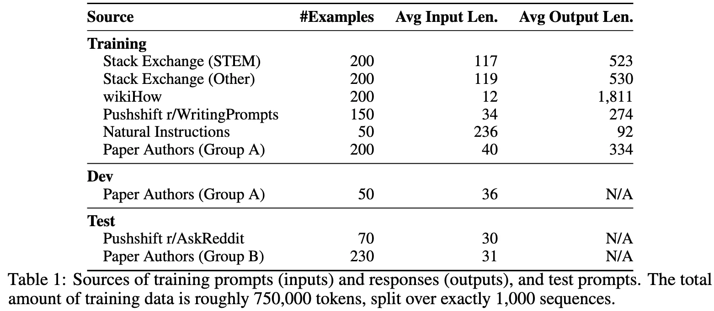

+++
date = '2023-05-18T20:17:46+08:00'
draft = false
title = 'LIMA: Less Is More for Alignment'
categories = ['LLMs']
tags = ['LLMs', 'Instruction Tuning']
+++

:(fas fa-award fa-fw):
:(fas fa-building fa-fw):
:(fas fa-file-pdf fa-fw):[arXiv 2305.11201](https://arxiv.org/abs/2305.11201)
:(fab fa-github fa-fw):

:(fas fa-globe fa-fw):
:(fas fa-blog fa-fw):

## TL;DR

**Superficial Alignment Hypothesis**: A model's knowledge and capabilities are learned almost entirely during pretraining, while alignment teaches it the style or format when interacting with users. -> a rather small set of examples is sufficient to achieve alignment.

## Motivations & Innovations

Existing alignment methods require significant amounts of instruction data. -> simply fine-tuning on 1,000 carefully curated training examples.

## Approach

### Data Source

- Community Questions & Answers
- Manually Authored Examples

## Experiments

Baseline: Starting from LLaMa 65B, SFT on 1,000-example alignment training set 

- LIMA outperforms RLHF-trained DaVinci003 from OpenAI, as well as a 65B-parameter reproduction of Alpaca with 52 times more data.

