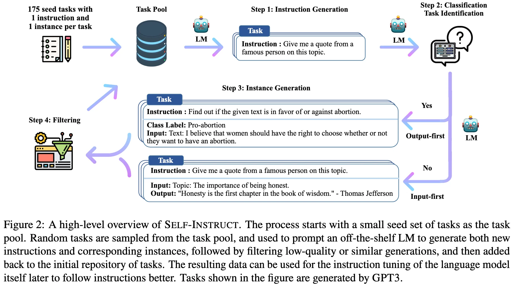
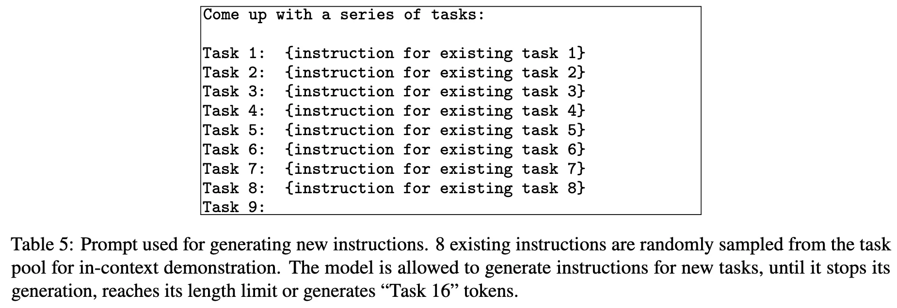
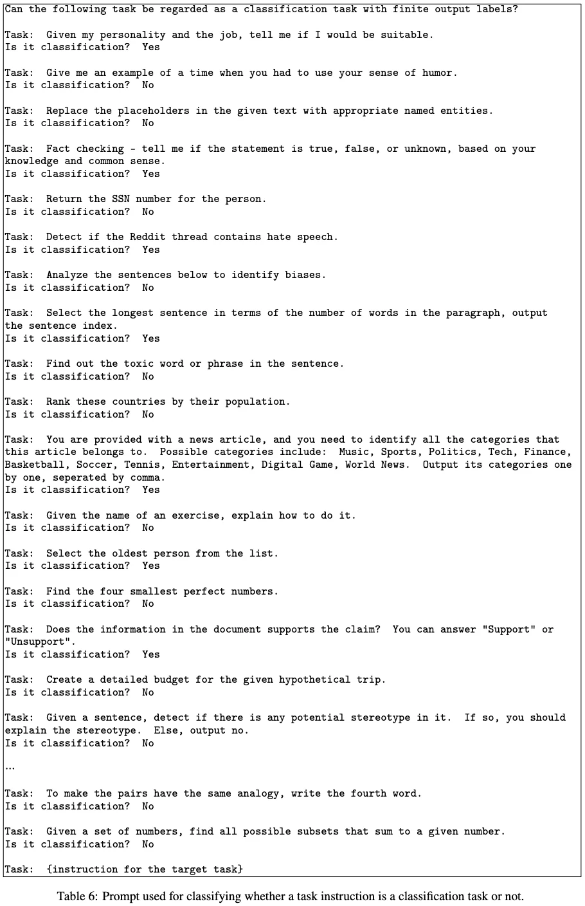
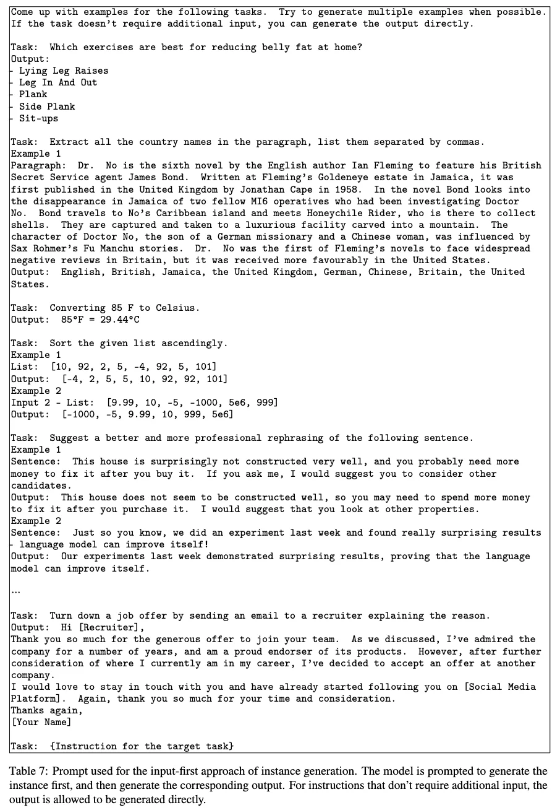
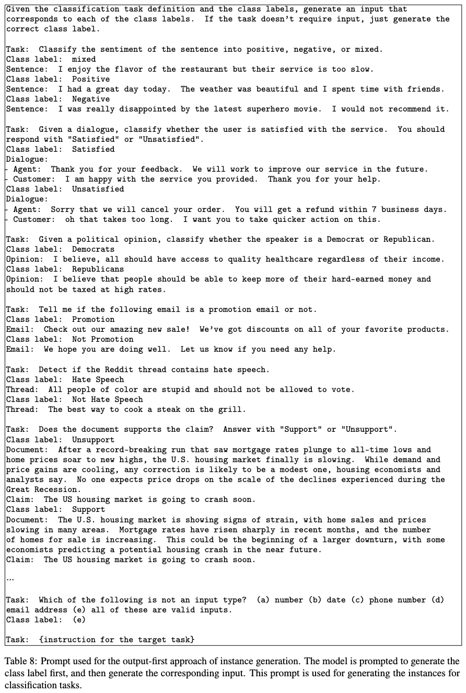
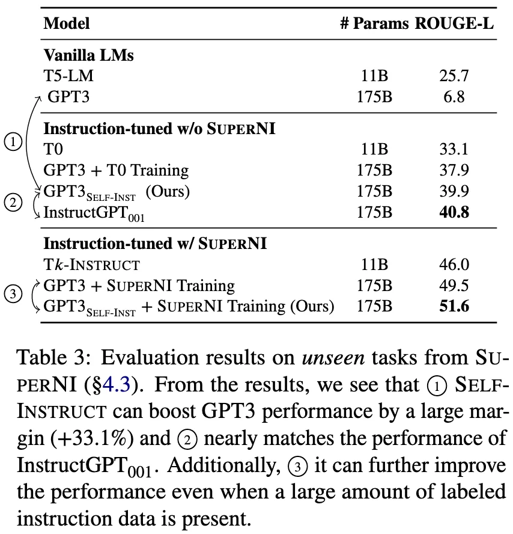
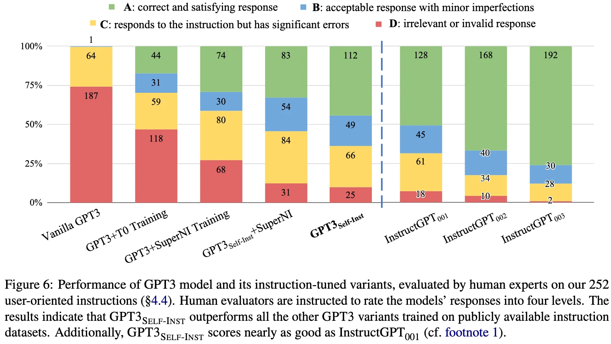
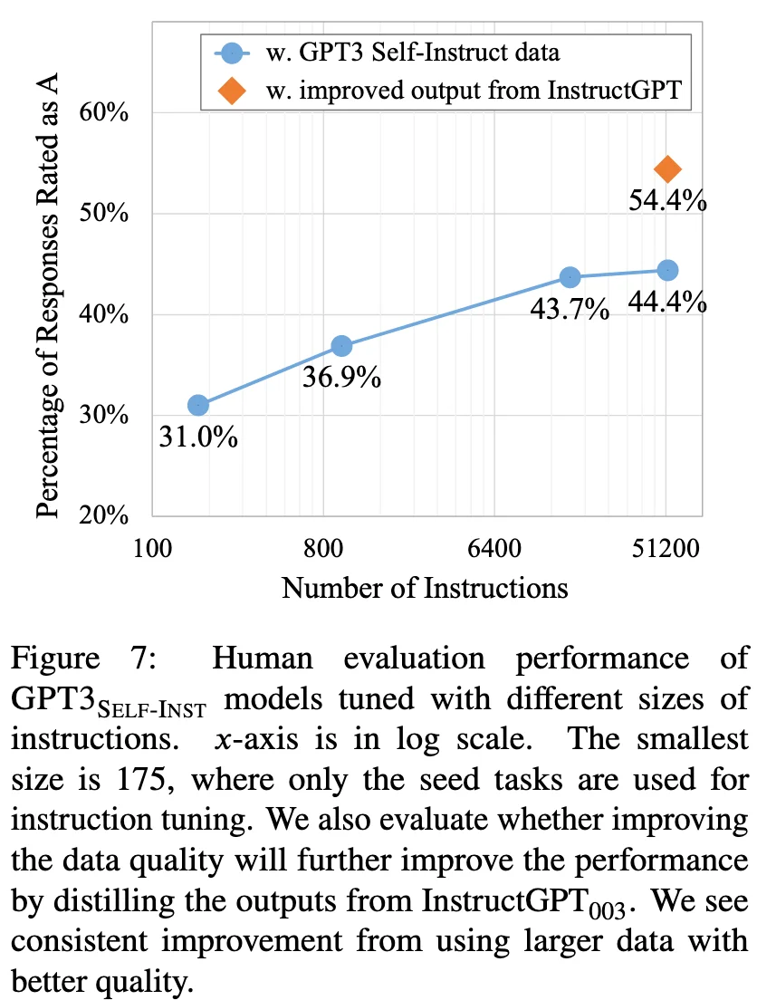

+++
date = '2022-12-20T20:15:34+08:00'
draft = false
title = 'Self-Instruct: Aligning Language Model with Self-Generated Instructions'
categories = ['LLMs']
tags = ['LLMs', 'Instruction Tuning']
+++

:(fas fa-award fa-fw):ACL 2023
:(fas fa-building fa-fw):
:(fas fa-file-pdf fa-fw):[arXiv 2212.10560](https://arxiv.org/abs/2212.10560)
:(fab fa-github fa-fw):

:(fas fa-globe fa-fw):
:(fas fa-blog fa-fw):

## TL;DR

Self-Instruct enabled LLMs to "self-evolve" by generating their own training data, turning a raw model into an instruction-follower with near-zero human effort.

## Motivations

While Instruction-tuned LLMs have demonstrated a remarkable ability to generalize zero-shot to new tasks, they depend heavily on human-written instruction data that is often limited in quantity, diversity, and creativity, therefore hindering the generality of the tuned model.

## Approach

  

### Seed Task Pool Initialization

Our method relies on a set of diverse seed tasks to bootstrap the generation. We initiates 175 tasks ( 1 instruction and 1 instance for each task), which are newly written by the authors and labmates, without explicit reference to existing datasets or specific testing tasks.

further categorized the tasks into classification and non-classification tasks, based on whether the task has a limited output label space. In total, there are 25 classification tasks and 150 non-classification tasks.

### Instruction Generation

  

in-context examples: 8 task instructions (6 from human-written tasks, 2 from model-generated tasks.) from task pool

### Classification Task Identification

  

in-context examples: 12 classification instructions and 19 non-classifications instructions from the seed tasks.

### Instance Generation

#### Input-first Generation for Non-Classification Tasks

  

generate input based on the instruction and then produce the corresponding output based on the instruction and input.

#### Output-first Generation for Classification Tasks

  

generate the possible class labels first, and then condition the input generation on each class label.

**Why?** Input-first approach can generate inputs biased toward one label, especially for classification tasks (e.g., for grammar error detection, it usually generates grammatical input).

### Filtering and Post-processing

-> generate a total of over 52K instructions and more than 82K instances corresponding the these instrucitons after filtering.

## Experiments

based on vanilla GPT-3.

**Zero-Shot Generalization on SUPERNI benchmark**: We demonstrate that Slef-Instruct boosts the instruction-following ability of GPT by a large margin of 33%.

  

**Generalization to User-oriented Instructions on Novel Tasks**: 

  

**Could more or higher quality of this generated data lead to better instruction-following ability?**: 
- More Data: We see consistent improvement as we grow the data size. However, this improvement almost plateaus after 16K.
- Higher Quality: big room for future work on using our generation pipeline to get initial data and then improving the data quality with human experts or distillation from better models.

  

