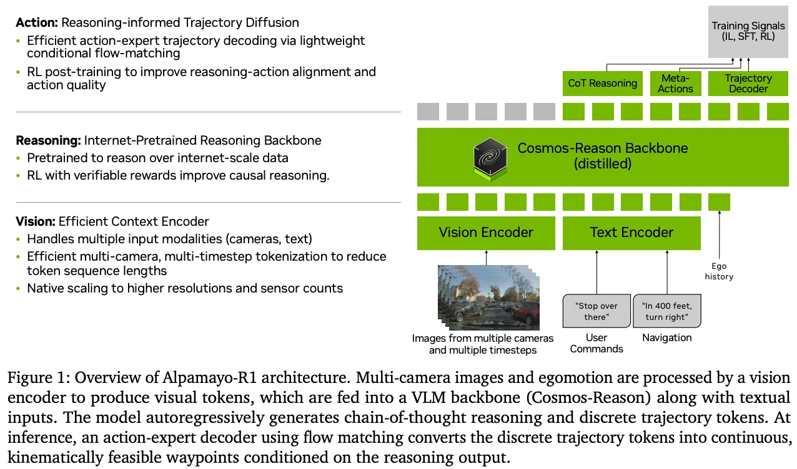
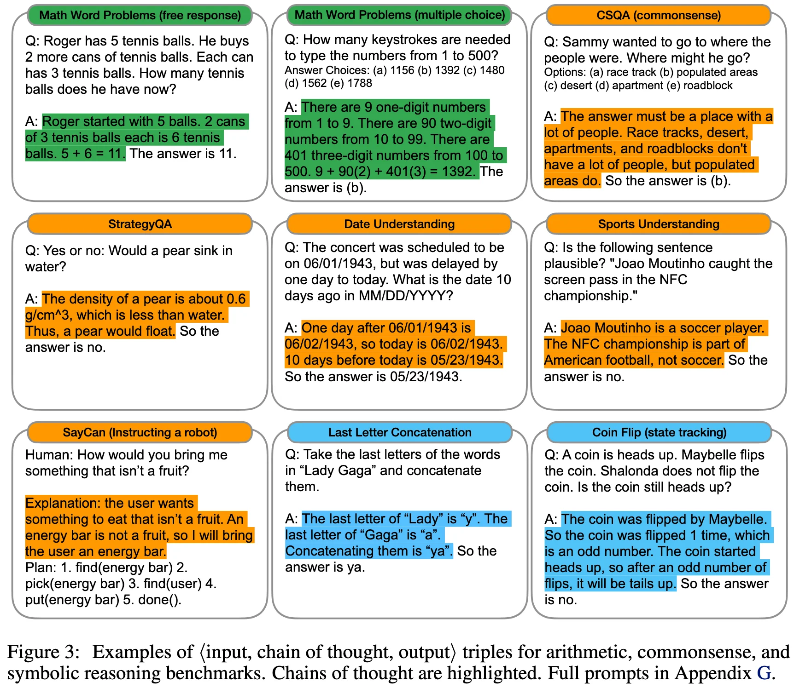

+++
date = '2025-10-30T15:13:13+08:00'
draft = false
title = 'NVIDIA Alpamayo'
categories = ['VLAs']
tags = ['VLAs']
+++

:(fas fa-award fa-fw):
:(fas fa-building fa-fw):NVIDIA
:(fas fa-file-pdf fa-fw):[arXiv 2511.00088](https://arxiv.org/abs/2511.00088)
:(fab fa-github fa-fw):

:(fas fa-globe fa-fw):[nvidia.com/en-sg/solutions/autonomous-vehicles/alpamayo/](https://www.nvidia.com/en-sg/solutions/autonomous-vehicles/alpamayo/)
:(fas fa-blog fa-fw):

## TL;DR

NVIDIA Alpamayo is an open portfolio of AI models, simulation frameworks, and physical AI datasets designed to accelerate the development of safe, transparent, and reasoning-based autonomous vehicles.

- Alpamayo 1: Reasoning VLA Model
- AlpaSim: Open Simulation Framework
- Physical AI Open Datasets

## Motivations & Innovations

## Approach

### Model

### Training Recipe

### Data Recipe

## Experiments

