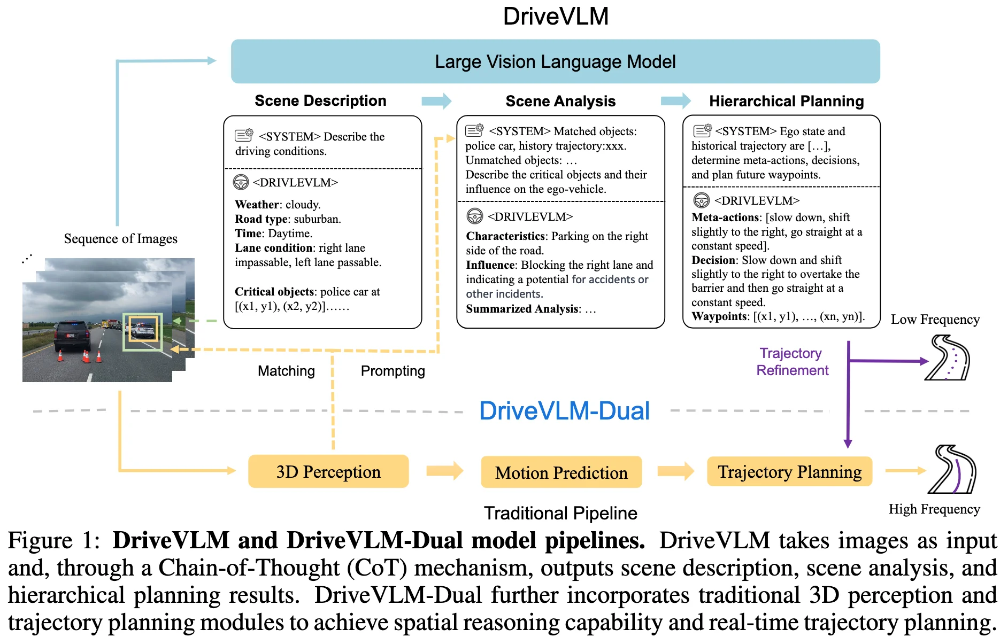

+++
date = '2025-06-26T10:25:00+08:00'
draft = false
title = 'DRIVEVLM: The Convergence of Autonomous Driving and Large Vision-Language Models'
organization = ['Li Auto']
categories = []
tags = []
+++

123 &middot; [arXiv]() &middot; [GitHub]()

## Motivation

## Contribution

## Method

### Input
- A sequence of images

### Output

### Architecture
- Vision Encoder
- LLM
- Vision-Language Adapter

**Scene Description.**
- Environment Description
    - Weather: spans conditions from sunny to snowy, affecting visibility and traction
    - Time: distinguishes between daytime and nighttime, impacting driving strategies due to visibility changes
    - Road types: such as urban or highway, introduce different challenges
    - lane conditions: focus on current lane positioning and possible maneuvers, crucial for safe driving decisions.
- Critical Object Identification
    - Category
    - 2D bounding box

**Scene Analysis.**

**Hierarchical Reasoning.**

### DriveVLM-Dual

## Experiment

## References
- 
- 
- 

## Question
