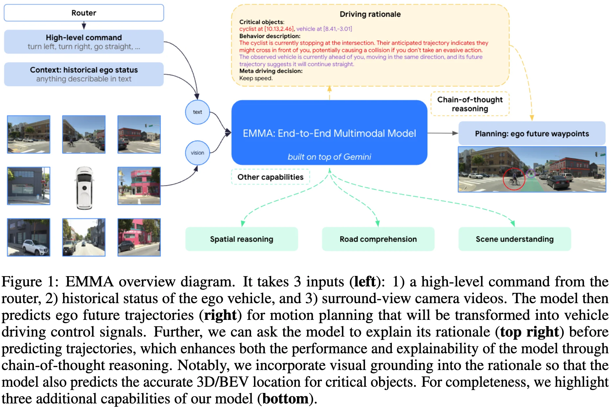

+++
date = '2025-06-20T14:29:54+08:00'
draft = false
title = 'EMMA'
organization = ['Waymo']
categories = []
tags = []
+++

123 &middot; [arXiv](https://arxiv.org/abs/2410.23262) &middot; [Blog](https://waymo.com/blog/2024/10/introducing-emma) &middot; [GitHub]()

## Motivation

## Contribution

## Method

## Experiment

## References
- https://waymo.com/blog/2024/10/introducing-emma
- 
- 

## Question
