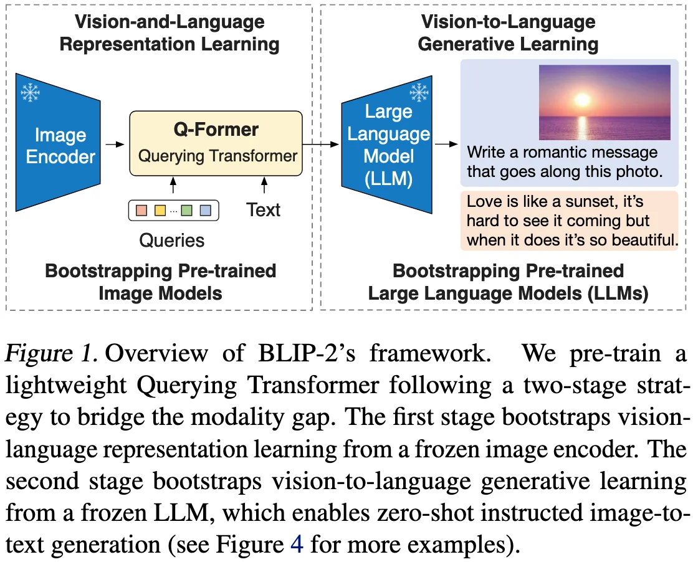
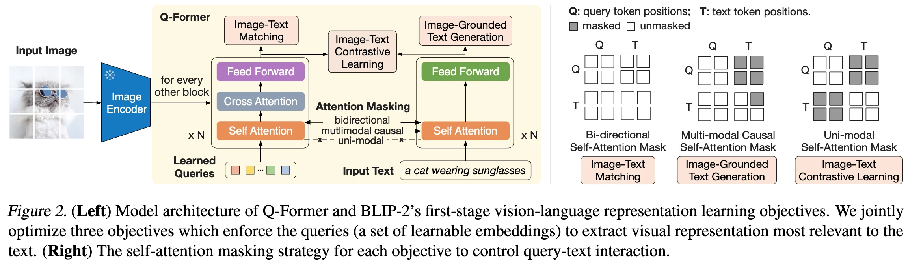
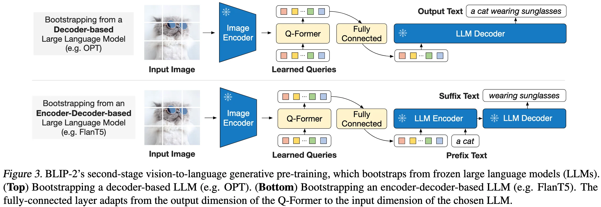

+++
date = '2025-11-27T13:24:53+08:00'
draft = false
title = 'BLIP-2: Bootstrapping Language-Image Pre-training with Frozen Image Encoders and Large Language Models'
organization = ['Salesforce Research']
categories = []
tags = []
+++

123 &middot; [arXiv]() &middot; [GitHub](https://github.com/salesforce/LAVIS/tree/main/projects/blip2)

## Motivations

## Contributions

## Method

### Model Architecture

## Experiments

## References

## Questions
