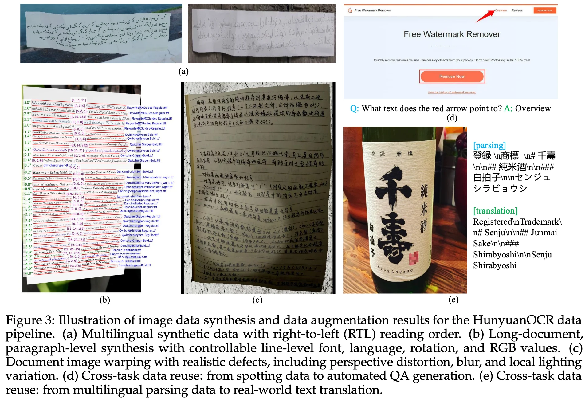
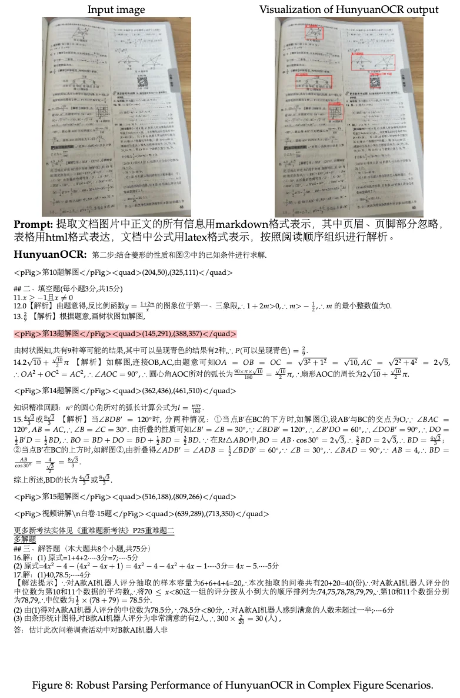
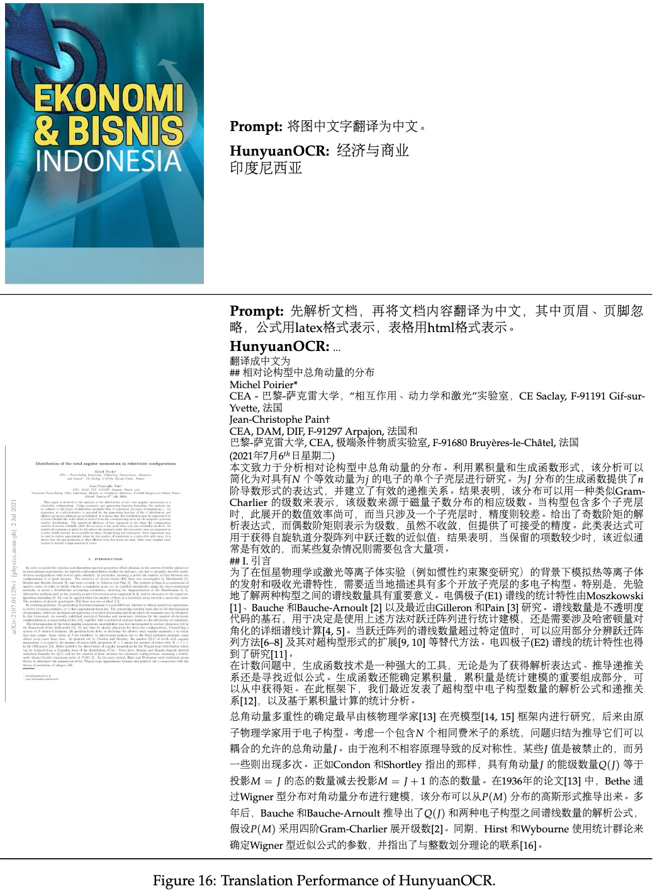

+++
date = '2025-11-16T14:27:22+08:00'
draft = false
title = 'HunyuanOCR Technical Report'
categories = ['VLMs']
tags = ['VLMs', 'OCR']
+++

:(fas fa-building fa-fw):<span style="color:gray">Tencent Hunyuan Vision Team</span>
:(fas fa-file-pdf fa-fw):[arXiv 2511.19575](https://arxiv.org/abs/2511.19575)
:(fab fa-github fa-fw):[Tencent-Hunyuan/HunyuanOCR](https://github.com/Tencent-Hunyuan/HunyuanOCR)
[tencent/HunyuanOCR](https://huggingface.co/tencent/HunyuanOCR)

## Motivation
- Traditional OCR systems rely on the modularized pipeline architecture, primarily including, but not limited to: text detection, text recognition, document layout analysis, named entity recognition, and optional text translation modules, which inevitably result in cumulative error propagation, elevate deployment and maintenance overhead. -> **End-to-End**
- While leading general VLMs (e.g., Gemini, Qwen-VL) deliver superior OCR performance, they often entail excessive computational overhead and high latency due to the massive parameter scales. -> **OCR-specific, lightweight(1B)**
- **unified multi-task modeling, including text spotting, document parsing, information extraction, visual question answering, and text image translation.**

## Method

### Model Architecture


**Large Language Model (0.5B)**: HunyuanOCR model is initialized with pre-trained weights from Hunyuan-0.5B with xD-RoPE.

**Native ResolutionVision Encoder (0.4B)**: SigLIP-v2-400M pre-trained model.

**Vision-Language Adapter**:
```python
(perceive): HunYuanVisionPatchMerger(
  (proj): Sequential(
    (0): Conv2d(1152, 2304, kernel_size=(2, 2), stride=(2, 2))
    (1): GELU(approximate='none')
    (2): Conv2d(2304, 4608, kernel_size=(1, 1), stride=(1, 1))
  )
  (mlp): Linear(in_features=4608, out_features=1024, bias=True)
  (before_rms): HunYuanVLRMSNorm((1152,), eps=1e-05)
  (after_rms): HunYuanVLRMSNorm((1024,), eps=1e-05)
)
```
End-to-End Optimization

## Data Recipe
### Data Collection
- public benchmarks
- web crawling
- synthetic data

200 million image-text pairs spanning nine major real-world scenarios—street views, documents, advertisements, handwritten text, screenshots, cards/certificates/invoices, game interfaces, video frames, and artistic typography—and covering more than 130 languages.



### Data Synthesis

### Data Augmentation
- geometric deformation via control-point manipulation to emulate folds, curves, and perspective distortions.
- imaging degradation with motion blur, Gaussian noise, and compression artifacts.
- illumination perturbations that model global/local lighting variations, shadows and reflections.

## <span style="color: red;">Training Recipe</span>

<style>
table.center-table {
  width: 100%;
  table-layout: fixed;
  font-size: 0.75em;
  border-collapse: collapse;
}
table.center-table th,
table.center-table td {
  text-align: center;
  vertical-align: middle;
  padding: 3px 3px !important;
  overflow-wrap: break-word;
}
table.center-table th {
  font-weight: bold;
}
table.center-table th:first-child,
table.center-table td:first-child {
  width: 10%;
  padding: 3px 3px !important;
}
table.center-table tbody tr:last-child td:not(:first-child) {
  text-align: left;
}
</style>


<table class="center-table">
  <thead>
    <tr>
      <th rowspan="2">Stages</th>
      <th colspan="4">Pre-training</th>
      <th rowspan="2" style="color: red;">Reinforcement Learning</th>
    </tr>
    <tr>
      <th>Stage-1</th>
      <th>Stage-2</th>
      <th>Stage-3</th>
      <th>Stage-4</th>
    </tr>
  </thead>
  <tbody>
    <tr>
      <td><strong>Purpose</strong></td>
      <td style="white-space: nowrap;">Vision-Language Alignment</td>
      <td style="white-space: nowrap;">Multimodal Pre-training</td>
      <td style="white-space: nowrap;">Long-context Pre-training</td>
      <td style="white-space: nowrap;">Application-oriented SFT</td>
      <td>-</td>
    </tr>
    <tr>
      <td><strong>Trainable Params</strong></td>
      <td>ViT &amp; Adapter</td>
      <td>All</td>
      <td>All</td>
      <td>All</td>
      <td>-</td>
    </tr>
    <tr>
      <td><strong>Learning Rate</strong></td>
      <td>3e-4 → 3e-5</td>
      <td>2e-4 → 5e-5</td>
      <td>8e-5 → 5e-6</td>
      <td>2e-5 → 1e-6</td>
      <td>-</td>
    </tr>
    <tr>
      <td><strong>Training Tokens</strong></td>
      <td>50B</td>
      <td>300B</td>
      <td>80B</td>
      <td>24B</td>
      <td>-</td>
    </tr>
    <tr>
      <td><strong>Sequence Length</strong></td>
      <td>8k</td>
      <td>8k</td>
      <td>32k</td>
      <td>32k</td>
      <td>-</td>
    </tr>
    <tr>
      <td><strong>Data Composition</strong></td>
      <td>
        <ul style="margin: 0; padding-left: 20px;">
          <li>Synthetic Parsing and Recognition Data</li>
          <li>General Image Caption Data</li>
          <li>Pure Text (≤10%)</li>
        </ul>
      </td>
      <td>
        <ul style="margin: 0; padding-left: 20px;">
          <li>Increase the proportion of synthetic spotting, parsing, translation and VQA data.</li>
          <li>Pure Text (≤10%)</li>
        </ul>
      </td>
      <td>
        <ul style="margin: 0; padding-left: 20px;">
          <li>Long Pure Text</li>
          <li>Real-world Auto-annotated Data</li>
          <li>Long Document Parsing Data</li>
          <li>Information Extraction Data</li>
        </ul>
      </td>
      <td>
        <ul style="margin: 0; padding-left: 20px;">
          <li>Human-annotated Data</li>
          <li>Hard-negative Data</li>
          <li>Standardized Instruction Data</li>
        </ul>
      </td>
      <td>-</td>
    </tr>
  </tbody>
</table>

> a small proportion of plain text to preserve the core linguistic capabilities of the language model.


## Supplementary Material
### Evolution of Optical Character Recognition (OCR)

- 1950s-1980s: OCR systems were based on template matching and feature engineering, focusing on basic text recognition in scanned documents.
- 1990s: machine learning
- 2015s: deep learning
- 2020s: vision-language models
    - General VLMs
    - Specialized VLMs (Modular): still depend on a preliminary layout analysis module to detect document elements, with the VLM subsequently parsing content within localized regions.
    - Specialized OCR Models (End2End)

### Performance Comparison of OCR Systems


### OCR Tasks
#### Text Spotting
detect and recognize text within an image, and output the line-leveltext content and coordinates in a formatted manner. `<ref>text</ref><quad>(x1,y1),(x2,y2)</quad>`
- `<ref>text</ref>`: text content 
- `<quad>(x1,y1),(x2,y2)</quad>`: text coordinates with its top-left and bottom-right vertices, normalized to the range [0, 1000] to maintain consistency across input images of varying resolutions.


#### Document Parsing
parse the text into a structured format.
- Fine-Grained Element Parsing: support independent identification and extraction of specialized document elements, including mathematical formulas, chemical formulas, tables, and charts.
- End-to-End Document Parsing



#### Information Extraction (IE)
extract information from the text.


#### Visual Question Answering (VQA)
answer questions based on the visual content of a given image.
#### Text Image Translation
translate the text in an image into either Chinese or English.
- support over 14 languages
- support both document-oriented images and general-purpose images



### Recommended Instruction


### Common Supported IE Categories


### <span style="color:red;">Reinforcement Learning Details</span>


### Code
```python
HunYuanVLForConditionalGeneration(
  (model): HunYuanVLModel(
    (embed_tokens): Embedding(120818, 1024, padding_idx=120817)
    (layers): ModuleList(
      (0-23): 24 x HunYuanVLDecoderLayer(
        (self_attn): HunYuanVLAttention(
          (q_proj): Linear(in_features=1024, out_features=2048, bias=False)
          (k_proj): Linear(in_features=1024, out_features=1024, bias=False)
          (v_proj): Linear(in_features=1024, out_features=1024, bias=False)
          (o_proj): Linear(in_features=2048, out_features=1024, bias=False)
          (query_layernorm): HunYuanVLRMSNorm((128,), eps=1e-05)
          (key_layernorm): HunYuanVLRMSNorm((128,), eps=1e-05)
          (rotary_emb): HunYuanVLRotaryEmbedding()
        )
        (mlp): HunYuanVLMLP(
          (gate_proj): Linear(in_features=1024, out_features=3584, bias=False)
          (up_proj): Linear(in_features=1024, out_features=3584, bias=False)
          (down_proj): Linear(in_features=3584, out_features=1024, bias=False)
          (act_fn): SiLUActivation()
        )
        (input_layernorm): HunYuanVLRMSNorm((1024,), eps=1e-05)
        (post_attention_layernorm): HunYuanVLRMSNorm((1024,), eps=1e-05)
      )
    )
    (norm): HunYuanVLRMSNorm((1024,), eps=1e-05)
  )
  (lm_head): Linear(in_features=1024, out_features=120818, bias=False)
  (vit): HunYuanVisionTransformer(
    (embeddings): HunYuanVisionPatchEmbed(
      (patch_embedding): Conv2d(3, 1152, kernel_size=(16, 16), stride=(16, 16))
      (position_embedding): Embedding(16385, 1152)
    )
    (layers): ModuleList(
      (0-26): 27 x HunYuanVisionBlock(
        (self_attn): HunYuanVisionAttention(
          (q_proj): Linear(in_features=1152, out_features=1152, bias=True)
          (k_proj): Linear(in_features=1152, out_features=1152, bias=True)
          (v_proj): Linear(in_features=1152, out_features=1152, bias=True)
          (o_proj): Linear(in_features=1152, out_features=1152, bias=True)
        )
        (mlp): HunYuanVisionMLP(
          (act_fn): GELUActivation()
          (dense_h_to_4h): Linear(in_features=1152, out_features=4304, bias=True)
          (dense_4h_to_h): Linear(in_features=4304, out_features=1152, bias=True)
        )
        (input_layernorm): LayerNorm((1152,), eps=1e-05, elementwise_affine=True)
        (post_attention_layernorm): LayerNorm((1152,), eps=1e-05, elementwise_affine=True)
      )
    )
    (perceive): HunYuanVisionPatchMerger(
      (proj): Sequential(
        (0): Conv2d(1152, 2304, kernel_size=(2, 2), stride=(2, 2))
        (1): GELU(approximate='none')
        (2): Conv2d(2304, 4608, kernel_size=(1, 1), stride=(1, 1))
      )
      (mlp): Linear(in_features=4608, out_features=1024, bias=True)
      (before_rms): HunYuanVLRMSNorm((1152,), eps=1e-05)
      (after_rms): HunYuanVLRMSNorm((1024,), eps=1e-05)
    )
  )
)
```
