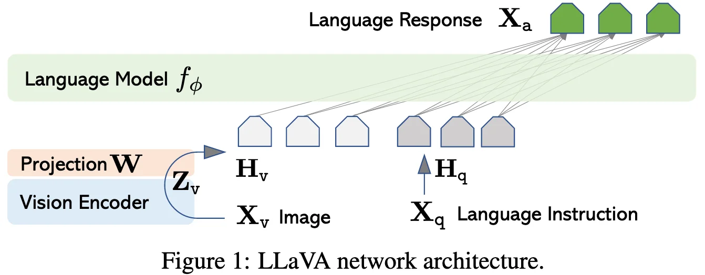

+++
date = '2023-04-26T20:22:53+08:00'
draft = false
title = 'LLaVA: Visual Instruction Tuning'
categories = ['VLMs']
tags = ['VLMs']
+++

:(fas fa-award fa-fw):NeurIPS 2023 (Oral)
:(fas fa-building fa-fw):Microsoft Research
:(fas fa-file-pdf fa-fw):[arXiv 2304.08485](https://arxiv.org/abs/2304.08485)
:(fab fa-github fa-fw):[haotian-liu/LLaVA](https://github.com/haotian-liu/LLaVA)
:(fas fa-globe fa-fw):[llava-vl.github.io](https://llava-vl.github.io/)

## Motivation

## Contribution

## Method
### Architecture

**Large Language Model**: Vicuna

**Vision Encoder**: the pre-trained CLIP visual encoder ViT-L/14

**Adapter**: While a simple linear layer is employed here, more sophisticated alternatives, such as gated cross-attention in Flamingo and Q-former in BLIP-2, could be optionally substitued. 
- cross-modal alignment between visual space and text space.
- visual feature compression

## Training Recipe
**Pre-training for Feature Alignment**: 

**Fine-tuning End-to-End**:

## Data Recipe
### GPT-assisted Visual Instruction Data Generation

## Experiment

## Reference
- 
- 
- 

## Question

NIPS 2023, Oral - ReadPaper
  - https://llava-vl.github.io

Motivations

Contributions

Method
[图片]
Task
Data: GPT-assisted Visual Instruction Data Generation
Multi-modal data
1. Image-text pairs: CC LAION

Input/Output
Multi-Modal Tokenizer
Image Tokenizer
  - Encoder: the pre-trained CLIP visual encoder ViT-L/14
  - Projector:  connect image features into the word embedding space.
    - (this paper) a simple linear layer
    - Gated cross-attention in Flamingo
    - Q-Former in BLIP-2
Text Tokenizer
LLM Decoder (Vicuna)
Training
Pre-training for Feature Alignment
Fine-tuning End-to-End