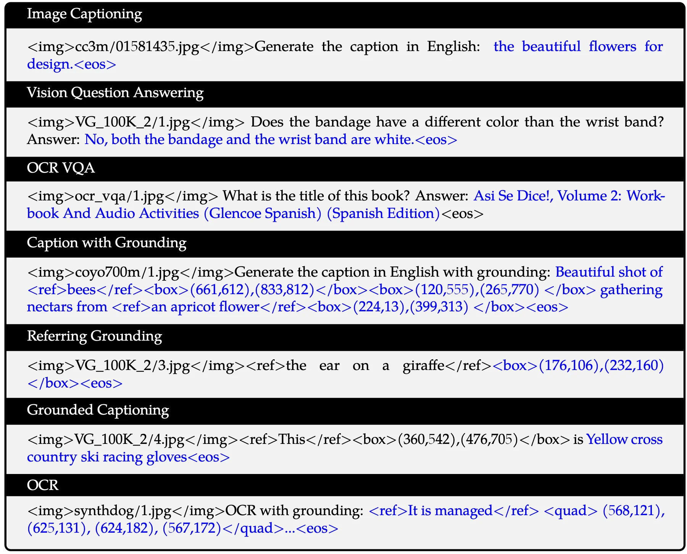
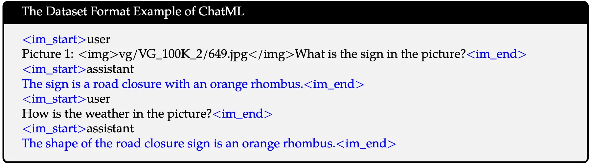
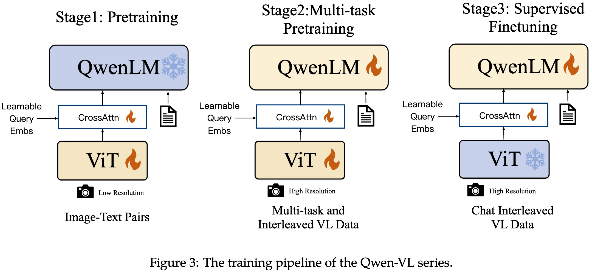
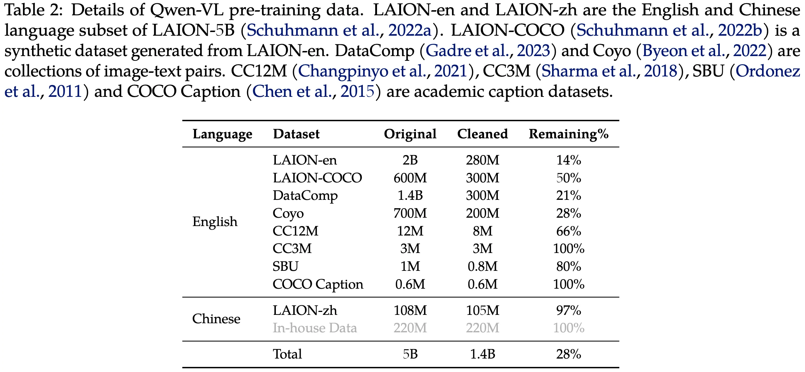
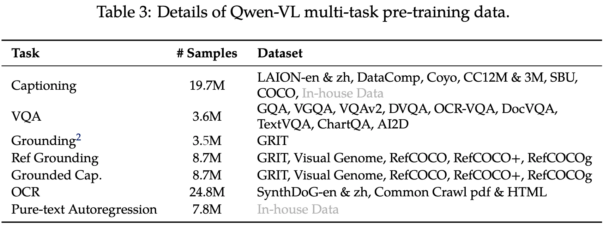

+++
date = '2023-08-25T20:53:14+08:00'
draft = false
title = 'Qwen-VL: A Versatile Vision-Language Model for  Understanding, Localization, Text Reading, and Beyond'
categories = ['VLMs']
tags = ['VLMs']
+++

:(fas fa-building fa-fw):Qwen Team, Alibaba Group
:(fas fa-file-pdf fa-fw):[arXiv 2308.12966](https://arxiv.org/abs/2308.12966)
:(fab fa-github fa-fw):[QwenLM/Qwen-VL](https://github.com/QwenLM/Qwen-VL)
[Qwen/Qwen-VL](https://huggingface.co/Qwen/Qwen-VL)

## Motivation

- Despite their powerful capabilities in text generation and following user's intentions via instruction tuning, native LLMs lack the ability to handle multiple modalities (e.g., images, speech, and videos) -> **LVLM**
- Current open-source LVLMs lag far behind the proprietary models, primarily due to inadequate training and optimization. -> **open-source**
- The majority of open-source LVLMs are limited to coarse-grained perception, lacking the ability for fine-grained visual understanding such as obect grounding, OCR and text-oriented question answering. -> **fine-grained perception**

## Contribution

## Method

### Architecture

**Large Language Model (7.7B)**: Qwen-VL model is initialized with pre-trained weights from Qwen-7B.

**Vision Encoder (1.9B)**: Qwen-VL model employs Vision Transformer (ViT) as visual encoder, initialized with pre-trained weights from Openclip's ViT-bigG.

- fixed resolution during both training and inference
- stride of 14 is used for the ViT encoder

**Vision-Language Adapter (0.08B)**: a single-layer cross-attention module initialized randomly, compressing the image tokens to a fixed length of **256**. Considering the significance of positional information for fine-grained image comprehension, 2D absolute positional encodings are incorpporated into the cross-attention mechanism's query-key pairs to mitigate the poential loss of positional details during compression.

**Inputs & Outputs**:

- **Image Input**: To distinguish visual input from text input, the image tokens is explicitly bracketed by two special tokens (`` and `</img>`), indicating the start and end of the visual input.
- **Bounding Box Input and Output**

Visualization of the multi-task pre-training data format:

Visualization of the supervised fine-tuning data format:

## Training Recipe

### Pre-training

- In the first stage of pre-training, we mainly utilize a large-scale, weakly labeled, web-crawled set of image-text pairs, composed of several publicly accessible sources and some in-house data.
- freeze the large language model and only optimize the vision encoder and VL adapter in this stage.
- fixed resolution: 224x224

### Multi-task Pre-training

- In the second stage of multi-task pre-training, we introduce high-quality and fine-grained VL annotation data with a larger input resolution and interleaved image-text data.
- unlock the large language model and train the whole model.
- fixed resolution: 448x448

### Supervised Fine-tuning

- During this stage, we finetuned the Qwen-VL pre-trained model through **instruction fine-tuning** to enhance its instruction following and dialogue capabilities, resulting in the interactive Qwen-VL-Chat model.

## Data Recipe

**lots of data cleaning work!!! Please refer to the dataset details section!!!**

### Pre-training Data

In the first stage of pre-training, we mainly utilize a large-scale, weakly labeled, web-crawled set of image-text pairs, composed of several publicly accessible sources and some in-house data.

### Multi-task Pre-training Data

In the second stage of multi-task pre-training, we introduce high-quality and fine-grained VL annotation data with a larger input resolution and interleaved image-text data.

Finally, we simply construct interleaved image-text data by packing the same task data into sequences of ``length 2048.

### ``Supervised Fine-tuning Data
