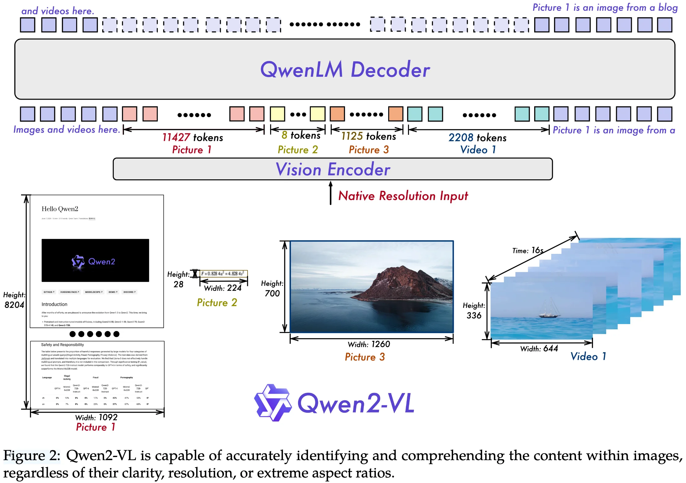
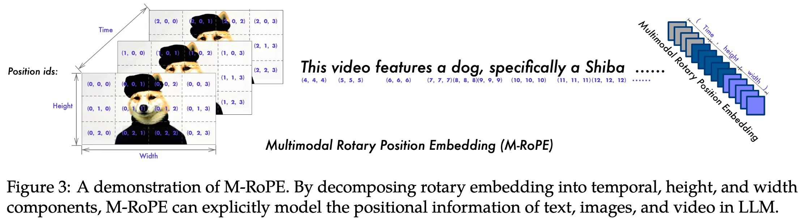

+++
date = '2024-09-25T20:53:12+08:00'
draft = false
title = 'Qwen2-VL: Enhancing Vision-Language Model’s Perception of the World at Any Resolution'
categories = ['VLMs']
tags = ['VLMs']
+++

:(fas fa-building fa-fw):Qwen Team, Alibaba Group
:(fas fa-file-pdf fa-fw):[arXiv 2409.12191](https://arxiv.org/abs/2409.12191)
:(fab fa-github fa-fw):[QwenLM/Qwen2-VL](https://github.com/QwenLM/Qwen2-VL)
[Qwen/Qwen2-VL](https://huggingface.co/collections/Qwen/qwen2-vl)

## Motivation

## Contribution

## Method

### Architecture

**Large Language Model (1.5B/7.6B/72B)**: Qwen2-VL model is initialized with pre-trained weights from Qwen2 series.

**Vision Encoder (675M)**: Qwen2-VL model employs a constant 675M parameter **Vision Transformer (ViT)** as visual encoder accross various-sized LLMs.
- **Naive Dynamic Resolution**: To dynamically encoding images of any aspect ratio and resolution into a variable number of visual tokens, Qwen2-VL modify ViT by replacing the original absolute position embedding with 2D-RoPE
- fixed resolution during both training and inference
- stride of 14 is used for the ViT encoder
  

**Vision-Language Adapter**: a simple MLP layer to compress adjacent 2x2 tokens into a single token, with the special `<|vision_start|>` and `<|vision_end|>` tokens placed at the begining and end of the compressed visual tokens. 
- patch size of 14 is employed within ViT

## Training Recipe

### Training Infrastructure

**Storage**:

- text data: store text data on CPFS (Cloud Parallel File Storage) and use mmap (Memory Map) for efficient access.
- vision data: use OSS (Object Storage Service) for persistent storage.
  - video data decoding: develop a caching decoding technique due to several failed attempts with open-source (FFmpeg) and in-house software.

**Parallelism**:

- use 3D parallellism, including data parallelism (DP), tensor parallelism (TP), and pipeline parallelism (PP)
- leverage deepspeed’s zero-1 redundancy optimizer to shard states for memory saving
- Sequence parallelism (SP) with selective checkpointing activation was leveraged to reduce memory usage
- leverage 1F1B PP for Qwen2-VL 72B training

**Software**:

- PyTorch
- CUDA
- flash-attention: for efficient training in both the vision encoder and the LLM
- fused operators: LayerNorm, RMSNorm and Adam
- we leverage the overlap of communication and computation during matrix multiplication in our training process.

## Data Recipe

ablation study

conclusion
