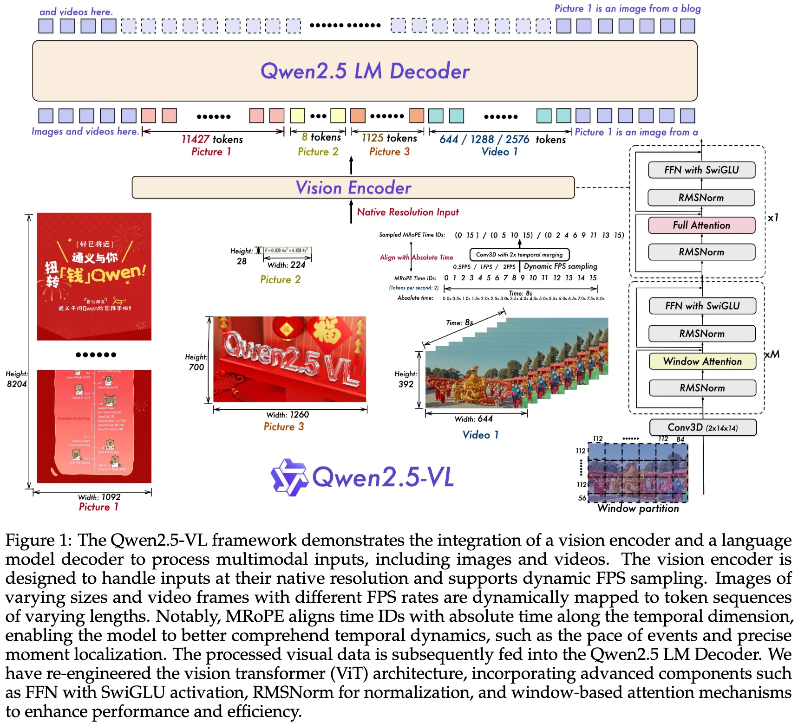

+++
date = '2025-02-25T20:38:06+08:00'
draft = false
title = 'Qwen2.5-VL Technical Report'
categories = ['VLMs']
tags = ['VLMs', 'LLMs', 'Qwens']
+++

:(fas fa-building fa-fw):Qwen Team, Alibaba Group
:(fas fa-file-pdf fa-fw):[arXiv 2502.13923](https://arxiv.org/abs/2502.13923)
:(fab fa-github fa-fw):[QwenLM/Qwen2.5-VL](https://github.com/QwenLM/Qwen2.5-VL)
[Qwen/qwen25-vl](https://huggingface.co/collections/Qwen/qwen25-vl)
:(fab fa-blog fa-fw):[blog/qwen2.5-vl](https://qwenlm.github.io/blog/qwen2.5-vl/)

## Motivation

## Contribution

## Method

## Architecture

**Large Language Model (3B/7B/72B)**: Qwen2.5-VL model is initialized with pre-trained weights from Qwen2.5.

- To better meet the demands of multimodal understanding, we have modified the 1D RoPE (Rotary Position Embedding) to our Multimodal Rotary Position Embedding Aligned to Absolute Time.

**Vision Encoder**: Qwen2.5-VL model employs a redesigned Vision Transformer (ViT) as visual encoder.

**Vision-Language Adapter**: a single-layer cross-attention module initialized randomly, compressing the image tokens to a fixed length of **256**.

group spatially adjacent sets of four patch features
These grouped features are then concatenated
a two-layer multi-layer perceptron (MLP)

**we first group spatially adjacent sets of four patch features. These grouped features are then concatenated and passed through a two-layer multi-layer perceptron (MLP) to project them into a dimension that aligns with the text embeddings used in the LLM. This method not only reduces computational costs but also provides a flexible way to dynamically compress image feature sequences of varying lengths.
**

**Inputs & Outputs**:

## Data Recipe

### Pre-training Data

Qwen2-VL vs Qwen2.5-VL: 1.2 trillion tokens vs 4 trillion tokens.

clean raw web data, synthesize data

**Interleaved Image-Text Data.** essential

**Grounding Data with Absolute Position Coordinates**:

## Training Recipe

## Contribution

|               | Qwen2-VL | Qwen2.5-VL       |
| ------------- | -------- | ---------------- |
| Pre-training  | 1.2B     | approximately 4B |
| Post-training | 1.5B     | 2.5B             |
| Pre-training  | 1.5B     | 2.5B             |

 **Pre-training Data**

- image captions
- interleaved image-text pairs
- optical character recognition (OCR) data
  - synthetic data
  - open-sourced data
  - in-house collected data
- visual knowledge (e.g., celebrity, landmark, flora, and fauna identification)
- multi-modal academic questions
- localization data
- document parsing data
- video descriptions
- video localization
- agent-based interaction data

**data method**

- clean raw web data
- synthesize data

**Training Recipe**

### Post-training

**Post-training Data**

**Training Recipe**

## Experiment

## Reference

## Question
