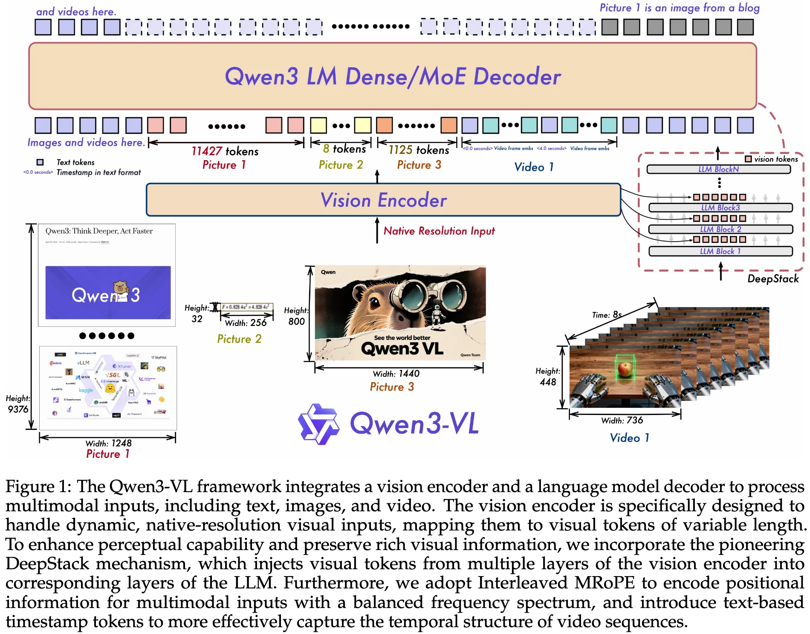

+++
date = '2025-11-27T19:13:03+08:00'
draft = false
title = 'Qwen3-VL Technical Report'
categories = ['VLMs']
tags = ['VLMs']
+++

:(fas fa-building fa-fw):<span style="color:gray">Qwen Team, Alibaba Group</span>
:(fas fa-file-pdf fa-fw):[arXiv 2511.21631](https://arxiv.org/abs/2511.21631)
:(fab fa-github fa-fw):[QwenLM/Qwen3-VL](https://github.com/QwenLM/Qwen3-VL)
[Qwen/qwen3-vl](https://huggingface.co/collections/Qwen/qwen3-vl)


## Motivation

## Contribution

## Method

## Architecture



**Large Language Model**: Qwen3-VL model is initialized with pre-trained weights from Qwen3.
- three dense variants (Qwen3-VL-2B/4B/8B/32B) and two MoE variants (Qwen3-VL-30B-A3B, Qwen3-VL-235B-A22B)

**Vision Encoder**: SigLIP-2

**Vision-Language Adapter**: a two-layer MLP to compress 2x2 visual features from the vision encoder into a single visual token.

**Inputs & Outputs**:

## Data Recipe

### Pre-training Data


## Training Recipe


```python
# Qwen3-VL-8B-Instruct
Qwen3VLModel(
  (visual): Qwen3VLVisionModel(
    (patch_embed): Qwen3VLVisionPatchEmbed(
      (proj): Conv3d(3, 1152, kernel_size=(2, 16, 16), stride=(2, 16, 16))
    )
    (pos_embed): Embedding(2304, 1152)
    (rotary_pos_emb): Qwen3VLVisionRotaryEmbedding()
    (blocks): ModuleList(
      (0-26): 27 x Qwen3VLVisionBlock(
        (norm1): LayerNorm((1152,), eps=1e-06, elementwise_affine=True)
        (norm2): LayerNorm((1152,), eps=1e-06, elementwise_affine=True)
        (attn): Qwen3VLVisionAttention(
          (qkv): Linear(in_features=1152, out_features=3456, bias=True)
          (proj): Linear(in_features=1152, out_features=1152, bias=True)
        )
        (mlp): Qwen3VLVisionMLP(
          (linear_fc1): Linear(in_features=1152, out_features=4304, bias=True)
          (linear_fc2): Linear(in_features=4304, out_features=1152, bias=True)
          (act_fn): GELUTanh()
        )
      )
    )
    (merger): Qwen3VLVisionPatchMerger(
      (norm): LayerNorm((1152,), eps=1e-06, elementwise_affine=True)
      (linear_fc1): Linear(in_features=4608, out_features=4608, bias=True)
      (act_fn): GELU(approximate='none')
      (linear_fc2): Linear(in_features=4608, out_features=4096, bias=True)
    )
    (deepstack_merger_list): ModuleList(
      (0-2): 3 x Qwen3VLVisionPatchMerger(
        (norm): LayerNorm((4608,), eps=1e-06, elementwise_affine=True)
        (linear_fc1): Linear(in_features=4608, out_features=4608, bias=True)
        (act_fn): GELU(approximate='none')
        (linear_fc2): Linear(in_features=4608, out_features=4096, bias=True)
      )
    )
  )
  (language_model): Qwen3VLTextModel(
    (embed_tokens): Embedding(151936, 4096)
    (layers): ModuleList(
      (0-35): 36 x Qwen3VLTextDecoderLayer(
        (self_attn): Qwen3VLTextAttention(
          (q_proj): Linear(in_features=4096, out_features=4096, bias=False)
          (k_proj): Linear(in_features=4096, out_features=1024, bias=False)
          (v_proj): Linear(in_features=4096, out_features=1024, bias=False)
          (o_proj): Linear(in_features=4096, out_features=4096, bias=False)
          (q_norm): Qwen3VLTextRMSNorm((128,), eps=1e-06)
          (k_norm): Qwen3VLTextRMSNorm((128,), eps=1e-06)
        )
        (mlp): Qwen3VLTextMLP(
          (gate_proj): Linear(in_features=4096, out_features=12288, bias=False)
          (up_proj): Linear(in_features=4096, out_features=12288, bias=False)
          (down_proj): Linear(in_features=12288, out_features=4096, bias=False)
          (act_fn): SiLUActivation()
        )
        (input_layernorm): Qwen3VLTextRMSNorm((4096,), eps=1e-06)
        (post_attention_layernorm): Qwen3VLTextRMSNorm((4096,), eps=1e-06)
      )
    )
    (norm): Qwen3VLTextRMSNorm((4096,), eps=1e-06)
    (rotary_emb): Qwen3VLTextRotaryEmbedding()
  )
)
```

```python
# Qwen3-VL-4B-Instruct
Qwen3VLModel(
  (visual): Qwen3VLVisionModel(
    (patch_embed): Qwen3VLVisionPatchEmbed(
      (proj): Conv3d(3, 1024, kernel_size=(2, 16, 16), stride=(2, 16, 16))
    )
    (pos_embed): Embedding(2304, 1024)
    (rotary_pos_emb): Qwen3VLVisionRotaryEmbedding()
    (blocks): ModuleList(
      (0-23): 24 x Qwen3VLVisionBlock(
        (norm1): LayerNorm((1024,), eps=1e-06, elementwise_affine=True)
        (norm2): LayerNorm((1024,), eps=1e-06, elementwise_affine=True)
        (attn): Qwen3VLVisionAttention(
          (qkv): Linear(in_features=1024, out_features=3072, bias=True)
          (proj): Linear(in_features=1024, out_features=1024, bias=True)
        )
        (mlp): Qwen3VLVisionMLP(
          (linear_fc1): Linear(in_features=1024, out_features=4096, bias=True)
          (linear_fc2): Linear(in_features=4096, out_features=1024, bias=True)
          (act_fn): GELUTanh()
        )
      )
    )
    (merger): Qwen3VLVisionPatchMerger(
      (norm): LayerNorm((1024,), eps=1e-06, elementwise_affine=True)
      (linear_fc1): Linear(in_features=4096, out_features=4096, bias=True)
      (act_fn): GELU(approximate='none')
      (linear_fc2): Linear(in_features=4096, out_features=2560, bias=True)
    )
    (deepstack_merger_list): ModuleList(
      (0-2): 3 x Qwen3VLVisionPatchMerger(
        (norm): LayerNorm((4096,), eps=1e-06, elementwise_affine=True)
        (linear_fc1): Linear(in_features=4096, out_features=4096, bias=True)
        (act_fn): GELU(approximate='none')
        (linear_fc2): Linear(in_features=4096, out_features=2560, bias=True)
      )
    )
  )
  (language_model): Qwen3VLTextModel(
    (embed_tokens): Embedding(151936, 2560)
    (layers): ModuleList(
      (0-35): 36 x Qwen3VLTextDecoderLayer(
        (self_attn): Qwen3VLTextAttention(
          (q_proj): Linear(in_features=2560, out_features=4096, bias=False)
          (k_proj): Linear(in_features=2560, out_features=1024, bias=False)
          (v_proj): Linear(in_features=2560, out_features=1024, bias=False)
          (o_proj): Linear(in_features=4096, out_features=2560, bias=False)
          (q_norm): Qwen3VLTextRMSNorm((128,), eps=1e-06)
          (k_norm): Qwen3VLTextRMSNorm((128,), eps=1e-06)
        )
        (mlp): Qwen3VLTextMLP(
          (gate_proj): Linear(in_features=2560, out_features=9728, bias=False)
          (up_proj): Linear(in_features=2560, out_features=9728, bias=False)
          (down_proj): Linear(in_features=9728, out_features=2560, bias=False)
          (act_fn): SiLUActivation()
        )
        (input_layernorm): Qwen3VLTextRMSNorm((2560,), eps=1e-06)
        (post_attention_layernorm): Qwen3VLTextRMSNorm((2560,), eps=1e-06)
      )
    )
    (norm): Qwen3VLTextRMSNorm((2560,), eps=1e-06)
    (rotary_emb): Qwen3VLTextRotaryEmbedding()
  )
)
```

```python
# Qwen3-VL-2B-Instruct
Qwen3VLModel(
  (visual): Qwen3VLVisionModel(
    (patch_embed): Qwen3VLVisionPatchEmbed(
      (proj): Conv3d(3, 1024, kernel_size=(2, 16, 16), stride=(2, 16, 16))
    )
    (pos_embed): Embedding(2304, 1024)
    (rotary_pos_emb): Qwen3VLVisionRotaryEmbedding()
    (blocks): ModuleList(
      (0-23): 24 x Qwen3VLVisionBlock(
        (norm1): LayerNorm((1024,), eps=1e-06, elementwise_affine=True)
        (norm2): LayerNorm((1024,), eps=1e-06, elementwise_affine=True)
        (attn): Qwen3VLVisionAttention(
          (qkv): Linear(in_features=1024, out_features=3072, bias=True)
          (proj): Linear(in_features=1024, out_features=1024, bias=True)
        )
        (mlp): Qwen3VLVisionMLP(
          (linear_fc1): Linear(in_features=1024, out_features=4096, bias=True)
          (linear_fc2): Linear(in_features=4096, out_features=1024, bias=True)
          (act_fn): GELUTanh()
        )
      )
    )
    (merger): Qwen3VLVisionPatchMerger(
      (norm): LayerNorm((1024,), eps=1e-06, elementwise_affine=True)
      (linear_fc1): Linear(in_features=4096, out_features=4096, bias=True)
      (act_fn): GELU(approximate='none')
      (linear_fc2): Linear(in_features=4096, out_features=2048, bias=True)
    )
    (deepstack_merger_list): ModuleList(
      (0-2): 3 x Qwen3VLVisionPatchMerger(
        (norm): LayerNorm((4096,), eps=1e-06, elementwise_affine=True)
        (linear_fc1): Linear(in_features=4096, out_features=4096, bias=True)
        (act_fn): GELU(approximate='none')
        (linear_fc2): Linear(in_features=4096, out_features=2048, bias=True)
      )
    )
  )
  (language_model): Qwen3VLTextModel(
    (embed_tokens): Embedding(151936, 2048)
    (layers): ModuleList(
      (0-27): 28 x Qwen3VLTextDecoderLayer(
        (self_attn): Qwen3VLTextAttention(
          (q_proj): Linear(in_features=2048, out_features=2048, bias=False)
          (k_proj): Linear(in_features=2048, out_features=1024, bias=False)
          (v_proj): Linear(in_features=2048, out_features=1024, bias=False)
          (o_proj): Linear(in_features=2048, out_features=2048, bias=False)
          (q_norm): Qwen3VLTextRMSNorm((128,), eps=1e-06)
          (k_norm): Qwen3VLTextRMSNorm((128,), eps=1e-06)
        )
        (mlp): Qwen3VLTextMLP(
          (gate_proj): Linear(in_features=2048, out_features=6144, bias=False)
          (up_proj): Linear(in_features=2048, out_features=6144, bias=False)
          (down_proj): Linear(in_features=6144, out_features=2048, bias=False)
          (act_fn): SiLUActivation()
        )
        (input_layernorm): Qwen3VLTextRMSNorm((2048,), eps=1e-06)
        (post_attention_layernorm): Qwen3VLTextRMSNorm((2048,), eps=1e-06)
      )
    )
    (norm): Qwen3VLTextRMSNorm((2048,), eps=1e-06)
    (rotary_emb): Qwen3VLTextRotaryEmbedding()
  )
)