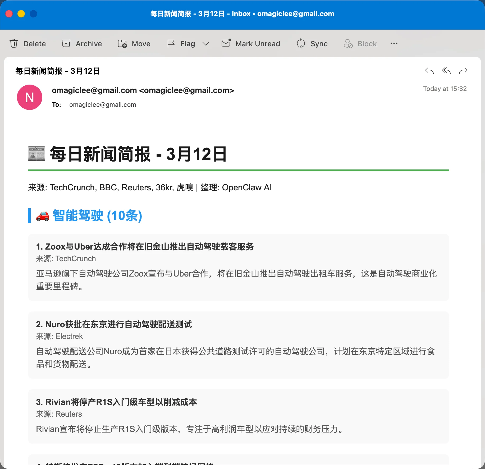
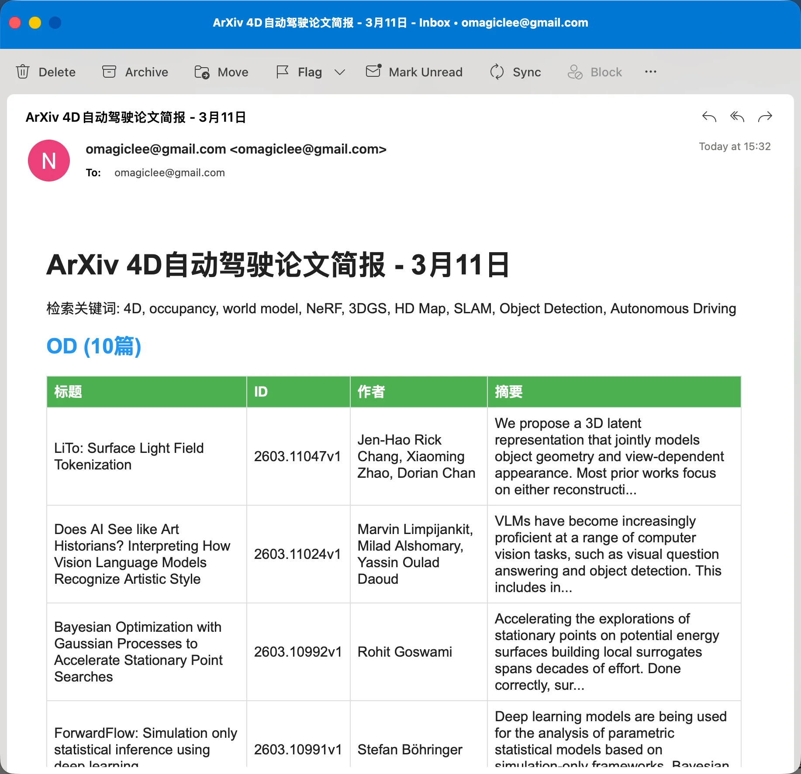

+++
date = '2026-02-04T19:15:45+08:00'
draft = false
title = '一文读懂 OpenClaw：你的 7×24 小时 AI 助手（上篇）'
categories = ['AgentAI']
tags = ['AgentAI', 'OpenClaw']
featured = true
+++


## 什么是 [OpenClaw](https://openclaw.ai/)？

<div align="center">


</div>

早上 7:30，你的手机震动了一下。

> "🌅 早报：昨天智驾圈有 3 条重要更新——小鹏 AI Day 定档 4 月、蔚来 Banyan 3.0 正式推送、理想 OTA 7.0 优化 NOA 变道策略。详情已整理在飞书文档，需要我展开哪条？"
>
> "📚 arxiv 速报：今日推送 12 篇 LLM 相关论文，其中 3 篇关于 Agent 架构，已按引用量排序。"

你还没起床，OpenClaw 已经帮你干完了活。

这就是 OpenClaw——一个 7×24 小时在线的私人 AI 助手。它不是那种"你问一句它答一句"的聊天机器人，而是一个能自己干活、会主动找你的数字员工。

OpenClaw 是一个开源的个人 AI 助手平台，通过 **LLM + 工具调用**实现真正的自动化——可以 7×24 小时在线，通过自然语言描述就能帮你完成各种任务。

## OpenClaw 能做什么？

和 ChatGPT、Kimi 这类对话 AI 不同，OpenClaw 不只是回答问题——它能**真正帮你执行操作**：发邮件、加日程、抓网页、控制智能家居，全都是它自己动手，而不是给你一段"建议你这样做"的文字。

### 官方能力

以下是 OpenClaw 官方支持的核心能力（来自 [openclaw.ai](https://openclaw.ai/)）：

| 能力 | 能帮你做什么 |
|:-----|:-------------|
| **多通道对话** | 在 WhatsApp、Telegram、Discord、Slack、Signal、iMessage 上和 AI 对话，手机上发条消息就行 |
| **邮件自动化** | 读邮件、分类、生成摘要、代拟回复、发送——收件箱从此不再爆炸 |
| **日程管理** | 接入 Google Calendar / Apple Calendar，帮你查日程、加会议、检测冲突 |
| **网页搜索与抓取** | 自动搜索、打开网页、提取信息、填表单，相当于一个 7×24 在线的浏览器助手 |
| **文档处理** | 读 PDF、分析文档、生成报告，本地文件随意读写 |
| **定时任务** | 设置 cron 定时规则，Agent 按时自动执行并推送结果，不用你开口 |
| **智能家居** | 通过 Home Assistant 控制灯光、温度、空调等设备 |
| **长期记忆** | 记住你的偏好、项目背景、常用术语，越用越懂你 |
| **图片理解** | 发一张图给它，能识别内容、回答问题 |
| **50+ 集成** | Gmail、GitHub、Spotify、Todoist 等主流平台开箱即用 |

### 社区热门用例

OpenClaw 拥有 **100+ 社区 Skills**，以下是开源社区中最受欢迎的真实用法：

| 用例 | 怎么用 | 热度 |
|:-----|:-------|:-----|
| **邮件分拣** | 自动分类收件箱、按紧急程度排序、生成每日邮件摘要。社区反馈平均每周省 3-5 小时 | 最热门 |
| **早间简报** | 起床前收到一条消息：今天天气、日程、待办、邮件重点、新闻摘要，一条搞定 | 最热门 |
| **智能家居联动** | 根据时间/健康数据/天气自动调节灯光、温度、空气净化器（需 Home Assistant） | 热门 |
| **自动写代码** | 晚上给个需求，早上收到 PR。配合 GitHub 做 CI/CD 监控和代码审查 | 热门 |
| **健康数据追踪** | 对接 WHOOP / Oura / Garmin，每天推送睡眠、心率、运动数据摘要和建议 | 热门 |
| **股票/加密货币监控** | 设定价格阈值或关键词，触发时实时推送到手机 | 热门 |
| **个人知识库** | 把平时看到的文章、笔记、灵感自动整理成结构化文档，跨会话检索 | 热门 |
| **语音日记** | 用语音记录一天的事，Agent 自动转文字、打标签、做情绪分析 | 新兴 |

### My Use Case

我目前跑了 4 个固定任务，覆盖"信息获取 → 知识管理 → 日常提醒"三个层面：

**1. 智驾行业早报**

每天早上 7:30，Agent 自动抓取智驾领域新闻源，筛选重要更新，整理成 3-5 条摘要推送到飞书。起床就能看到昨天发生了什么，不用自己刷十几个网站。每天省 30 分钟信息筛选。

**2. arxiv 论文日更**

下午自动巡检 arxiv 的 cs.AI / cs.CL / cs.LG 分类，筛选 LLM 和 Agent 相关新论文，按相关度排序后推送摘要。用的是社区的 `arxiv-watcher` Skill，配合 memory 做持续追踪，不遗漏重要论文。

**3. Apple Notes 备忘录**

用 `apple-notes` Skill 接管 Apple 备忘录。在 Telegram 上发一句"帮我记一下：周三和产品对齐 RAG 方案"，Agent 自动在 Notes 里创建笔记并归类到对应文件夹，iCloud 同步到所有设备。比打开 Notes App 手动记录快得多。

**4. Apple Reminders 代替 Siri**

用 `apple-reminders` Skill 管理提醒事项。"明天下午三点提醒我给 XX 打电话"——Agent 直接调用 `remindctl` 创建提醒，比 Siri 靠谱得多（不会识别错、不会莫名失败），还能批量查看、完成、删除。

## OpenClaw 为什么火遍全网？

> 2025年11月24日发布，84天达成 **200K ⭐**，2026年3月超 **304K ⭐**，创 GitHub 史上最快增长纪录

AI 喊了这么多年，大多数人用它还停留在"问个问题、查个资料"。为什么？因为它只能"说"，不能"做"。

OpenClaw 解决了这个痛点——它不仅能回答你，还能**帮你干活**。

**它做对了三件事**：

1. **接入你的通讯软件**：WhatsApp、Telegram、Discord、飞书...不用开命令行，手机上直接对话
2. **7×24 小时待命**：定时检查邮件、日程、待办事项，**主动推送**给你，而不是等你来问
3. **本地运行，数据隐私**：开源透明，跑在自己电脑上，不用担心数据被云端收集

**GitHub**：304K+ ⭐ | 57K+ Fork | MIT 协议

> ⚠️ 安全提示：MITRE 报告发现超 **4.2 万个** 实例暴露公网，90% 可绕过身份验证。建议**不要在主力电脑或公司设备上运行**。

## OpenClaw 技术架构

OpenClaw 采用**事件驱动、Session 隔离**的架构。一条消息从客户端到最终执行的完整链路：


flowchart LR
    subgraph Channels["Channels"]
        WA["WhatsApp"]
        TG["Telegram"]
        DC["Discord / Slack / ..."]
    end

    GW["Gateway<br/>Always-on daemon<br/>Routing · Events · Validation"]

    Session["Session<br/>Isolation bucket<br/>Per-user · Per-group · .jsonl"]

    Agent["Agent<br/>Isolated execution env<br/>Workspace · Model · Tools/Skills"]

    subgraph Resources["Resources"]
        Tools["Tools<br/>browser · fs · runtime · web<br/>memory · automation · messaging"]
        Skills["Skills<br/>SKILL.md recipes<br/>AgentSkills spec"]
        Models["Models<br/>OpenAI · Anthropic<br/>Gemini · Ollama · vLLM"]
    end

    subgraph Access["Access"]
        CLI["CLI"]
        WebUI["Web UI"]
        App["macOS / iOS"]
        Nodes["Nodes<br/>Remote devices<br/>camera · screen · GPS"]
    end

    Channels --> GW --> Session --> Agent --> Resources
    GW -.-> Access


### Gateway

唯一长期运行的守护进程，OpenClaw 的**控制中枢**。一台主机只运行一个 Gateway 进程，也是唯一打开 WhatsApp Session 的地方。

| 能力 | 说明 |
|:-----|:-----|
| **消息通道管理** | 同时维护 WhatsApp、Telegram、Discord、Slack、Signal、iMessage 等所有连接 |
| **事件发射** | 发送 `agent`、`chat`、`presence`、`health`、`heartbeat`、`cron` 等事件 |
| **Session 管理** | 所有 Session 状态的权威来源（single source of truth） |
| **协议验证** | 对入站帧进行 JSON Schema 验证，拒绝非法请求 |
| **WebSocket API** | 为 CLI、Web UI、macOS App、移动端 Nodes 提供类型安全的接口 |

### Session

消息路由的**隔离桶**。核心原则：**一个 Session = 一段连续、共享上下文的对话**。

| 特性 | 说明 |
|:-----|:-----|
| **Session 模型** | 每个 Agent 有主 DM Session（`main`），群组/频道/线程各自独立 |
| **安全 DM 模式** | 按发送者/渠道隔离 DMs，防止上下文泄露 |
| **持久化** | `sessions.json`（元数据）+ `.jsonl`（对话记录，用于重建模型上下文） |

为什么不能只用一个 Session？——群聊和私聊混在一起会导致隐私泄露；多人私聊共享一个 Session，A 的问题可能用 B 的上下文回答。按人/群/话题拆 Session，上下文更干净、更安全。如果只有你一个人、一个用途，用默认的 `main` 就够了。

### Agent

核心执行单元。**不是简单的模型选择**，而是完整的隔离工作环境：

| 组成 | 说明 |
|:-----|:-----|
| **Workspace** | 独立工作目录：SOUL.md（人格）、AGENTS.md（规则）、MEMORY.md（长期记忆）、USER.md（用户偏好） |
| **Session Store** | 独立的聊天历史和路由状态 |
| **Model 配置** | 可选择不同模型（OpenAI、Anthropic、Gemini、Ollama 等） |
| **Tools/Skills** | 可配置的工具和技能组合 |

**多 Agent 路由**：不同来源的消息可路由到不同 Agent，实现任务隔离：

| 拆分维度 | 举例 |
|:---------|:-----|
| **身份/角色** | 工作微信 → 专业 Agent（只谈公事）；私人 Telegram → 随意 Agent（能开玩笑） |
| **任务域** | 「写代码」Agent 配 IDE / Git / 文档工具；「日程/待办」Agent 配日历 / 提醒 / 邮件 |
| **成本/模型** | 简单问答走本地 Ollama；复杂推理走 Claude / GPT |
| **权限安全** | 财务/支付相关只给一个 Agent，且只开放有限 Tools |

### Nodes

Gateway 通常跑在一台机器上（比如你的 Mac），但 Agent 有时需要**其他设备**的能力——手机摄像头、屏幕录制、当前定位。这些连接到 Gateway 的额外设备就是 **Node**：通过 WebSocket 连上来，声明自己能做什么，Agent 按需调用。

| 类型 | 说明 |
|:-----|:-----|
| **macOS Companion App** | 桌面端节点，提供屏幕、窗口、剪贴板等能力 |
| **iOS / Android 节点** | 手机/平板，提供摄像头、定位、语音、Canvas |
| **Headless Node** | 无界面模式（`openclaw node run`），适合服务器环境 |

每个 Node 声明支持的能力（`camera.*`、`screen.record`、`location.get` 等），Agent 通过 Gateway 远程调用——「让手机拍一张照」「在平板上画个草图」都能实现。

### Workspace

Agent 的**本地工作目录**，运行时读写文件的"家"：

| 文件 | 用途 |
|:-----|:-----|
| **SOUL.md** | 人格定义——Agent 的性格、语气、行为准则 |
| **AGENTS.md** | Agent 规则——允许/禁止什么操作 |
| **USER.md** | 用户偏好——你的习惯、常用术语、关注领域 |
| **MEMORY.md** | 长期记忆——跨会话持久化的关键信息 |
| **memory/YYYY-MM-DD.md** | 每日记忆——当天的重要对话和事件 |

**Memory vs Context**：Memory 是 Workspace 中的 Markdown 文件，负责**长期记忆**（跨会话持久化）；Context 是每次请求发给模型的完整内容（system prompt + 历史消息 + 工具结果），受上下文窗口限制。两者互补——Memory 提供"我记得你上周说过..."，Context 提供"我们刚才聊了..."。

### Models

OpenClaw 是模型无关的框架，采用 `provider/model` 格式引用（如 `anthropic/claude-opus-4-6`）。

- **云端**：OpenAI (GPT-5 Codex)、Anthropic (Claude Opus 4.6、Sonnet 4.5)、Google Gemini、MiniMax (M2.5 系列)
- **本地**：Ollama / vLLM / LM Studio，通过 OpenAI 兼容接口接入
- **特性**：API Key 轮换（一个 key 失效自动切换）、跨 Provider 热切换（不重启即可换模型）

### Tools vs Skills vs Plugins

三者最容易混淆：

> - **Tools** = OpenClaw **内置**的"手"和"脚"（自带的能力）
> - **Skills** = 教 Agent "什么时候用什么工具"（使用说明书）
> - **Plugins** = 给 OpenClaw **额外增加**的"手"和"脚"（扩展能力）

以 `apple-reminders` Skill 为例，`SKILL.md` 核心内容：

```nohighlight
---
name: apple-reminders
description: Manage Apple Reminders via the remindctl CLI on macOS
metadata: { "openclaw": { "requires": { "bins": ["remindctl"] } } }
---

# Apple Reminders CLI (remindctl)

## 何时使用
当用户想要查看、创建、编辑、完成或删除 Apple Reminders 时使用此 Skill。

## 准备工作
未安装时自动执行：`brew install steipete/tap/remindctl`

## 常用命令
- 查看：`remindctl today` / `remindctl tomorrow` / `remindctl week`
- 创建：`remindctl add --title "Call mom" --list Personal --due tomorrow`
- 完成：`remindctl complete 1 2 3`
- JSON 输出：`remindctl today --json`
```

**Skill 就是一个"配方"**——告诉 Agent 什么场景下该做什么事、具体怎么操作。它自己不实现功能，只指导 Agent 使用已有的 Tools 或 CLI。

**Plugins** 是代码级扩展，给 OpenClaw 增加新命令、工具、通道。Plugin 可自带 Skills（通过 `openclaw.plugin.json` 声明），在 Gateway 进程中运行（非沙箱）。安装：`openclaw plugins install`。