+++
date = '2020-06-19T18:54:34+08:00'
draft = false
title = 'Denoising Diffusion Probabilistic Models (DDPM)'
categories = ['Generative Models']
tags = ['Generative Models', 'DDPM']
featured = false  # 是否推荐到首页 Recommended Posts，默认不推荐
+++

:(fas fa-award fa-fw):
:(fas fa-building fa-fw):
:(fas fa-file-pdf fa-fw):[arXiv 2006.11239](https://arxiv.org/abs/2006.11239)
:(fab fa-github fa-fw):

:(fas fa-globe fa-fw):
:(fas fa-blog fa-fw):

## TL;DR

## Motivations & Innovations

## Approach
### Model

normal gaussian distribution:

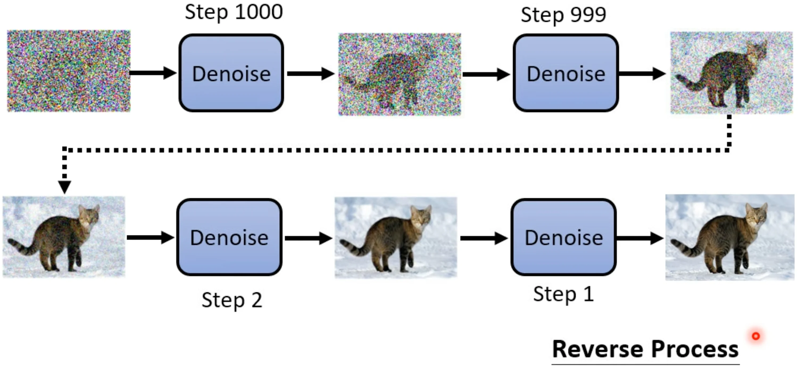

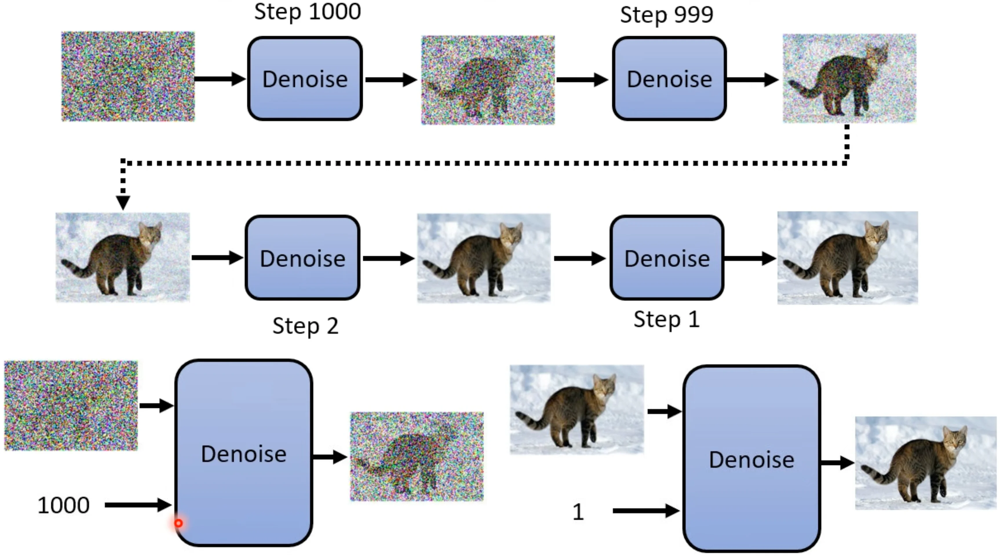

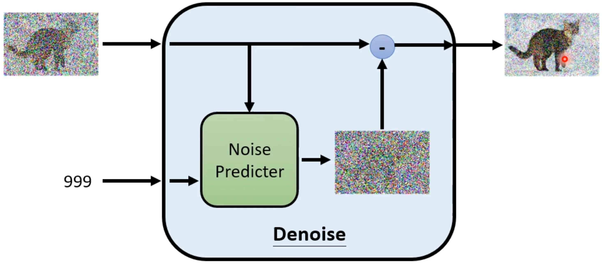

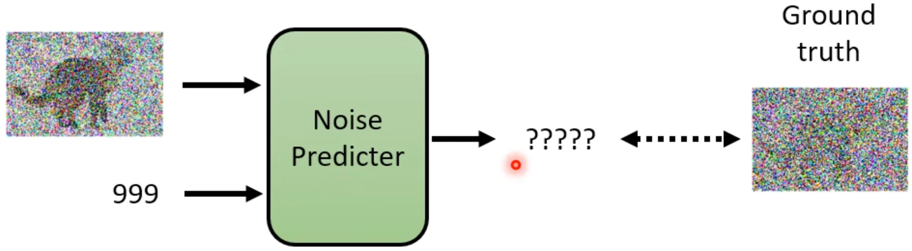

### 加噪过程 -> 生产数据

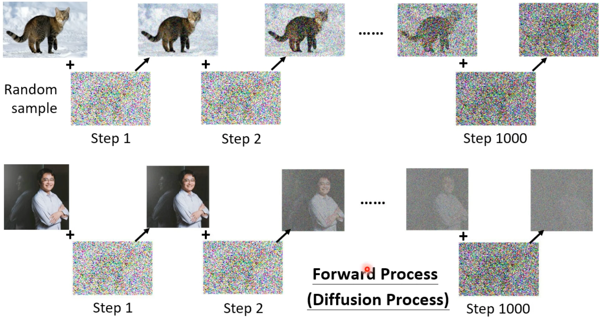

### 加入 text control

训练

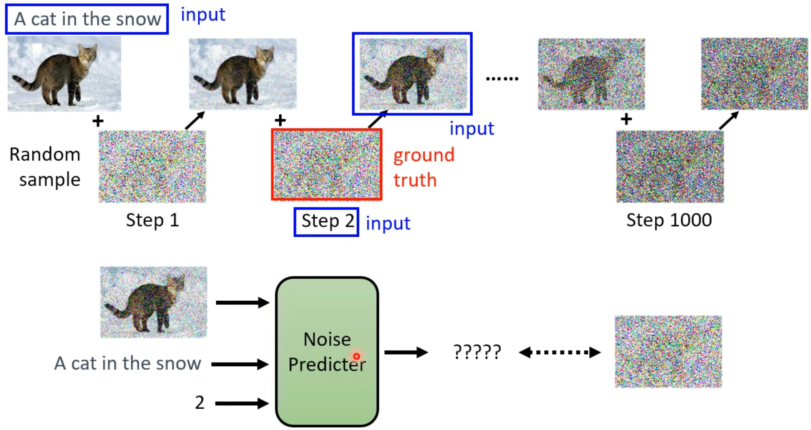

### data
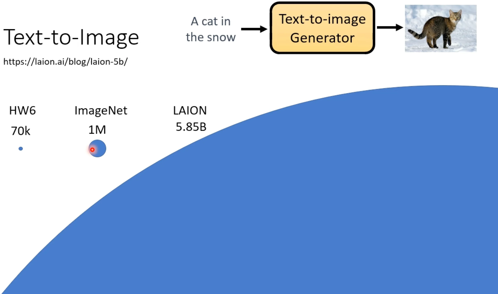

laion data browser

### 算法细节

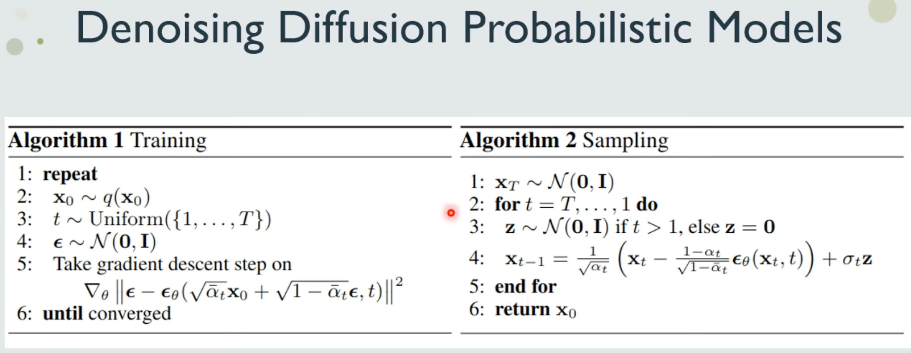

forward process:

reverse process

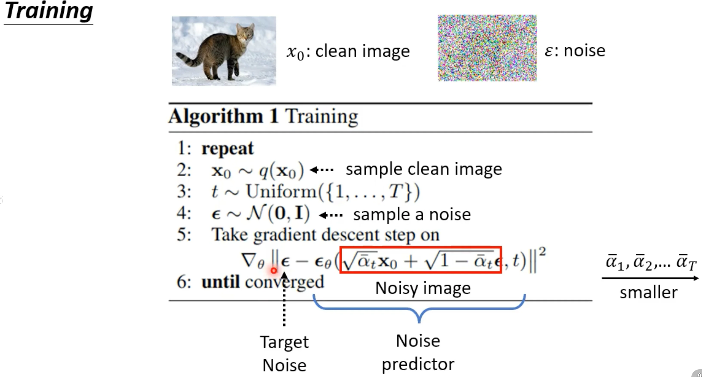

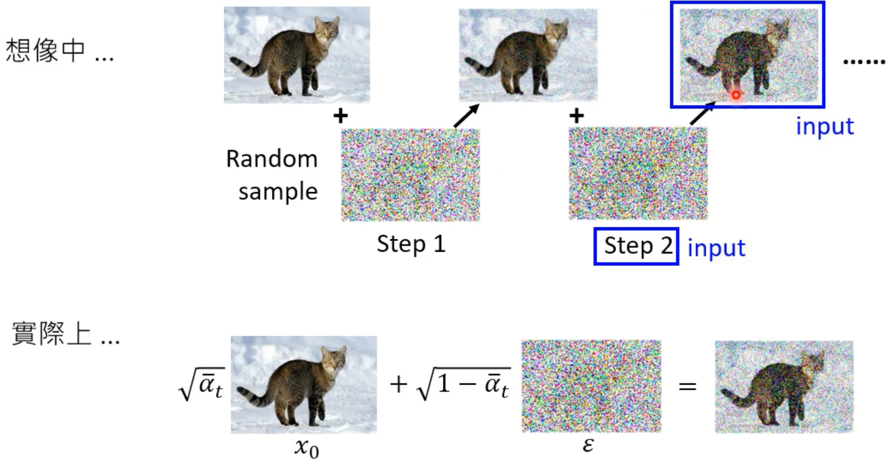

### VAE vs. Diffusion Model

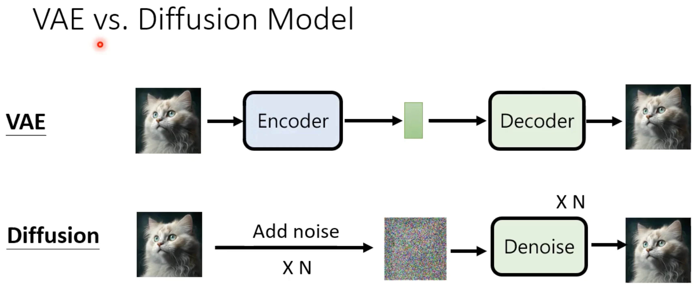

## Diffusion-based Products

Diffusion 模型在图像生成领域取得了巨大成功，催生了许多商业化产品和知名公司：

| 产品/公司 | 特点 | 链接 |
|----------|------|------|
| **DALL·E** (OpenAI) | 集成于 ChatGPT，支持 API 调用，强调对文本提示的精准遵循 | [OpenAI](https://openai.com/dall-e-3/) |
| **Stable Diffusion** (Stability AI) | 开源模型，2024年发布 3.5 版本 (Large/Large Turbo/Medium)，社区版免费商用 | [Stability AI](https://stability.ai/stable-diffusion) |
| **Midjourney** (独立研究实验室) | 以艺术风格见长，通过 Discord 社区运营 | [Midjourney](https://www.midjourney.com/) |
| **Imagen** (Google DeepMind) | 2026年推出 Nano Banana 2 (Gemini 3.1 Flash Image)，支持实时生成 | [Google DeepMind](https://deepmind.google/) |
| **Adobe Firefly** (Adobe) | 集成于 Creative Cloud，主打商业安全合规 | [Adobe Firefly](https://www.adobe.com/firefly.html) |
