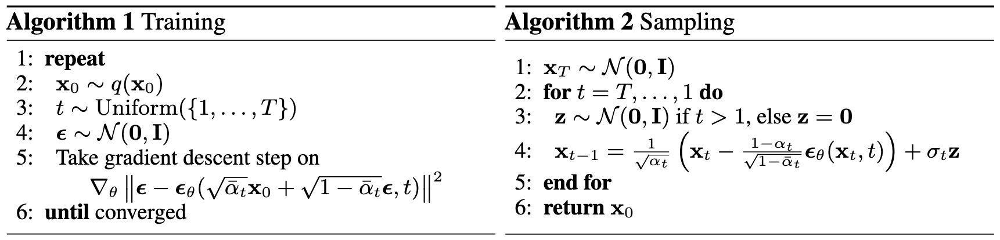
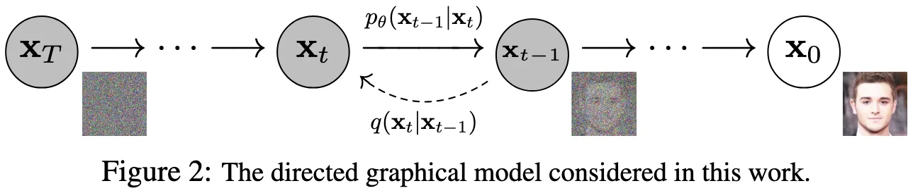

+++
date = '2020-06-19T20:48:28+08:00'
draft = false
title = 'DDPM'
categories = []
tags = []
featured = false
+++

:(fas fa-award fa-fw):NeurIPS 2020
:(fas fa-building fa-fw):Berkeley
:(fas fa-file-pdf fa-fw):[arXiv 2006.11239](https://arxiv.org/abs/2006.11239)

DDPM（Denoising Diffusion Probabilistic Models）是扩散模型最经典的基础工作之一。它的核心思想并不复杂：先定义一个固定的加噪过程，把真实样本逐步扰动成高斯噪声；再训练一个神经网络去学习反向去噪过程，从纯噪声中一步步恢复出数据样本。

## 1. Pipeline Overview

DDPM 可以分成两个阶段来看：**训练阶段**和**采样阶段**。

训练阶段中，我们从一个真实样本 $x_0$ 出发，随机选择一个时间步 $t$，然后按照预先定义好的规则往 $x_0$ 里加入噪声，得到带噪样本 $x_t$。接着，把 $x_t$ 和时间步 $t$ 一起送进网络，让网络预测对应的噪声。

采样阶段则正好相反。我们不再从真实图像出发，而是直接从纯高斯噪声 $x_T$ 出发，然后利用训练好的网络不断做去噪，把噪声一步步还原成结构清晰的样本，最终得到 $x_0$。

从宏观上看，DDPM 做的事情可以概括成一句话：

> 训练时学习"如何去噪"，采样时反复执行这个去噪过程。

接下来，我们沿着训练流程的依赖关系，逐步展开每个环节。

## 2. Forward Process：加噪过程


\begin{algorithm}
\caption{Training}
\begin{algorithmic}
\REPEAT
    \STATE $x_0 \sim q(x_0)$ \COMMENT{sample an image}
    \STATE $t \sim \text{Uniform}(\{1,\ldots,T\})$ \COMMENT{sample a timestep}
    \STATE $\epsilon \sim \mathcal{N}(0, I)$ \COMMENT{sample a noise}
    \STATE Take gradient descent step on $\nabla_\theta \Vert \epsilon - \underbrace{\epsilon_\theta(\underbrace{\sqrt{\bar{\alpha}_t}x_0 + \sqrt{1-\bar{\alpha}_t}\epsilon}_{\text{noisy image }x_t}, t)}_{\text{noise predictor}} \Vert^2$
\UNTIL{converged}
\end{algorithmic}
\end{algorithm}


理解 DDPM 的第一步，是理解它的 forward process。这个过程本身不涉及任何学习，而是一个预先定义好的、固定的加噪机制。它的核心作用是**为训练构造输入和监督信号**。

### 2.1 马尔可夫加噪链

DDPM 定义了一个马尔可夫链，从真实样本 $x_0$ 出发，逐步注入高斯噪声。每一步的转移分布为：

$$
q(x_t \mid x_{t-1}) = \mathcal{N}(x_t;\,\sqrt{1-\beta_t}\,x_{t-1},\,\beta_t I)
$$

其中 $\beta_t \in (0,1)$ 是预设的噪声调度参数，控制第 $t$ 步注入多少噪声。

直觉上，每一步做了两件事：把前一步的信号缩小一点（乘以 $\sqrt{1-\beta_t}$），同时叠加一份方差为 $\beta_t$ 的高斯噪声。随着 $t$ 增大，信号成分越来越弱，噪声成分越来越强，最终 $x_T$ 趋近于纯高斯噪声 $\mathcal{N}(0,I)$。

为了后续推导方便，记：

$$
\begin{aligned}
\alpha_t &= 1 - \beta_t \\
\bar{\alpha}_t &= \prod_{s=1}^{t} \alpha_s
\end{aligned}
$$

### 2.2 从逐步加噪到一步加噪（重参数化）

训练时，我们需要根据 $x_0$ 和任意时间步 $t$ 来构造 $x_t$。如果真的按马尔可夫链逐步模拟 $x_0 \to x_1 \to \cdots \to x_t$，效率会很低。幸运的是，利用高斯分布的性质，可以把多步加噪合并成一步。

**改写为采样形式**

先把单步转移改写为采样形式：

$$
x_t = \sqrt{\alpha_t}\,x_{t-1} + \sqrt{1 - \alpha_t}\,\epsilon_t, \quad \epsilon_t \sim \mathcal{N}(0, I)
$$

**展开两步**

把 $x_{t-1}$ 用前一步展开：

$$
x_{t-1} = \sqrt{\alpha_{t-1}}\,x_{t-2} + \sqrt{1-\alpha_{t-1}}\,\epsilon_{t-1}
$$

代入 $x_t$ 的表达式：

$$
\begin{aligned}
x_t
&= \sqrt{\alpha_t}\!\left(\sqrt{\alpha_{t-1}}\,x_{t-2} + \sqrt{1-\alpha_{t-1}}\,\epsilon_{t-1}\right) + \sqrt{1-\alpha_t}\,\epsilon_t \\
&= \sqrt{\alpha_t \alpha_{t-1}}\,x_{t-2} + \sqrt{\alpha_t(1-\alpha_{t-1})}\,\epsilon_{t-1} + \sqrt{1-\alpha_t}\,\epsilon_t
\end{aligned}
$$

后两项是独立高斯变量的线性组合。利用性质：若 $a \sim \mathcal{N}(0,\sigma_1^2 I)$ 和 $b \sim \mathcal{N}(0,\sigma_2^2 I)$ 独立，则 $a+b \sim \mathcal{N}(0,(\sigma_1^2+\sigma_2^2)I)$，合并方差：

$$
\alpha_t(1-\alpha_{t-1}) + (1-\alpha_t)
= \alpha_t - \alpha_t\alpha_{t-1} + 1 - \alpha_t
= 1 - \alpha_t\alpha_{t-1}
$$

因此两步合并后：

$$
x_t = \sqrt{\alpha_t\alpha_{t-1}}\,x_{t-2} + \sqrt{1-\alpha_t\alpha_{t-1}}\,\bar{\epsilon}, \quad \bar{\epsilon} \sim \mathcal{N}(0, I)
$$

**推广到 $t$ 步**

规律已经清楚：每多展开一步，信号系数变成 $\alpha$ 的累积乘积，噪声方差相应地变成 $1$ 减去这个乘积。归纳可得：

$$
\boxed{
x_t = \sqrt{\bar{\alpha}_t}\,x_0 + \sqrt{1-\bar{\alpha}_t}\,\epsilon,
\quad \epsilon \sim \mathcal{N}(0, I)
}
$$

等价于分布形式：

$$
q(x_t \mid x_0) = \mathcal{N}(x_t;\,\sqrt{\bar{\alpha}_t}\,x_0,\,(1-\bar{\alpha}_t)I)
$$

这个闭式形式的含义很直观：$x_t$ 是原始样本 $x_0$ 和标准高斯噪声 $\epsilon$ 的加权组合。权重 $\sqrt{\bar{\alpha}_t}$ 控制信号保留量，$\sqrt{1-\bar{\alpha}_t}$ 控制噪声注入量。随着 $t$ 增大，$\bar{\alpha}_t \to 0$，信号消失，噪声主导。

### 2.3 训练真值的构造

有了闭式形式，训练数据的构造变得非常高效：

1. 从数据集中采样一个真实样本 $x_0$
2. 随机采样一个时间步 $t \sim \text{Uniform}(\{1,\ldots,T\})$
3. 随机采样一个标准高斯噪声 $\epsilon \sim \mathcal{N}(0, I)$
4. 直接计算 $x_t = \sqrt{\bar{\alpha}_t}\,x_0 + \sqrt{1-\bar{\alpha}_t}\,\epsilon$

这样一步就得到了训练输入 $x_t$ 和对应的监督真值 $\epsilon$——不需要逐步模拟整条马尔可夫链。

所以，forward process 的核心作用不是生成样本，而是：

> **定义一个已知的退化机制，并用它高效地构造训练输入和真值监督。**

## 3. Training：输入/输出、目标与损失

Forward process 告诉了我们如何构造训练数据，接下来就可以定义模型的输入、输出和损失函数。

### 3.1 输入/输出

模型的输入有两个：

- **带噪样本** $x_t$：当前已经被加噪到第 $t$ 步的样本
- **时间步** $t$：告诉模型当前噪声的程度

模型的输出是噪声预测 $\epsilon_\theta(x_t, t)$，即模型对"$x_t$ 中包含的噪声"的估计。

需要特别强调的是：模型预测的 $\epsilon_\theta(x_t, t)$ 对应的是 forward process 闭式公式中的那个 $\epsilon$——从 $x_0$ 到 $x_t$ 的**整体噪声**，不是从 $x_{t-1}$ 到 $x_t$ 的单步局部噪声。

### 3.2 预测目标：噪声

一个自然的问题是：为什么让模型预测噪声，而不直接预测原始图像 $x_0$？

从数学上看，二者是等价的。一旦预测出了噪声 $\epsilon_\theta$，就可以通过 forward 闭式公式反解出对 $x_0$ 的估计：

$$
\hat{x}_0 =
\frac{x_t - \sqrt{1-\bar{\alpha}_t}\,\epsilon_\theta(x_t, t)}{\sqrt{\bar{\alpha}_t}}
$$

但在原始 DDPM 中，预测噪声是最自然的选择。这并非经验 trick，而是有明确的理论和优化层面的支撑：

**1. 与 ELBO 推导的自然对齐**。DDPM 的训练目标是从变分下界（ELBO）一步步推导出来的。在固定方差、选定参数化之后，ELBO 中每一项 KL 散度都可以化简为噪声预测的 MSE 形式。预测噪声不是一个随意的设计选择，而是这套概率建模推导的自然落地形式。当然，这并不意味着"只能预测噪声"——预测原图 $x_0$、预测均值、预测 $v$ 等都是合法的参数化方式，后续工作中也有大量实践。但对原始 DDPM 这套推导来说，噪声参数化是最直接的一种。

**2. 学习目标统一**。无论 $t$ 大还是小，真值噪声 $\epsilon$ 始终服从标准高斯分布 $\mathcal{N}(0, I)$，监督目标的尺度和动态范围在所有时间步上都是一致的。相比之下，如果直接预测 $x_0$，在 $t$ 很大（信噪比极低）时，从近乎纯噪声的输入中重建完整图像的难度会急剧增大，不同时间步之间的学习难度差异很大。噪声参数化让训练目标在时间步维度上更均匀，优化更稳定。

**3. 简化损失函数**。从 ELBO 展开后的完整损失中，不同时间步本应带有不同的加权系数。而 DDPM 论文发现，在噪声参数化下直接丢掉这些加权系数，使用无加权的简单 MSE 损失（即 $L_{\text{simple}}$），在实验上反而取得了更好的生成质量。这一简化能成立，正是因为噪声参数化本身已经让各时间步的目标足够规整。

### 3.3 损失函数

损失函数的形式非常直接——让预测噪声尽量接近真实噪声：

$$
L_{\text{simple}} = \mathbb{E}_{x_0,\,\epsilon,\,t}
\left[\left\|\epsilon - \epsilon_\theta(x_t, t)\right\|^2\right]
$$

其中 $x_t = \sqrt{\bar{\alpha}_t}\,x_0 + \sqrt{1-\bar{\alpha}_t}\,\epsilon$。DDPM 的训练因此可以概括为一个**带时间条件的噪声回归问题**。

## 4. Reverse Process：去噪过程


\begin{algorithm}
\caption{Sampling}
\begin{algorithmic}
\STATE $x_T \sim \mathcal{N}(0, I)$
\FOR{$t = T, \ldots, 1$}
    \STATE $z \sim \mathcal{N}(0, I)$ \COMMENT{if $t > 1$, else $z = 0$}
    \STATE $x_{t-1} = \frac{1}{\sqrt{\alpha_t}}\left(x_t - \frac{1-\alpha_t}{\sqrt{1-\bar{\alpha}_t}} \epsilon_\theta(x_t, t)\right) + \sigma_t z$
\ENDFOR
\RETURN $x_0$
\end{algorithmic}
\end{algorithm}


Forward process 是人为定义好的退化机制，reverse process 才是模型真正要学习的对象。训练完成后，执行 reverse process 就是生成的全部过程。

DDPM 将**反向过程建模为一条马尔可夫链**，每一步用一个高斯分布来描述：

$$
p_\theta(x_{t-1} \mid x_t) =
\mathcal{N}(x_{t-1};\,\mu_\theta(x_t, t),\,\sigma_t^2 I)
$$

其中方差 $\sigma_t^2$ 被设为与 $\beta_t$ 相关的固定常数（原始 DDPM 直接取 $\sigma_t^2 = \beta_t$），**唯一需要学习的是均值 $\mu_\theta(x_t, t)$**。因此推导 reverse process 的核心任务就是：找到 $\mu_\theta$ 的具体表达式。

推导路线分为两步：**先算出理想情况下（已知 $x_0$）的真实后验均值，再用网络的噪声预测替换其中未知的 $x_0$**。

反向过程理想的"老师"是**条件后验分布** $q(x_{t-1} \mid x_t, x_0)$——它告诉我们：如果同时知道当前带噪样本 $x_t$ 和原始数据 $x_0$，那么上一步 $x_{t-1}$ 应该服从什么分布。虽然看起来复杂，但它可以完全解析地计算出来。下面一步步推导。

从贝叶斯公式出发，写出条件概率的定义：

$$
q(x_{t-1} \mid x_t, x_0)
= \frac{q(x_{t-1},\,x_t \mid x_0)}{q(x_t \mid x_0)}
$$

分子是 $x_{t-1}$ 和 $x_t$ 的联合分布（给定 $x_0$），分母是 $x_t$ 的边际分布（给定 $x_0$）。用链式法则把分子展开：

$$
q(x_{t-1},\,x_t \mid x_0) = q(x_t \mid x_{t-1},\,x_0) \; q(x_{t-1} \mid x_0)
$$

代回去：

$$
q(x_{t-1} \mid x_t, x_0)
= \frac{q(x_t \mid x_{t-1},\,x_0)\;q(x_{t-1} \mid x_0)}{q(x_t \mid x_0)}
$$

接下来利用 forward process 的**马尔可夫性**：$x_t$ 只依赖于 $x_{t-1}$，与更早的 $x_0$ 条件无关，即：

$$
q(x_t \mid x_{t-1},\,x_0) = q(x_t \mid x_{t-1})
$$

代入得：

$$
q(x_{t-1} \mid x_t, x_0)
= q(x_t \mid x_{t-1})\,\frac{q(x_{t-1} \mid x_0)}{q(x_t \mid x_0)}
$$

分母 $q(x_t \mid x_0)$ 不含 $x_{t-1}$，在关于 $x_{t-1}$ 的分布中只充当归一化常数，因此可以写成正比关系：

$$
q(x_{t-1} \mid x_t, x_0) \propto q(x_t \mid x_{t-1})\;q(x_{t-1} \mid x_0)
$$

右边的两个因子——以及之前分母中的 $q(x_t \mid x_0)$——全部是已知的高斯分布，它们的表达式在 forward process 中已经推导过：

$$
\begin{aligned}
q(x_t \mid x_{t-1}) &= \mathcal{N}(x_t;\,\sqrt{\alpha_t}\,x_{t-1},\,(1-\alpha_t)I) \\[4pt]
q(x_{t-1} \mid x_0) &= \mathcal{N}(x_{t-1};\,\sqrt{\bar{\alpha}_{t-1}}\,x_0,\,(1-\bar{\alpha}_{t-1})I) \\[4pt]
q(x_t \mid x_0) &= \mathcal{N}(x_t;\,\sqrt{\bar{\alpha}_t}\,x_0,\,(1-\bar{\alpha}_t)I)
\end{aligned}
$$

第一项是单步转移分布，后两项是 forward process 的闭式公式（分别对应第 $t-1$ 步和第 $t$ 步）。

接下来把右边两项的概率密度函数写出来。高斯分布 $\mathcal{N}(x;\,\mu,\sigma^2)$ 的核心部分是指数 $\exp\!\left(-\frac{(x-\mu)^2}{2\sigma^2}\right)$，省略与 $x_{t-1}$ 无关的归一化系数后：

$$
q(x_{t-1} \mid x_t, x_0)
\propto
\exp\!\left(-\frac{(x_t - \sqrt{\alpha_t}\,x_{t-1})^2}{2(1-\alpha_t)}\right)
\cdot
\exp\!\left(-\frac{(x_{t-1} - \sqrt{\bar{\alpha}_{t-1}}\,x_0)^2}{2(1-\bar{\alpha}_{t-1})}\right)
$$

两项指数相乘即指数相加。把各平方项展开：

$$
(x_t - \sqrt{\alpha_t}\,x_{t-1})^2 = x_t^2 - 2\sqrt{\alpha_t}\,x_t\,x_{t-1} + \alpha_t\,x_{t-1}^2
$$

$$
(x_{t-1} - \sqrt{\bar{\alpha}_{t-1}}\,x_0)^2 = x_{t-1}^2 - 2\sqrt{\bar{\alpha}_{t-1}}\,x_0\,x_{t-1} + \bar{\alpha}_{t-1}\,x_0^2
$$

代入后合并指数内部：

$$
\propto \exp\!\left(-\frac{1}{2}\left[
  \frac{x_t^2 - 2\sqrt{\alpha_t}\,x_t\,x_{t-1} + \alpha_t\,x_{t-1}^2}{1-\alpha_t}
  +
  \frac{x_{t-1}^2 - 2\sqrt{\bar{\alpha}_{t-1}}\,x_0\,x_{t-1} + \bar{\alpha}_{t-1}\,x_0^2}{1-\bar{\alpha}_{t-1}}
\right]\right)
$$

我们只关心含 $x_{t-1}$ 的项。其中 $\frac{x_t^2}{1-\alpha_t}$ 和 $\frac{\bar{\alpha}_{t-1}\,x_0^2}{1-\bar{\alpha}_{t-1}}$ 都不含 $x_{t-1}$，可以并入比例常数。按 $x_{t-1}$ 的幂次分别提取二次项和一次项：

$$
\propto \exp\!\left(-\frac{1}{2}\left[
  \underbrace{\left(\frac{\alpha_t}{1-\alpha_t}+\frac{1}{1-\bar{\alpha}_{t-1}}\right)}_{\displaystyle 1/\tilde{\sigma}_t^2}
  x_{t-1}^2
  -\,
  2\underbrace{\left(\frac{\sqrt{\alpha_t}\,x_t}{1-\alpha_t}+\frac{\sqrt{\bar{\alpha}_{t-1}}\,x_0}{1-\bar{\alpha}_{t-1}}\right)}_{\displaystyle \tilde{\mu}_t/\tilde{\sigma}_t^2}
  x_{t-1}
\right]\right)
$$

这是一个关于 $x_{t-1}$ 的标准二次型，对应高斯分布 $\mathcal{N}(\tilde{\mu}_t,\,\tilde{\sigma}_t^2 I)$。怎么从二次型读出均值和方差？回忆高斯 PDF 的核心形式：

$$
\exp\!\left(-\frac{(x-\mu)^2}{2\sigma^2}\right) = \exp\!\left(-\frac{1}{2}\left[\frac{1}{\sigma^2}x^2 - \frac{2\mu}{\sigma^2}x + \frac{\mu^2}{\sigma^2}\right]\right)
$$

对比可知：**$x_{t-1}^2$ 的系数就是精度 $1/\tilde{\sigma}_t^2$**（取倒数得方差），**$x_{t-1}$ 的一次项系数就是 $\tilde{\mu}_t / \tilde{\sigma}_t^2$**（乘以 $\tilde{\sigma}_t^2$ 得均值）。

**先算方差**。二次项系数（精度）为：

$$
\frac{1}{\tilde{\sigma}_t^2} = \frac{\alpha_t}{1-\alpha_t} + \frac{1}{1-\bar{\alpha}_{t-1}}
$$

通分，公分母为 $(1-\alpha_t)(1-\bar{\alpha}_{t-1})$：

$$
= \frac{\alpha_t(1-\bar{\alpha}_{t-1}) + (1-\alpha_t)}{(1-\alpha_t)(1-\bar{\alpha}_{t-1})}
$$

展开分子：$\alpha_t(1-\bar{\alpha}_{t-1}) + (1-\alpha_t) = \alpha_t - \alpha_t\bar{\alpha}_{t-1} + 1 - \alpha_t = 1 - \alpha_t\bar{\alpha}_{t-1}$。而由 $\bar{\alpha}_t$ 的定义 $\bar{\alpha}_t = \prod_{s=1}^t \alpha_s = \alpha_t\bar{\alpha}_{t-1}$，所以 $1 - \alpha_t\bar{\alpha}_{t-1} = 1 - \bar{\alpha}_t$。代入得：

$$
\frac{1}{\tilde{\sigma}_t^2} = \frac{1-\bar{\alpha}_t}{(1-\alpha_t)(1-\bar{\alpha}_{t-1})}
$$

取倒数即后验方差：

$$
\tilde{\sigma}_t^2 = \frac{(1-\alpha_t)(1-\bar{\alpha}_{t-1})}{1-\bar{\alpha}_t}
= \frac{\beta_t(1-\bar{\alpha}_{t-1})}{1-\bar{\alpha}_t}
$$

最后一步用了 $1 - \alpha_t = \beta_t$。可以看到，后验方差是一个只依赖噪声调度参数的常数，不含任何需要学习的量。

**再算均值**。一次项系数为 $\tilde{\mu}_t / \tilde{\sigma}_t^2$，因此：

$$
\tilde{\mu}_t = \tilde{\sigma}_t^2 \cdot \left(\frac{\sqrt{\alpha_t}\,x_t}{1-\alpha_t} + \frac{\sqrt{\bar{\alpha}_{t-1}}\,x_0}{1-\bar{\alpha}_{t-1}}\right)
$$

将 $\tilde{\sigma}_t^2 = \frac{(1-\alpha_t)(1-\bar{\alpha}_{t-1})}{1-\bar{\alpha}_t}$ 代入，分别乘进两项：

$$
\begin{aligned}
\tilde{\mu}_t(x_t, x_0)
&= \frac{(1-\alpha_t)(1-\bar{\alpha}_{t-1})}{1-\bar{\alpha}_t} \cdot \frac{\sqrt{\alpha_t}\,x_t}{1-\alpha_t}
  \;+\; \frac{(1-\alpha_t)(1-\bar{\alpha}_{t-1})}{1-\bar{\alpha}_t} \cdot \frac{\sqrt{\bar{\alpha}_{t-1}}\,x_0}{1-\bar{\alpha}_{t-1}} \\[6pt]
&= \frac{\sqrt{\alpha_t}(1-\bar{\alpha}_{t-1})}{1-\bar{\alpha}_t}\,x_t
  \;+\; \frac{\sqrt{\bar{\alpha}_{t-1}}\,\beta_t}{1-\bar{\alpha}_t}\,x_0
\end{aligned}
$$

第一项中 $(1-\alpha_t)$ 约分掉了，第二项中 $(1-\bar{\alpha}_{t-1})$ 约分掉了，同时 $1-\alpha_t$ 替换为 $\beta_t$。

到此，条件后验 $q(x_{t-1} \mid x_t, x_0) = \mathcal{N}(\tilde{\mu}_t, \tilde{\sigma}_t^2 I)$ 的均值和方差都已经完全确定——这一步纯粹是概率论的代数操作，不涉及任何近似。只要知道 $x_t$ 和 $x_0$，后验均值就能精确算出。

**但有一个问题**：实际推断时 $x_0$ 是未知的——我们正是要从噪声生成 $x_0$，不可能事先知道它。好消息是，在第 3.2 节我们已经推导过，可以利用 forward process 的闭式公式，从网络的噪声预测反解出对 $x_0$ 的估计：

$$
\hat{x}_0 = \frac{x_t - \sqrt{1-\bar{\alpha}_t}\,\epsilon_\theta(x_t, t)}{\sqrt{\bar{\alpha}_t}}
$$

将这个 $\hat{x}_0$ 代入后验均值公式中 $x_0$ 的位置：

$$
\begin{aligned}
\mu_\theta(x_t, t)
&= \frac{\sqrt{\alpha_t}(1-\bar{\alpha}_{t-1})}{1-\bar{\alpha}_t}\,x_t
  \;+\; \frac{\sqrt{\bar{\alpha}_{t-1}}\,\beta_t}{1-\bar{\alpha}_t}
  \cdot \frac{x_t - \sqrt{1-\bar{\alpha}_t}\,\epsilon_\theta(x_t, t)}{\sqrt{\bar{\alpha}_t}}
\end{aligned}
$$

先简化第二项中的系数。注意 $\bar{\alpha}_t = \alpha_t\bar{\alpha}_{t-1}$，因此 $\frac{\sqrt{\bar{\alpha}_{t-1}}}{\sqrt{\bar{\alpha}_t}} = \frac{1}{\sqrt{\alpha_t}}$。这意味着第二项变为 $\frac{\beta_t}{\sqrt{\alpha_t}(1-\bar{\alpha}_t)} \cdot \bigl(x_t - \sqrt{1-\bar{\alpha}_t}\,\epsilon_\theta\bigr)$。

现在把两项中 $x_t$ 的系数合并：

$$
\begin{aligned}
&\frac{\sqrt{\alpha_t}(1-\bar{\alpha}_{t-1})}{1-\bar{\alpha}_t} + \frac{\beta_t}{\sqrt{\alpha_t}(1-\bar{\alpha}_t)} \\[6pt]
= &\frac{\alpha_t(1-\bar{\alpha}_{t-1}) + \beta_t}{\sqrt{\alpha_t}(1-\bar{\alpha}_t)}
\end{aligned}
$$

分子中：$\alpha_t(1-\bar{\alpha}_{t-1}) + \beta_t = \alpha_t - \alpha_t\bar{\alpha}_{t-1} + 1 - \alpha_t = 1 - \bar{\alpha}_t$（再次用到 $\alpha_t\bar{\alpha}_{t-1} = \bar{\alpha}_t$ 和 $\beta_t = 1-\alpha_t$）。于是 $x_t$ 的总系数化简为：

$$
\frac{1-\bar{\alpha}_t}{\sqrt{\alpha_t}(1-\bar{\alpha}_t)} = \frac{1}{\sqrt{\alpha_t}}
$$

而 $\epsilon_\theta$ 的系数为 $-\frac{\beta_t}{\sqrt{\alpha_t}(1-\bar{\alpha}_t)} \cdot \sqrt{1-\bar{\alpha}_t} = -\frac{1-\alpha_t}{\sqrt{\alpha_t}\sqrt{1-\bar{\alpha}_t}}$。合并后得到最终的均值公式：

$$
\boxed{
\mu_\theta(x_t, t) =
\frac{1}{\sqrt{\alpha_t}}
\left(x_t - \frac{1-\alpha_t}{\sqrt{1-\bar{\alpha}_t}}\,\epsilon_\theta(x_t, t)\right)
}
$$

直觉上，这个公式做了一件很直观的事情：模型先判断 $x_t$ 中有多少噪声（$\epsilon_\theta$ 的输出），再据此算出下一步应该朝哪个方向、去掉多少——这个结果就是反向分布的中心位置 $\mu_\theta$。注意 $\mu_\theta$ 是 $x_{t-1}$ 的期望位置，而不是对 $x_0$ 的直接估计；对 $x_0$ 的估计（$\hat{x}_0$ 公式）在 3.2 节已经给出，二者虽由同一个 $\epsilon_\theta$ 推导而来，但语义不同。

有了反向分布的均值和方差，完整的采样过程就是从纯高斯噪声 $x_T \sim \mathcal{N}(0,I)$ 出发，对 $t = T, \ldots, 1$ 逐步执行：

$$
x_{t-1} = \underbrace{\frac{1}{\sqrt{\alpha_t}}\left(x_t - \frac{1-\alpha_t}{\sqrt{1-\bar{\alpha}_t}}\,\epsilon_\theta(x_t, t)\right)}_{\mu_\theta(x_t,\,t)} + \sigma_t z, \quad z \sim \mathcal{N}(0, I)
$$

每一步可以拆成两部分：前半部分是确定性的去噪修正（即 $\mu_\theta$），后半部分 $\sigma_t z$ 是注入的随机性，保证采样结果的多样性。经过 $T$ 步迭代，最终得到接近真实数据分布的样本 $x_0$。

这种逐步细化的生成方式是 DDPM 生成质量高的关键，但也是采样速度慢的根本原因——每生成一张图都需要跑 $T$（通常为 1000）次网络前向传播。后续的 DDIM 等工作正是针对这一点进行改进。

## 5. Model Architecture

在理解 DDPM 的核心逻辑时，没有必要一上来就陷入具体 backbone 细节。可以先把网络看成一个黑盒函数：

$$
(x_t, t) \longrightarrow \epsilon_\theta(x_t, t)
$$

从原始论文实现来看，DDPM 使用 **U-Net** 作为去噪网络，适合处理图像这种具有强局部结构和多尺度特征的数据。后续工作中也出现了基于 **Transformer** 的扩散 backbone（如 DiT），但那属于架构演化的方向，不是理解原始 DDPM 所必须的。

先把网络理解为：

> 一个接收带噪样本和时间步，并输出噪声预测的函数近似器。

这就足够了。

## 6. Summary

DDPM 的核心逻辑可以概括为四句话：

1. 定义一个固定的 forward process，把真实样本逐步加噪
2. 利用闭式公式高效构造训练输入 $x_t$ 和真值噪声 $\epsilon$
3. 训练网络学习 reverse process，即根据 $x_t$ 和 $t$ 预测噪声
4. 采样时从纯噪声出发，反复执行去噪，最终生成样本

DDPM 看似是在做复杂的生成建模，实际上它把问题转化成了一个非常清晰的目标：**学习一个带时间条件的逐步去噪器。**

这也是扩散模型后来能够持续发展的根本原因：训练目标简单、稳定，概率建模逻辑非常自然。

## References
- [Denoising Diffusion Probabilistic Models](https://arxiv.org/abs/2006.11239)
- [What are Diffusion Models? (Lilian Weng)](https://lilianweng.github.io/posts/2021-07-11-diffusion-models/)
