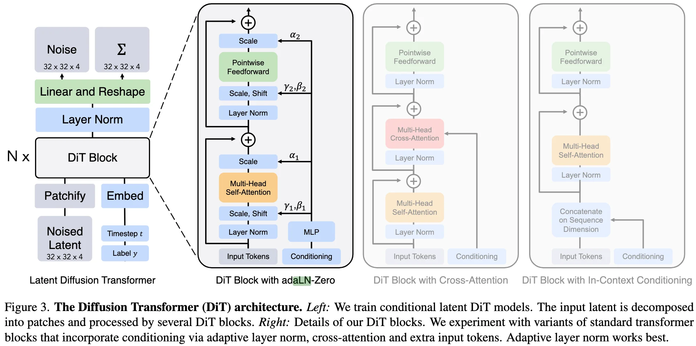

+++
date = '2026-03-16T12:26:56+08:00'
draft = false
title = 'DiT: Scalable Diffusion Models with Transformers'
categories = ['Generative Models']
tags = ['Generative Models', 'Diffusion', 'DiT']
featured = false
+++

:(fas fa-award fa-fw):
:(fas fa-building fa-fw):Meta AI, FAIR Team
:(fas fa-file-pdf fa-fw):[arXiv ]()
:(fab fa-github fa-fw):

:(fas fa-globe fa-fw):
:(fas fa-blog fa-fw):

## TL;DR

## Motivations & Innovations

## Approach

### Model

### Training Recipe

### Data Recipe

## Experiments

