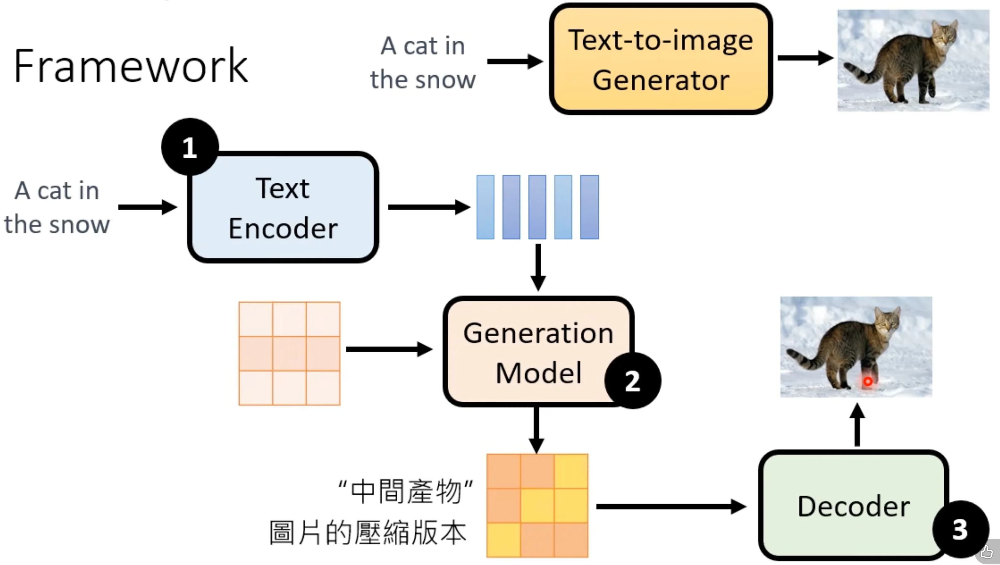
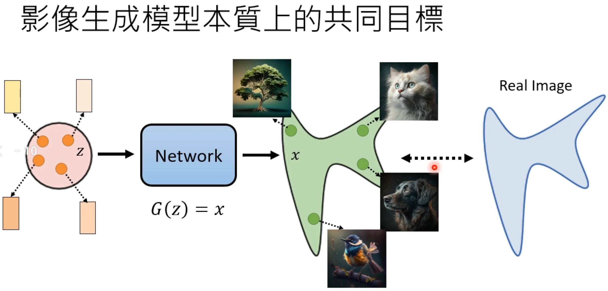
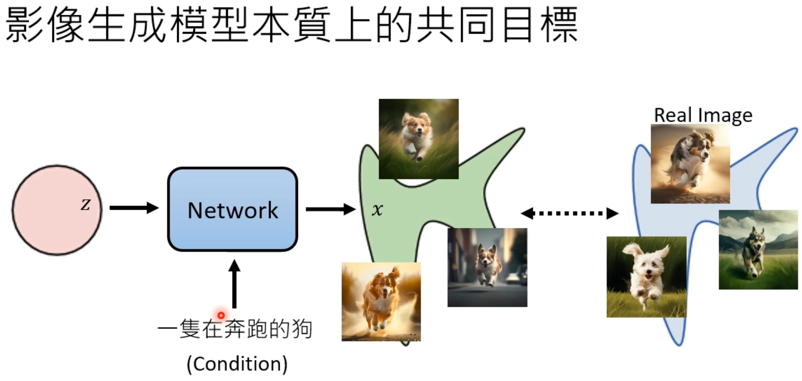

+++
date = '2026-03-14T20:51:30+08:00'
draft = false
title = 'Stable Diffusion'
categories = []
tags = []
featured = false
math = true
+++

:(fas fa-award fa-fw):
:(fas fa-building fa-fw):
:(fas fa-file-pdf fa-fw):[arXiv ]()
:(fab fa-github fa-fw):

:(fas fa-globe fa-fw):
:(fas fa-blog fa-fw):

## TL;DR

## Motivations & Innovations

## Approach

### Model

### Training Recipe

### Data Recipe

## Experiments

## 李宏毅

### 前提知识

- **[KL 散度](/posts/basics/kl-divergence/)**：衡量两概率分布差异，与交叉熵的关系及在生成模型中的作用。
- **[最大似然估计（MLE）](/posts/basics/maximum-likelihood-estimation/)**：从数据估计模型参数，负对数似然与 KL 散度的等价性。

1. text encoder
2. generation Model (Diffusion Model) -> latent 中间产物 (小分辨率图片或者看不懂的隐变量特征)
3. image decoder

1&2&3都是分段训练后合并的。

图片生成模型本质：

目标定义：分布越接近越好。

